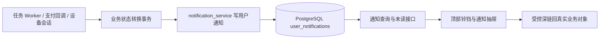

# 消息通知中心产品与技术方案

> 日期：2026-09-14
>
> 基线：`origin/main@11c3de13422f2bab009a052a9f2074bf8c13e12c`
>
> 状态：方案冻结候选；只定义产品、架构、工作包和验收，不代表业务代码已完成
>
> 上游：前端审计 G20 / FP-29、FE-PRELAUNCH-20260913 已合入的任务通知抽屉

## 1. 决策摘要

消息通知能力定位为 AI 长任务的“结果到达、异常补救、资金变化、账号安全”中心，不在第一阶段扩展为营销站内信或外部消息平台。

本方案采用以下默认决策：

1. 第一阶段只做站内持久化通知，覆盖创作任务、钱包和账号安全；平台公告另立工作包。
2. 保留现有顶部铃铛与任务通知抽屉，将其从“读取当前任务状态”升级为“读取持久化事件”。
3. PostgreSQL 是唯一真源；不引入 Redis、Kafka、RabbitMQ 或新的消息队列框架。
4. 通知写入与业务状态转换处于同一数据库事务，并使用唯一去重键抵抗 Worker 重试、多实例并发和支付回调重放。
5. 站内消息记录与主动弹出提醒分离：关闭提醒不删除任务、交易和安全事实，也不影响用户在业务页面查看真实状态。
6. 第一阶段沿用轮询；暂不引入 WebSocket/SSE。桌面系统通知、邮件、短信、微信通知均延期。
7. 本文的 `NTF-WP*` 只是方案工作包标签，不是正式 CW/TXX 编号。实施前必须按最新任务账本、远程分支、开放 PR 和共享 claim 重新查重，并把准确文件名登记到正式文件映射。

## 2. 最新主分支的真实现状

截至本方案基线，通知并非完全空白。FE-PRELAUNCH-20260913 已经交付：

- 顶部铃铛、未读角标和“任务通知”弹窗；前端每 30 秒查询一次。
- `GET /api/studio/notifications`，从 `generation_tasks` 和 `oral_tasks` 当前终态实时派生最近 50 条通知。
- `POST /api/studio/notifications/read`，把全局 `read_before` 水位保存到 `studio_notification_preferences.prefs_json`。
- 既有 `enabled` 偏好以及客户 Session fencing 下的已读写入。

当前实现适合作为可用的第一版入口，但还不是完整消息中心：

| 当前能力 | 当前限制 | 本方案处理 |
| --- | --- | --- |
| 从任务表动态生成通知 | 没有不可变事件；任务状态再次变化时旧事件消失，`updated_at` 变化可能让消息重新变未读 | 建立持久化用户通知表，业务转换时写入事件 |
| 一个 `read_before` 全局水位 | 只能全部已读，不能单条已读；时间边界变化会影响判定 | 每条消息保存 `read_at`，全部已读使用服务端 cutoff |
| 最近 50 条任务状态 | 无游标分页、筛选、归档和完整历史 | 新增游标分页、类别/未读筛选和 90 天保留 |
| 生成任务逐行展示 | 一个批次多个 task 会造成重复提醒 | 视频生成按 batch 聚合，口播和单体异步任务按 task 聚合 |
| 只覆盖视频生成和口播 | 无人物图、首帧、转写、充值、低余额、设备安全 | 分阶段补齐明确事件矩阵 |
| `enabled=false` 时返回空列表 | “关闭弹出提醒”和“没有历史消息”混在一起 | 持久化收件箱与弹出偏好分离 |
| 点击只进入任务详情 | 没有钱包、设备、安全等动作类型 | 使用受控 `action_type + action_payload` 深链协议 |

因此后续工作不是重做铃铛，而是保留现有 UI 入口、替换数据语义并扩展事件范围。

## 3. 产品目标与非目标

### 3.1 产品目标

- 用户离开创建页后，仍能知道长任务已经完成、失败或需要人工处理。
- 对“部分成功”“状态待确认”“归档失败”等真实状态给出准确下一步，不把它们美化成成功。
- 用户能够追踪未读/已读，刷新、重启应用或更换已授权设备后状态不丢失。
- 充值、余额和设备安全事件不被普通任务噪声淹没。
- 多实例 API、多个 Worker、支付重复回调下，每个业务事实最多形成一条目标通知。
- 任何通知都能回到真实业务对象，通知失败不改变任务、钱包或设备本身的真实状态。

### 3.2 第一阶段非目标

- 不做营销活动、推荐内容、运营群发和复杂公告编辑后台。
- 不做短信、邮件、微信公众号/企业微信推送。
- 不承诺应用完全退出后仍能收到 Windows 原生推送。
- 不用通知表替代任务历史、钱包流水、安全审计或运维告警。
- 不把 `QUEUED`、`RUNNING` 等过程状态逐条写成消息。
- 不把管理员运维告警直接暴露给客户；既有 ops alert 链继续独立运行。

## 4. 用户场景与体验闭环

### 4.1 创作完成

用户提交视频批次后继续处理别的工作。批次进入终态时，顶部铃铛出现未读角标。用户打开抽屉，看到“视频已生成”，点击后进入该批次详情与下载入口。

### 4.2 需要补救

批次出现部分失败、归档失败或 `SUBMISSION_UNCERTAIN` 时，通知使用警告或紧急层级，并以“查看失败项”“核对任务状态”作为动作。通知文案不得只写“生成失败”，必须说明是否已有可用结果以及下一步。

### 4.3 充值与余额

可信支付回调完成幂等入账后生成“充值成功”通知，点击进入使用记录。余额在成功结算后首次跌破阈值时产生一条低余额通知；持续低余额期间不重复提醒，充值恢复到阈值以上后才允许下一次触发。

### 4.4 账号安全

新设备发起配对时产生紧急通知并进入设备审批。当前账号允许多设备独立在线，其他设备正常登录不得生成“被顶号/会话替换”事件。同设备凭据恢复导致旧会话替换、设备撤销与账号撤销分别按真实安全事实产生记录；既有会话围栏继续负责即时阻断。通知不能包含设备 token、完整指纹、可用会话凭据或激活码。

## 5. 信息架构与交互

### 5.1 顶部铃铛

- 角标只表示未读通知数，`>99` 显示 `99+`。
- 侧栏“任务中心”角标继续表示运行中/排队中的任务数，二者不得混用。
- 首次加载失败不把旧账号角标留在界面；账号变化立即清空本地状态并重新请求。
- 页面重新获得焦点时立即刷新；正常前台每 30 秒刷新，连续失败按 30/60/120/300 秒退避。

### 5.2 通知抽屉

现有 `StudioDialog` 可先继续复用；视觉实现阶段优先改为右侧抽屉，避免打断当前创作上下文。

抽屉结构：

1. 标题“消息通知”和未读数量。
2. 筛选：全部、待处理、任务、资金与安全。
3. 消息列表：未读点、状态图标、标题、摘要、相对时间、主动作。
4. “全部标为已读”和“查看全部消息”。
5. 加载、空态、离线、重试均使用真实状态，不用审核示例回退生产错误。

打开抽屉不自动标记全部已读。点击某条消息并成功发起目标导航时单条已读；用户也可显式全部已读。

### 5.3 完整消息页

新增 `notifications` 页面，支持游标分页、类别筛选、只看未读和按日期分组。第一阶段不提供物理删除；可以在后续增加“隐藏/归档”，但业务源记录始终保留。

### 5.4 深链动作

客户端只接受白名单动作，不执行服务端传入的任意 URL：

| `action_type` | 必需载荷 | 目标 |
| --- | --- | --- |
| `OPEN_GENERATION_BATCH` | `batch_id` | `task-detail/generation_batch/{id}` |
| `OPEN_ORAL_TASK` | `task_id` | `task-detail/oral_task/{id}` |
| `OPEN_PROJECT` | `project_id` | 视频创作/项目上下文 |
| `OPEN_PERSON` | `identity_id` | 人物详情 |
| `OPEN_WALLET` | 无或 `order_no` | 个人中心使用记录/充值记录 |
| `OPEN_DEVICE_APPROVAL` | `pairing_id` | 账号安全/设备审批 |
| `NONE` | 无 | 仅展示，无跳转 |

前端必须先按账号权限读取目标对象；通知载荷不能绕过既有 owner/IDOR 保护。

## 6. 第一阶段事件合同

| 事件码 | 触发事实 | 层级 | 聚合/去重键 | 用户动作 | 是否可关闭弹出 |
| --- | --- | --- | --- | --- | --- |
| `generation.batch.succeeded` | 批次所有有效任务成功且结果可交付 | INFO | `generation_batch:{batch_id}:SUCCEEDED` | 查看并下载 | 是 |
| `generation.batch.partial_failed` | 批次存在可用结果且部分失败 | IMPORTANT | `generation_batch:{batch_id}:COMPLETED_WITH_FAILURES` | 查看成功结果和失败项 | 否 |
| `generation.batch.needs_attention` | 批次或任务进入需人工核对状态 | URGENT | `generation_batch:{batch_id}:NEEDS_ATTENTION:{reason_family}` | 核对状态 | 否 |
| `generation.batch.failed` | 批次无可交付结果且终态失败 | IMPORTANT | `generation_batch:{batch_id}:FAILED` | 查看原因/重试 | 是 |
| `oral.task.succeeded` | 口播成片可交付 | INFO | `oral_task:{task_id}:SUCCEEDED` | 查看成片 | 是 |
| `oral.task.failed` | 口播失败、归档失败或状态待确认 | IMPORTANT/URGENT | `oral_task:{task_id}:{terminal_status}` | 查看或处理 | 需处理类否 |
| `asset.task.succeeded` | 人物图、首帧、源帧、转写等长任务完成 | INFO | `{task_kind}:{task_id}:SUCCEEDED` | 打开来源对象 | 是 |
| `asset.task.failed` | 上述任务失败或待确认 | IMPORTANT | `{task_kind}:{task_id}:{terminal_status}` | 返回来源对象 | 是 |
| `wallet.recharge.paid` | 订单首次可信地转为 `PAID` 且钱包已入账 | IMPORTANT | `recharge_order:{order_id}:PAID` | 查看使用记录 | 否 |
| `wallet.balance.low` | 结算后首次跌破低余额阈值 | IMPORTANT | `wallet:{user_id}:LOW:{threshold_cycle}` | 去充值 | 是 |
| `security.device_pairing.requested` | 新设备创建有效待审批申请 | URGENT | `device_pairing:{pairing_id}:PENDING` | 审批设备 | 否 |
| `security.session.replaced` | 同设备恢复凭据时，原会话被明确替换；其他设备正常登录不触发 | URGENT | `security_event:{security_event_id}:SESSION_REPLACED` | 查看账号安全 | 否 |
| `security.device.revoked` | 某设备被明确撤销，相关会话失效 | URGENT | `security_event:{security_event_id}:DEVICE_REVOKED` | 查看账号安全 | 否 |
| `security.account.revoked` | 账号被明确撤销，账号下会话失效 | URGENT | `security_event:{security_event_id}:ACCOUNT_REVOKED` | 恢复访问后查看账号安全 | 否 |

过程状态、用户主动取消、草稿保存、复制成功、普通页面加载失败不进入持久化收件箱，继续使用页面内状态或 Toast。

安全事件使用与业务状态转换同事务产生的持久化 `security_event_id`，重放时复用该 ID，不得在每次投递时随机生成。现有来源缺少稳定事件 ID 时，由 WP3 补齐事件登记；内部事件身份应区分设备及原会话，不能只依赖各设备独立递增的 epoch，也不能把会话凭据放进通知 payload。账号或设备已撤销时，通知不绕过认证/围栏向失效会话投递；恢复有效访问后按权限读取历史，原安全审计仍独立保留。

### 6.1 生成批次聚合规则

- 视频生成按 `generation_batch` 发消息，不按其中每个 `generation_task` 逐条发。
- 只有批次展示状态发生有意义的终态转换时发消息。
- “先部分失败、后重试成功”可以保留两条事实通知；旧失败消息不改写成成功。
- 同一批次相同事件码只允许一条；重试创建新批次/新任务时使用新的 source id。
- 被 supersede 或被客户隐藏的任务不单独形成新通知；已经生成的财务和安全通知不能因隐藏任务而删除。

### 6.2 低余额规则

- 第一阶段默认阈值为 60 可用秒，部署配置可调整，界面暂不开放自定义。
- 只在成功结算后从“高于等于阈值”跨到“低于阈值”时触发。
- 持续低余额不重复发；充值恢复到阈值以上后开启下一触发周期。
- 报价失败、预留中余额和待确认支付不能触发虚假低余额通知。

## 7. 通知偏好

继续复用 `studio_notification_preferences`，第一阶段不另建偏好表。建议 JSON 合同：

```json
{
  "enabled": true,
  "popup_enabled": true,
  "task_completed": true,
  "task_failed": true,
  "wallet": true,
  "security": true,
  "desktop_enabled": false
}
```

兼容规则：

- 旧数据读取使用 `popup_enabled ?? enabled ?? true`。
- 兼容窗口内更新总开关时同时写 `enabled` 与 `popup_enabled`。
- 站内收件箱始终记录第一阶段合同内事件；偏好控制的是主动提示和可选类别展示，不删除业务事实。
- `task_completed` 和低余额提示可关闭；任务需处理、充值成功和安全消息仍进入收件箱。
- `security` 第一阶段固定为 true；UI 可以解释“账号安全消息始终保留”，不能显示一个无效的关闭开关。
- 当前 `read_before` 只为旧接口兼容保留，新版已读以通知行 `read_at` 为准。

## 8. 技术架构



站内通知直接使用事务内写表，不需要单独 outbox。将来增加外部渠道时，再新增投递 outbox 和 delivery attempt；不得让外部发送失败回滚已完成的任务或已确认的支付。

### 8.1 数据模型

建议新增 `user_notifications`：

| 字段 | 类型/约束 | 说明 |
| --- | --- | --- |
| `id` | TEXT PK | 服务端生成的不透明 ID |
| `user_id` | TEXT FK users, NOT NULL | 接收用户 |
| `category` | TEXT CHECK | TASK / WALLET / SECURITY / SYSTEM |
| `event_type` | TEXT NOT NULL | 稳定事件码 |
| `severity` | TEXT CHECK | INFO / IMPORTANT / URGENT |
| `title` | TEXT NOT NULL | 已冻结的用户文案快照 |
| `body` | TEXT NOT NULL | 脱敏摘要 |
| `source_type` | TEXT NOT NULL | generation_batch / oral_task / order 等 |
| `source_id` | TEXT NOT NULL | 业务对象 ID；不直接做多态 FK |
| `action_type` | TEXT CHECK | 客户端白名单动作 |
| `action_payload_json` | JSONB NOT NULL | 只含必要对象 ID |
| `dedupe_key` | TEXT NOT NULL | 幂等去重键 |
| `read_at` | TIMESTAMPTZ NULL | 账号级已读时间 |
| `created_at` | TIMESTAMPTZ NOT NULL | 事件创建时间 |
| `expires_at` | TIMESTAMPTZ NULL | 清理时间 |

约束与索引：

- `UNIQUE(user_id, dedupe_key)`。
- `(user_id, created_at DESC, id DESC)` 用于游标分页。
- 部分索引 `(user_id, created_at DESC) WHERE read_at IS NULL` 用于未读计数。
- title/body 设置合理长度约束，避免供应商错误文本或日志整段进入通知。
- 不对 `source_id` 建多态外键；读取目标对象时重新执行既有权限校验。

第一阶段不需要 `notification_receipts`：一条通知只有一个目标用户，已读状态按账号跨设备共享。未来真正的系统公告需要独立公告与接收人模型，不能用向所有用户循环插入来冒充成熟广播系统。

### 8.2 事务和幂等

新增单一领域函数，候选接口：

```python
create_user_notification(
    conn,
    *,
    user_id,
    event_type,
    source_type,
    source_id,
    dedupe_key,
    severity,
    title,
    body,
    action_type,
    action_payload,
) -> NotificationCreateResult
```

要求：

- 接收调用方当前 `conn`，不得内部另开连接或自行 commit。
- 使用 `INSERT ... ON CONFLICT (user_id, dedupe_key) DO NOTHING`。
- 通知写失败时，第一阶段采用“业务事务整体失败并安全重试”的严格模式，保证不会出现业务成功但永久漏掉站内事件；接入前必须逐个核实调用点是否已有可重试事务。
- 支付回调继续以订单入账幂等为第一真相，通知去重是第二层保护。
- 任务完成文案只记录用户可理解的稳定摘要，Provider 原始错误继续留在受控诊断链。

### 8.3 API 合同

考虑已安装桌面客户端可能滞后，兼容窗口内保留现有 `/api/studio/notifications` 和 `/read`。新版建议使用显式 v2：

- `GET /api/studio/notifications/v2?cursor=&limit=20&category=&unread_only=`
- `GET /api/studio/notifications/v2/unread-count`
- `POST /api/studio/notifications/v2/{notification_id}/read`
- `POST /api/studio/notifications/v2/read-all`，请求携带服务端返回的 `before` cutoff
- 继续使用 `GET/PUT /api/studio/notification-preferences`

列表响应至少包含 `items`、`next_cursor`、`unread_count`、`server_time`。游标由 `created_at + id` 编码，不能使用 offset 作为长期历史分页。

单条已读和全部已读必须幂等。不存在或不属于当前用户的消息统一返回 404，避免 IDOR 枚举。客户写操作必须经过现有 `BusinessDbDep`/Session fencing，auditor 保持只读。

### 8.4 轮询策略

- 工作台前台：30 秒。
- 打开抽屉：立即查询，不为每条消息分别请求详情。
- 页面恢复可见或网络恢复：立即查询一次。
- 连续错误：30、60、120、300 秒退避；成功后恢复 30 秒。
- 请求单飞；账号、角色、会话 generation 改变后，旧响应不得覆盖新账号状态。
- 第一期不使用 PG `LISTEN/NOTIFY`、SSE 或 WebSocket。

## 9. 接入位置与边界

下列是实施候选面，正式开发前须在最新主分支重新核对并写入文件映射：

| 领域 | 现有主要位置 | 接入原则 |
| --- | --- | --- |
| 视频生成 | `server/app/generation.py`、`generation_worker.py` | 在批次展示状态第一次进入终态时聚合通知 |
| 数字人口播 | `server/app/oral.py`、`oral_worker.py` | 结果可交付、失败、归档失败分别写事实 |
| 图片/源帧/首帧 | `server/app/image_tasks.py`、相关 worker/routes | 只通知用户等待的长任务终态 |
| 拆解/转写/改写 | `analysis.py`、`script_from_audio.py`、`script_rewrite.py` | 绑定 project/source/task，不回写用户已切换的新草稿 |
| 钱包与支付 | `zpay_payments.py`、`payment_routes.py`、`recharge_routes.py`、结算服务 | 充值必须在首次可信入账事务中写；低余额在最终结算后判断 |
| 设备与会话 | `customer_device_service.py`、`customer_session_service.py` | 安全事件脱敏，不含令牌/完整指纹/激活码 |
| 查询 API | `server/app/studio_routes.py` 或冻结后的独立 notification routes | 逐步把动态任务派生查询迁移到持久化表 |
| 客户端 | `WorkspaceNotifications.tsx`、`StudioWorkspace.tsx`、`api.ts`、`studio/types.ts`、`studio/state.ts` | 复用现有铃铛、对话框、路由和账号 generation 守卫 |

候选新增文件名：

- `server/app/notification_service.py`
- `server/app/notification_routes.py`
- `client/src/studio/NotificationsPage.tsx`
- 对应专项测试文件和一条新的 Alembic migration

这些名称只有在正式任务文件映射登记后才能创建；迁移 revision 与 `down_revision` 必须以开工时最新 head 为准，本文不提前占用编号。

## 10. 安全、隐私和数据生命周期

- 所有读取、未读计数和已读写入都以服务端 actor 的 `user_id` 收窄，客户端传入的 user id 不参与授权。
- 通知中禁止保存设备/session token、API key、激活码、完整设备指纹、支付签名、供应商凭据、预签名 COS URL 或原始异常堆栈。
- 钱包文案展示已入账积分/秒数和订单号脱敏尾号；金额、积分和状态仍以钱包与订单接口为真源。
- 通知默认保留 90 天，由既有维护任务定期批量清理；清理失败不阻塞在线请求。
- 财务、安全和任务审计按原表既有保留策略执行，通知清理不能级联删除源记录。
- 管理端未来如接入客户异常，只能展示其权限允许的摘要，不能复用客户接口绕开管理端会话和 CSRF 合同。

## 11. 升级与兼容策略

1. 先部署通知表、领域服务和 v2 只读/已读接口，现有 v1 动态任务通知继续工作。
2. 对最近 30 天终态任务做一次受控回填；回填消息默认已读，避免升级后产生大量旧未读。
3. 接通新产生的任务事件，并用 dedupe key 验证多实例/重试不会重复。
4. 新客户端切换 v2，并加入钱包和安全动作；旧客户端仍只使用 v1 任务通知。
5. 观测一个兼容窗口后，按项目既有客户端兼容策略决定是否退休 v1 和 `read_before`。

回滚应用代码不得删除 `user_notifications` 数据；迁移 downgrade 只有在表为空时允许，存在数据时应拒绝破坏性回退并改走应用版本回滚。

## 12. 可认领工作包

以下依赖必须按项目规则串行落到最新 `origin/main`，不得从前置功能分支派生堆叠分支。

| 工作包标签 | 建议规模 | 前置 | 交付 | 完工标准 |
| --- | --- | --- | --- | --- |
| `NTF-WP1` 持久化与 API 基座 | L | 无 | migration、notification service、v2 列表/计数/单条已读/全部已读、偏好兼容、30 天已读回填工具/策略 | PG 真实执行；并发去重、分页、IDOR、fencing、auditor、回填和 downgrade guard 全通过 |
| `NTF-WP2` 创作任务事件 | L | WP1 已合 main | 视频批次、口播、图片/首帧/源帧、拆解/转写/改写终态接入 | 每个事件矩阵有红绿测试；批次聚合；重复 Worker/迟到结果/重试不重复或改写旧事实 |
| `NTF-WP3` 钱包与安全事件 | M | WP1 已合 main | 充值成功、低余额周期、设备配对、同设备会话替换、设备/账号撤销及稳定安全事件登记 | 重复支付回调通知一次；跨设备相同 epoch 的不同事件不相互去重；撤销事件不漏记；金额/安全信息脱敏；既有账务和 Session 原子性不回归 |
| `NTF-WP4` 客户端消息中心 | L | WP1、WP2、WP3 已合 main | v2 adapter、铃铛角标、抽屉、完整消息页、单条/全部已读、筛选、深链、偏好 UI | 账号切换隔离、迟到请求、离线退避、焦点恢复、键盘与读屏、所有动作目标真实可达 |
| `NTF-WP5` 桌面通知与平台公告 | 延期 | WP4 | Tauri 后台提示、权限设置、公告模型/管理端 | 另行产品确认和真实 Windows 验收；不计入第一阶段完成 |

推荐负责人边界：WP1/2 后端主责，WP3 账务与安全域主责，WP4 前端主责，QA 在每包合并前独立复核。任何包如果必须同时修改同一共享文件，应等待前置合并后再从最新 main 开工。

## 13. 自动化与验收矩阵

### 13.1 后端必测

- 两连接并发创建相同 `(user_id, dedupe_key)`，最终只有一行。
- 同一 source 对不同用户可分别建通知，跨用户读取和标记统一 404。
- 游标同时间戳下稳定，不漏、不重；新消息不会被旧的“全部已读”cutoff 误标。
- `enabled` 旧 JSON、损坏 JSON、缺键、新 JSON 均按兼容规则读取。
- 一个含多任务的批次只生成一个聚合终态通知。
- `SUCCEEDED + ARCHIVE_FAILED` 不显示为成功可下载。
- `SUBMISSION_UNCERTAIN`、迟到成功、人工 reconcile 和 retry lineage 不覆盖旧事件事实。
- ZPay/微信支付重复和并发回调只入账一次、通知一次。
- 低余额只在阈值跨越时触发，充值恢复后允许下一周期。
- 配对、替换会话通知不含敏感凭据；Session fencing 失效写入失败。
- 30 天回填默认已读、隐藏/superseded 任务过滤正确，重复执行幂等。

### 13.2 前端必测

- 铃铛未读数与任务中心进行中数量独立，`99+` 正确。
- 打开抽屉不自动全已读；点击单条只标记该条；全部已读不吞新消息。
- 任务、钱包、人物、项目、设备等白名单动作进入正确页面。
- 未知 `action_type` 安全降级为仅展示，不执行任意 URL。
- A→B→A 账号切换、退出、同设备会话被替换、设备/账号撤销、角色变更、组件卸载后，旧响应不污染当前账号；其他设备正常登录不打断当前独立会话。
- 轮询单飞和退避正确；恢复网络或页面可见时刷新。
- 偏好关闭仅停止允许关闭的主动提示，不隐藏需处理、资金和安全历史。
- 空态、加载、失败、重试、长标题、无动作消息、移动窄屏和键盘操作完整。

### 13.3 端到端必测

- 客户提交真实测试批次，在 Worker 完成后收到一条通知，点击进入同一批次并可查看结果。
- 部分失败与需处理链路文案、层级和动作准确。
- 支付测试回调入账后，钱包余额和通知在同一最终事实下可核对。
- 新设备申请后，在线账号收到安全通知并进入正确审批对象。
- 同一用户两台设备在相同 epoch 分别恢复凭据时，各产生一条独立安全消息；同一事件重放仍只产生一次。其他设备正常登录不产生会话替换消息。
- 设备撤销与账号撤销分别生成安全记录，失效会话不可读取通知；恢复有效访问后按原权限显示历史，不放宽认证或围栏。
- 两 API 实例、多 Worker 下未读计数和去重一致。

## 14. 可观测性与发布指标

至少记录以下脱敏指标：

- `notification_created_total{event_type}`
- `notification_deduplicated_total{event_type}`
- `notification_query_errors_total`
- `notification_read_total{mode=item|all}`
- 未读查询时延和列表查询时延分位数
- 任务终态时间到通知创建时间的延迟

第一阶段验收目标：

- 合同事件漏发率为 0（以业务终态与通知表对账）。
- 同用户同去重键重复消息为 0。
- 站内通知创建 P95 小于 1 秒；轮询可见延迟不超过一个正常 30 秒周期。
- 任何通知故障不产生重复扣费、重复任务提交或跨账号数据。

## 15. Definition of Done

第一阶段只有同时满足以下条件才能称为“消息通知功能已完成”：

- WP1—WP4 均完成并通过各自专项、全仓门禁和独立评审。
- 第一阶段事件矩阵全部有真实业务状态触发点和去重测试。
- 客户能分页查看、单条已读、全部已读，并从消息准确返回业务对象。
- 偏好、账号切换、Session fencing、IDOR、账务幂等和敏感信息边界通过验证。
- PostgreSQL 多实例链路通过，应用重启后消息和已读状态保留。
- 受控浏览器完成视觉、键盘和窄屏走查。
- staging 完成任务、支付和设备三条竖切；未跑真实支付或真实设备链路时不得提升到 `REAL_CHAIN_VERIFIED`。
- 桌面系统通知和平台公告未完成时，在发布说明中明确标为后续能力，不冒充第一阶段已交付。

## 16. 下一实施入口

正式开发从 `NTF-WP1` 开始。开工时先刷新远程状态，确认没有新通知任务、分支或 PR；再为它分配正式任务编号、冻结 migration head 和准确文件清单，并从当时最新 `origin/main` 创建独立 worktree。WP1 合入 main 前，WP2—WP4 不创建堆叠开发分支。

2026-09-14 独立复核：安全事件已改为稳定事件 ID，补齐设备/账号撤销合同和跨设备验收；方案一致性复核通过。此为设计交付，不代表通知实现完成。
