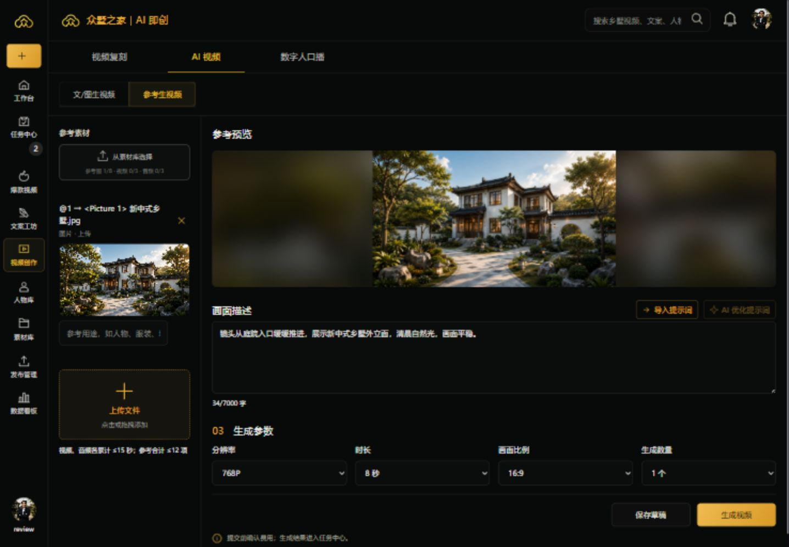

# CREATION-WORKFLOW-UI-20260916 · 创作布局与两步复刻流程

## 任务领取与证据（§14）

| 字段 | 记录 |
| --- | --- |
| 任务/工作包 | CREATION-WORKFLOW-UI-20260916，用户确认效果图后的实际页面实现 |
| Owner / Reviewer | Codex，会话 01a0aa65；执行者自检，独立 PR 评审待完成 |
| 分支 / 基线 SHA | feat/creation-workflow-ui-20260916 / ba616f46（已合并 PR #125） |
| 上游规格段落 | 本会话确认布局；文案单框覆盖 V4、首帧与双素材交接 V3；最新补充：参考生成参数横向四选项、移除面包屑 |
| 改动文件 | StudioWorkspace、CreationNavigation、CreationPages、ReplicaPreparation、PromptEditor、FirstFrameSelection、草稿状态、样式与测试；first_frame_routes / first_frames / image_tasks、API 类型与相关测试 |
| 失败测试或回归锁定 | 三导航测试先红；单框改写/迟到响应/新提示词失效测试先红；替换场景提示词与非场景形象拒绝测试先红；移除已废弃的准备页直接付费测试，替换为准备页禁止报价/建批及交接门禁 |
| 实现结果 | 见下方功能说明；实际业务代码，不以设计图冒充实现 |
| 验证命令与通过数 | 见下方完整运行及环境修复后补验记录 |
| 证据层级 | AUTOMATED_VERIFIED（本地）；远程三门禁与独立评审待完成 |
| 安全与可观测性 | 沿用权限、供应商任务持久化、素材归属与幂等校验；准备阶段无视频付费入口；模式切换不得绕过准备交接 |
| 迁移与回滚 | 无数据库迁移；replace_scene 默认 false，兼容旧任务；可整体回滚本 PR |
| 外部授权记录 | 用户明确答复“一起修改实际页面”；未授权且未执行真实付费调用、公网发布或合并 |
| 未测试项 | 正式供应商输出质量、生产链路、签名安装包现场验收；浏览器使用明确的 DEV 审核示例 |
| Lore 提交 SHA | 实现提交 ed23f997；证据收尾以本 PR 的提交列表为准 |

## 功能与边界

1. 顶层合并为“视频复刻 / AI 视频 / 数字人口播”，保留原路由兼容；原人物置换成为视频复刻的第二步。去除创作面包屑和重复的大标题。
2. AI 视频仍只有“文/图生视频 / 参考生视频”。左侧素材、右侧预览，提示词与参数在预览下方；两种模式均使用分辨率、时长、画幅、数量四个下拉框。窄屏改为两列参数及纵向区域。
3. 导入提示词与 AI 优化提示词并排；大加号上传区域支持单文件拖入，沿用文件类型、时长、只读、并发与旧草稿回填隔离。
4. 视频复刻第一步：提取口播、单框直接编辑或 AI 覆盖改写、撤销、保留可编辑拆解依据，再生成独立的新提示词。口播/拆解修改后标记新提示词待更新。迟到请求不能覆盖已编辑内容或另一个项目。
5. 第二步：原视频首帧、人物与形象选择、候选首帧生成/明确采用。只有最新提示词和采用首帧都就绪才交接到 AI 视频。顶部跳转到生成页也不能绕过未完成的准备状态。
6. 场景设置支持保留原背景，或使用所选场景形象的背景。替换背景只接受已有 SCENE_LOOK 形象，服务端模板不会同时要求保留原背景；该选择进入持久任务参数、幂等冲突检查及版本记录。既有场景形象链路使用人工对照确认，并明确要求检查人物、目标背景、姿态和道具一致性；不宣称自动语义或视觉质量已通过。
7. 不更改数字人口播业务；不调用真实供应商验证。视频时长/报价确认仍由 AI 视频现有提交链路处理。

## 验证记录

- 独立 worktree、共享 claim、锁定工作树；未修改 main 或其他任务的成果。
- Linux 完整 `npm run check`：复用现有质量镜像，测试容器 `creation-ui-quality`，独立 PostgreSQL `creation-ui-pg`；均以 `--rm` 启动，未使用共享业务 PG。运行日志在宿主 `outputs/creation-ui-gate/quality.log`。
- 已通过完整前端：106 文件 / 1621 项；TypeScript、Biome、secret、E2E lint、Rust fmt/check、Ruff/format、mypy（155 文件）。
- 最终前端补充回归：4 文件 / 241 项通过（准备交接拦截、拖放与清空后重新编辑）；未因纯样式调整重复后端全量。
- 后端场景模板专项：48 项通过。PG 场景参数冻结与幂等用例纳入完整后端门禁。
- 后端完整运行：2432 passed / 1 skipped / 1 failed，耗时 1505 秒。唯一失败为 `test_drill_script_is_present_and_executable`：Windows 源码打包未保留 Git 已记录的 100755 权限。仅在临时 Linux 副本恢复可执行位，未修改仓库脚本；对该项单独复验 1 passed。完整命令原始退出码为 1，不将其写为一次全绿；环境修复后没有未解决失败。
- 最终差异同步后，Linux secret / Biome / TypeScript 检查通过；Biome 保留 3 条既有样式优先级警告。口播独立提交不受复刻准备状态影响、历史首帧场景恢复均包含在最终 241 项回归中。
- `creation-ui-quality` 自动退出并删除；`creation-ui-pg` 已停止并自动删除，记录的匿名卷已确认不存在。未新建镜像；宿主临时源码归档已删除，保留测试日志与截图。
- 浏览器检查：1440×1000 桌面，两种模式切换和参数保留；390×844 手机，四参数按两列排列，页面宽度无横向溢出。截图来自 DEV 审核数据，不代表真实生成结果。

## 自检关注点

- 原始拆解与最终生成提示词分开保存；历史恢复不会将已生成的新稿替换回原拆解。
- 改写覆盖有版本/项目/登录会话隔离；撤销只作用于仍为该次结果的文案。
- 草稿切换清除旧准备状态；用户编辑口播或拆解会重新要求交接。
- 场景或画幅变化取消已采用首帧，旧候选不能直接作为新设置的结果。
- 场景替换默认关闭，不改变旧请求哈希；同一幂等键切换场景模式会被拒绝。
- 不把真实付费/生产或独立评审的未验证状态写为通过。
