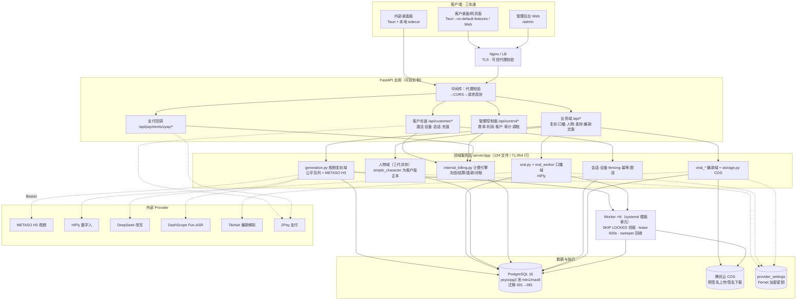
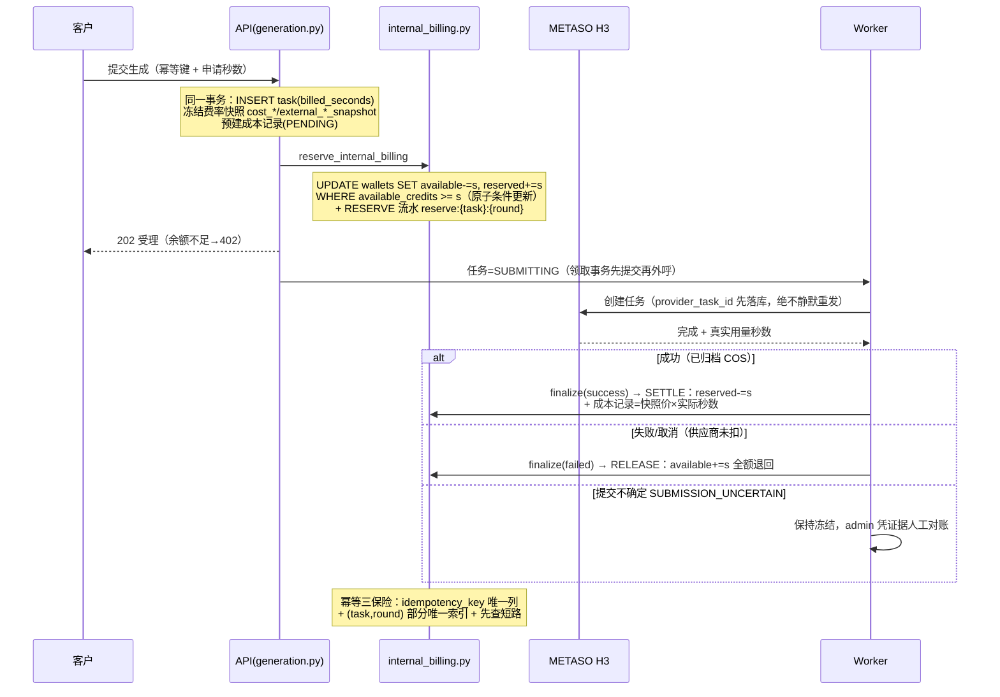

# 全栈技术架构与计价体系深度分析报告

> 版本：V1（2026-09-10）
> 方法：五路并行源码探查（后端架构/计费链路/并发控制/前端模块/冗余与追溯），关键结论均经人工复核源码并标注 `文件:行号` 证据；任务进度以账本 `docs/客户版任务清单-V3.md` 为准。
> 配套文档：`docs/前后端功能契约核查报告-2026-09-10.md`（接口契约）、`docs/客户视角主界面业务模块完成度分析-2026-09-10.md`（客户视角完成度）。

---

## 目录

1. [总体结论](#一总体结论)
2. [技术架构与架构图](#二技术架构与架构图)
3. [后端模块组成与开发进度](#三后端模块组成与开发进度)
4. [前端模块组成与开发进度](#四前端模块组成与开发进度)
5. [数据库连接情况](#五数据库连接情况)
6. [并发控制体系](#六并发控制体系)
7. [用户激活体系](#七用户激活体系)
8. [支付体系](#八支付体系)
9. [计价与扣费深度分析（核心）](#九计价与扣费深度分析核心)
10. [记录与可追溯性](#十记录与可追溯性)
11. [代码冗余与优化方案](#十一代码冗余与优化方案)
12. [优化方案汇总与排期建议](#十二优化方案汇总与排期建议)

---

## 一、总体结论

**架构与健康度**：项目是一个双车道（内部 SQLite 单机版 / 客户版 PostgreSQL 多实例）的 FastAPI + React/Tauri 全栈单体，分层意图清晰（routes → domain/service → db），并发控制完全建立在 PostgreSQL 原生能力上（行锁、SKIP LOCKED、唯一约束、触发器、advisory lock），红线禁用 Redis/消息队列。当前最新合并线 **client 1264 + server 2134 测试全绿**，Alembic 迁移链 79 个文件、head=`081_oral_unit_price`。

**进度**：客户版 V3 任务 T01–T39（激活码、两设备单在线、公平队列、计费、部署物、可观测、备份恢复、故障演练）全部达到 `AUTOMATED_VERIFIED`；剩余 57 项收敛任务（CW 系列）在排程。**全链路尚无任何 `STAGING_VERIFIED` / `PRODUCTION_GO`**：真实 ZPay 支付、真实 Provider 付费、生产迁移与发布属 T40，等待人工授权。

**计价体系现状（本次核心）**：已有"成本+售价"双轨费率表、原子钱包冻结/结算/退款、幂等账本、按日利润报表，**骨架是好的**；但距"所有 API 计价后台可设置、每接口成本、每次调用扣费、每次收益、日/周/月收益"的目标有 **四类明确缺口**：

1. **覆盖缺口**——图片类生成（首帧/人物图/场景图）、文案改写、ASR、爆款解析等 Provider 调用只记成本**不扣用户钱包**（有成本无收入）；
2. **维度缺口**——费率表无 Provider 维度（换/加上游不能差异化定价），无"接口→科目"的显式绑定（科目隐含在代码里）；
3. **粒度缺口**——收益报表只有"日"粒度，无周/月聚合；口播收入、调账、每客户售价差异均未进利润报表；
4. **单笔收益缺口**——单次调用的"扣费-成本=收益"没有落库字段，只能事后用两张表拼。

第九章给出逐条对齐方案（统一计价目录表 + 接口绑定 + 周月聚合 + 单笔收益落库）。

**冗余**：主要冗余不在"重复实现"而在"三代并存"——人物域 15 个文件三代并存、6 个任务族各抄一套租约样板、前端两代 UI 并存；另有死代码 3 处、git 里误 track 的审核包 PNG/dist 等 150+ 个交付产物文件。处理方案见第十一、十二章，按 P0/P1/P2 分级。

---

## 二、技术架构与架构图

### 2.1 分层总览（ASCII）

```
┌─────────────────────────── 客户端（三车道,同一代码库 client/）────────────────────────────┐
│ 内部桌面版(Tauri+本地sidecar)   客户桌面/网页版(Tauri --no-default-features / Web)   管理后台(/admin) │
│ com.internal.video-replica      com.xiangshu.video-replica.customer      HttpOnly Cookie+CSRF      │
└──────────────┬────────────────────────┬──────────────────────────────┬─────────────────┘
               └──────────── 127.0.0.1:8000 ──────────┴────── Nginx/LB(TLS,可信代理校验) ──┘
┌────────────────────────────── FastAPI 应用（可双 API 实例）─────────────────────────────┐
│ 中间件: 代理校验(main.py:177) → CORS(main.py:298) → 请求观测 X-Request-Id(ops_metrics.py:474) │
│ 路由 37 个 include_router(main.py:325-361):                                              │
│   /api/customer/* 激活·设备·会话·充值   /api/* 复刻·口播·人物·素材·爆款·文案·发布·看板        │
│   /api/control/* 费率·利润·客户·审计·调账   /api/payments/zpay/* 支付回调                     │
│   /health /live /ready /metrics(Bearer)                                                  │
├──────────────────────────── 领域服务层（server/app 104文件 71,954行）────────────────────┤
│ generation.py(7191行,视频复刻+公平队列+H3)  oral.py(口播)  simple_character.py(人物三代正本)  │
│ internal_billing.py(计费引擎)  customer_session/device_service+fencing+幂等+限流              │
│ viral_*(爆款)  storage.py(COS)  settings.py(Fernet密钥)  script_rewrite/asr/viral_tikhub    │
├──────────────────────────────── 数据与执行层 ────────────────────────────────────────────┤
│ db_portable.py(PG正典SQL门面,105处import) → db_pg.py(psycopg3池 min1/max8) → PostgreSQL 16   │
│                      └→ translate_to_sqlite(fail-closed) → SQLite(内部车道遗留)              │
│ Worker 进程×N(generation_worker 含 oral claim)：SKIP LOCKED 领取·lease 600s·sweeper 回收      │
│ 腾讯云 COS(预签名上传/签名下载)   Alembic 迁移 001→081                                        │
└──────────────────────────────────────────────────────────────────────────────────────┘
外部 Provider：METASO(H3视频) · HiFly(数字人) · DeepSeek(改写) · DashScope(Fun-ASR) · TikHub(爆款) · ZPay(支付)
```

### 2.2 系统架构图（Mermaid）



### 2.3 一次扣费的资金流转（Mermaid 时序）



---

## 三、后端模块组成与开发进度

### 3.1 模块组成（server/app，104 个 .py，71,954 行）

| 域 | 核心文件（行数） | 职责 |
|---|---|---|
| 应用装配 | `main.py`（VideoReplicaAPI 子类） | 37 个路由器、代理校验/CORS/观测中间件、生产安全启动门、`/health /live /ready /metrics` |
| 视频复刻 | `generation.py`(7191)、`generation_worker.py`(1762)、`generation_routes.py` | 拆解→首帧→Prompt→批次→H3 生成→COS 归档全链、公平队列、lease/sweeper |
| 数字人口播 | `oral.py`(1407)、`oral_worker.py`(1015)、`oral_routes.py` | 文本/音频驱动口播、HiFly 任务链、按条计费 |
| 人物域（三代并存） | `simple_character.py`(3318)+routes(1087)；`character_identity.py`(1905)+image_generation(1353)+asset_review(742)；`characters.py`(762, legacy) | 客户版正本=三代 simple_character；二代身份/七视图/审核被复用；一代 legacy 待封门 |
| 计费钱包 | `internal_billing.py`(828)、`wallet_routes.py`(121)、`recharge_routes.py`(1051)、`payment_routes.py`、`zpay.py`、`zpay_payments.py`、`operation_costs.py`、`admin_profit_routes.py`、`admin_rate_routes.py` | 冻结/结算/退款/对账、充值支付、成本记录、利润报表、费率后台 |
| 激活与设备 | `activation_code_service.py`(~800)+routes、`customer_device_service.py`、`customer_session_service.py`、`customer_fence.py`、`customer_idempotency.py` | 激活码全生命周期、两设备槽、单在线会话、fencing、幂等信封 |
| 爆款视频 | `viral_*.py` ×10 | TikHub 双平台榜单/导入/刷新/统计/媒体落 COS |
| 文案/音频 | `script_rewrite.py`(DeepSeek)、`asr.py`(Fun-ASR)、`script_from_audio.py` | 文案工坊链路 |
| 管理控制面 | `admin_*_routes.py` ×10、`control_routes.py`(1714)、`admin_write_contract.py`、`permissions.py` | 客户/资金/经营/审计/费率/运行时，管理写契约（幂等键+confirm+reason） |
| 可观测与备份 | `ops_metrics.py`、`backup.py`、`bootstrap.py` | Prometheus 指标、请求观测、PITR 备份工具、启动引导 |

### 3.2 开发进度（口径：任务账本 §18 + 证据账本）

- **已完成（`AUTOMATED_VERIFIED`）**：T01–T39 全链——M0/M1 基建、T10–T15 激活码目录/导出/兑换/幂等/限流、T16–T18 设备两槽/配对/管理、T19–T21 会话/fencing/PG-canonical SQL、T22–T23 计费悬挂对账/原子调账、T25 公平队列、T28–T33 前端与管理端、T35–T39 安全/部署/可观测/备份/演练。最新合并线 client 1264 + server 2134 全绿（合并提交 b45de8f）。
- **进行中**：57 项 CW 收敛任务（V3 清单），PG 全面统一增量（SQLite 仅存内部车道与归档工具）。
- **明确未做/待授权**：真实 ZPay 付费链路、真实 Provider 付费探针、生产 COS 变更、staging 部署与灰度（T40，需人工授权）；证据层级整体停在 `AUTOMATED_VERIFIED`，无 `STAGING_VERIFIED`。
- **业务模块客户可用度**：复刻/置换/爆款/文案/人物库/素材库 = L3（功能可用，真实付费链路待开闸）；视频生成/口播/数据看板 = L2；发布管理 = L1（详见配套完成度报告）。

---

## 四、前端模块组成与开发进度

### 4.1 三车道结构

- 入口分流 `client/src/RootApp.tsx:22-47`：`/review/v1.4`（DEV 审核区）｜Tauri 或 `/customer` → **客户版**（七屏状态机：checking/activation/login/binding-conflict/workspace/session-expired/replaced/revoked，凭据走 Tauri DPAPI 桥不入 localStorage）｜`/admin` → **管理后台**（7 Tab：总览/经营分析/资金/客户/生成记录/审计中心/系统设置）｜其余 → **内部版**。
- studio 壳 `StudioWorkspace.tsx`(2605 行) 持有单根 Context + hash 路由，页面分发 `:2033-2077`；业务页分四个创作通道（复刻/置换/视频生成/口播）+ 爆款/文案/人物库/素材库/发布/看板。

### 4.2 API 层与类型契约

| 文件 | 角色 | 契约保护 |
|---|---|---|
| `generated/api.ts`(17,560 行) | openapi-typescript 自动生成正本（`npm run generate:api`） | — |
| `api.ts`(5,740 行) | 唯一 fetch 封装 + 全部业务端点（内部/客户/生成） | 类型大量引用 `components["schemas"]` 别名（63 处），`tsc -b` 作 schema-drift 门禁 |
| `api.admin.ts`(1,648 行) | 管理控制面适配器（Cookie+CSRF+写契约头） | **基本手写类型，仅 2 处用 generated——最大漂移风险点** |

进度：前后端契约核查（同日报告）结论——前端调用 198 端点 0 真缺口、契约漂移 1 处已修复、generated 已同步。

### 4.3 架构特征

- 无全局 store（无 Redux/Zustand/react-query）：页面 useState+useCallback，客户车道 useReducer 状态机。
- 无 SSE/WebSocket：进度全部轮询（任务 2s、壳 20s、管理端自动刷新）。
- Tauri 客户版 `--no-default-features` 编译（代码层不可能拉起本地业务源）、NSIS 打包、**无自动更新插件**。
- 测试：78 个 Vitest 文件（与源文件约 1:1）+ Playwright e2e（customer/gate1）+ `npm run check` 全链门禁。

---

## 五、数据库连接情况

### 5.1 三层分工（非重复）

| 层 | 文件 | 职责 |
|---|---|---|
| PG 运行时 | `db_pg.py`(352 行) | DSN 解析（`VIDEO_REPLICA_DATABASE_URL` 优先）、**进程级 psycopg3 连接池**（`min=1/max=8` 默认，env 可调硬上限 64；`max_lifetime=3600s/max_idle=600s/取连接超时 30s/健康检查 check_connection`）、`pg_transaction()` 手动事务边界（可升 SERIALIZABLE）、客户生产 fail-closed 校验（:157-192：非 PG 拒启、残留 DB_PATH 拒启、sslmode 必须 require+） |
| 可移植门面 | `db_portable.py`(439 行, **105 处 import，业务正本**) | 业务层统一写 PG 方言（`%s`/`RETURNING`/`ON CONFLICT`/`FOR UPDATE SKIP LOCKED`），SQLite 车道经 `translate_to_sqlite` fail-closed 翻译（不认识的 SQL 直接抛错，绝不静默） |
| 遗留车道 | `db.py`(52 行) | SQLite+Alembic 运行时（每次新建连接、WAL、BEGIN IMMEDIATE）——按 2026-09-08 PG 统一决议属**待退役** |

### 5.2 关键参数与卫生

- 连接级 `statement_timeout=300s`、`idle_in_transaction_session_timeout=60s`（db_pg.py:55-60）；关闭钩子 `close_pg_pool()`。
- Alembic：`server/migrations/versions/` 79 个文件、编号 001–081（030/060 空号，041 即原"030_user_fair_queue"改名），head=`081_oral_unit_price`；`env.py` 读同一 DSN 环境变量。
- 时钟纪律：会话/租约/限流一律取事务内 PG `now()/clock_timestamp()`，不信任应用机时钟（SES-01）。
- SQLite 残留调用点：内部车道 4 处路由直连、worker 双 lane、`backup.py`、bootstrap——均在客户生产被启动门拦截。

**评价**：连接管理是本仓库做得最扎实的部分（池化+超时+健康检查+fail-closed+SQL 方言单向翻译）。主要风险是 SQLite 车道与 PG 车道长期并存带来的双真源心智负担，需按 CW 系列尽快收口。

---

## 六、并发控制体系

六层机制，全部基于 PostgreSQL 原生能力，多实例安全：

| # | 机制 | 实现 | 关键证据 |
|---|---|---|---|
| 1 | **两设备单在线** | `customer_session_state` 每用户一行活会话（PK=user_id）+ `session_epoch` 单调触发器 + 90s lease/30s 心跳；互踢**从不静默**——普通登录撞活 lease 返回 409 `OTHER_DEVICE_ONLINE`（附掩码设备名），只有用户显式 `/switch` 才原子切换（SWITCH 事件+epoch+1+新 token 同事务，旧 token 全实例即刻失效） | customer_session_service.py:206-395、029 迁移：61-70 |
| 2 | **Fencing（防旧会话写覆盖）** | 早快照只做 401 快速门；`fenced_pg_transaction` 在业务事务**行锁内**重验五元组 `(user,device,session,epoch,lease)`，任何不符 → 401+审计；lease 判定用锁后 `clock_timestamp()` | customer_fence.py:181-245、customer_auth.py:101-189 |
| 3 | **幂等** | 账本级 `wallet_transactions.idempotency_key` 唯一列；请求级 T14 信封引擎（域分隔 HMAC 摘要+request_hash 冲突 409+AES-GCM 密封重放+24h 恢复窗口）；管理写契约幂等 `(actor,route,key_digest)` | 029:239-244、customer_idempotency.py、admin_write_contract.py:145 |
| 4 | **用户公平队列** | 每用户并发=1（`running_tasks_count` CHECK 0..1），跨用户按 `last_dispatched_at` 升序轮转；worker 领取 = 锁序「容量行→游标→任务」+ `FOR UPDATE SKIP LOCKED`，最多让位 8 轮；全局容量 `max_concurrent_h3_tasks` 默认 2；开关 `fair_queue_enabled` 默认关 | generation.py:4492-4727、041 迁移 |
| 5 | **限流** | PG 表固定窗口原子 UPSERT（单条 SQL 完成"新建/过期重启/累加"），多实例共享预算；9 个维度（激活 IP/码、登录 IP/账号、导出等）+ 反枚举固定 PBKDF2 时延抹平 + 失败审计 advisory lock 去重 | security_rate_limit.py:259-325、032 迁移 |
| 6 | **Worker 租约与回收** | 单进程串行循环 + DB 租约（600s 主租约/120s 步进/CAS finalize）；过期 sweeper 四分支处理（可恢复续跑/归档退避/隔离 SUBMISSION_UNCERTAIN）；**先提交 SUBMITTING 再外呼付费 Provider**，崩溃不重发不漏账 | generation_worker.py:1710-1717、generation.py:5402-5520 |

**多实例评估**：任务消费（SKIP LOCKED）、限流预算、会话裁决、bootstrap 串行化（advisory lock）均多实例安全；水平扩展=多起 worker 进程（systemd 模板单元 `@.service`）。**仍单实例假设的**：单 worker 进程内无线程池（吞吐上限=进程串行+容量槽 2）；oral 与 generation 跨类型只共享"每用户 1+全局容量"安全门，完整跨类型轮转是文档化的后续工作；SQLite 车道天然单实例。

---

## 七、用户激活体系

- **目录**：批次（冻结面值/单价/条数快照，创建需 env `BATCH_CREATION_ENV=true` 显式解锁——PRICE-01 冻结门）→ 码（CSPRNG `XS04-xxxx×4` 140 位熵，仅存 HMAC digest+masked，六态状态机 GENERATED/ISSUED/ACTIVE/SUSPENDED/REVOKED/EXPIRED）→ 一次性 AES-256-GCM 导出（下载一次性+过期清扫）→ append-only 事件表。
- **兑换**（`POST /api/customer/activate`，activation_code_routes.py:548-770）：`SELECT ... FOR UPDATE OF c` 锁码行（100 并发单赢家）→ 非 ISSUED 统一 503 反枚举 → 批次过期/设备指纹防一机二码 → 同事务：建用户+建钱包（直接置 `credits_snapshot` 初始秒数）+绑设备+造 PAID 订单（provider=`activation_code`）+CHARGE 流水（幂等键）+FREE_GRANT 调账行（license-only 批次面值 0+初始赠送，即"首充赠送"的等价物）。
- **并发安全**：码行锁+批次 `FOR UPDATE` 串行化 check-then-insert 防超发（activation_code_service.py:419-435）+限流双维度+设备槽部分唯一索引（仅 BOUND 行约束）。
- **进度**：T10–T18 全部 `AUTOMATED_VERIFIED`（含 100 并发兑换出口门测试）。

## 八、支付体系

- **下单**：客户车道 `POST /api/customer/recharge-orders`（幂等信封防重复下单；金额校验 min/step/整除/int4 上界；订单号冲突重试 3 次；插单+建 ZPay 表单同事务）→ 二维码 `payment-code`（mapi.php，商户密钥不出服务端）。
- **回调**：`GET /api/payments/zpay/notify` MD5 验签（`hmac.compare_digest`，协议要求）+ pid/trade_status/money/channel 全校验；`confirm_recharge_payment`（zpay_payments.py:66-218）在**同一事务**内：订单状态 CAS（`WHERE status IN ('PENDING','CLOSED')` 行数=1）→ CHARGE 流水（幂等键 `zpay:charge:{id}`，与部分唯一索引双保险）→ 钱包加币（带 int4 溢出防护）。**到账与订单翻转原子，重放幂等**。
- **兜底**：admin 手动同步 `POST /api/control/recharge-orders/{no}/sync` 主动查 ZPay 后走同一 confirm 函数+审计；对账接口输出 PAID 无 CHARGE/CHARGE 无 PAID/账本差额。
- **缺口**：网关 URL/MD5/alipay|wxpay 白名单硬编码（zpay.py:17-26），**无沙箱模式**——真实付费链路属 T40 待授权；`pricing_scope` 支持每客户售价（044 迁移）。

---

## 九、计价与扣费深度分析（核心）

### 9.1 现有计价模型

**四张计价配置表 + 一个运行时开关组：**

| 存储 | 内容 | 维度 | 后台可改 |
|---|---|---|---|
| `operation_cost_rates`（056） | 上游**成本价**+对外**售价**档 | 科目(PK)×kind('upstream_cost'/'external_price')×unit(second/image/call)×resolution | ✅ `GET/PUT /api/control/settings/rates`（admin_rate_routes.py:161-252，逐科目审计+上界 1 亿分防手滑） |
| `runtime_settings`（022/081） | 内部基础价、充值阶梯(min/step)、口播单价 | 全局单行 | ✅ `PATCH /api/control/settings/billing`（control_routes.py:1308-1323） |
| `customer_unit_prices`（044） | 每客户售价覆盖 | user_id | ✅ `GET/PUT /api/control/customers/{id}/unit-price` |
| `daily_external_prices`（058） | 每日对外售价（报表口径） | 日期×分辨率 | ✅ `PUT /api/control/profit/daily-price` |

**9 个科目白名单**（admin_rate_routes.py:48-60，与 056 种子一致）：成本侧 7 个——`video_generation_768p/2k`（9/15 分每秒）、`video_analysis_768p/2k`、`first_frame_image`、`character_sheet_image`、`context_ir`（各 5 分）；售价侧仅 2 个——`external_price_768p/2k`（12/20 分每秒）。**成本与售价分离**：任务创建时冻结快照（`generation_tasks.cost_*_snapshot` 列），改价不影响在途任务。

### 9.2 扣费链路（已亲自复核）

- **视频**：预估=冻结=申请秒数。`reserve_internal_billing`（internal_billing.py:222-260）：`UPDATE wallets SET available-=s, reserved+=s WHERE user_id=%s AND available_credits >= %s`，rowcount≠1 即 402 余额不足——**无 SELECT FOR UPDATE、无版本号，靠原子条件更新+同事务提交**，PG READ COMMITTED 下安全；结算终态靠 `(task_id,billing_round)` 部分唯一索引+先查短路双保险。成功 SETTLE（预留消耗），失败/取消 RELEASE（全额退回），供应商未调用成本记 0。
- **口播**：创建同事务预留 1 条（单价 `oral_unit_price_fen` 可后台改，**"每任务 1 条"硬编码** internal_billing.py:294-303）；终态 SETTLE/RELEASE 按 `provider_charge_state` 裁决；有 admin 凭证据对账通道（billing-reconcile）。
- **图片/改写/ASR/爆款**：**不扣钱包**（image_tasks.py 零 wallet 引用），只写成本记录——目前对客户免费。
- **异常路径**：BILL-03（悬挂 RESERVE）检测器+对账器已实现，但只有手动脚本 `server/scripts/reconcile_dangling_billing_reservations.py`，**未接定时调度**；`SUBMISSION_UNCERTAIN` 保持冻结等人工，绝不静默扣。

### 9.3 成本与收益现状

- 成本：`operation_cost_records` 每次 Provider 调用一行（唯一约束 source+subject），提交前 PENDING 快照费率、完成后 `cost_fen=快照价×真实用量`，拿不到真实用量置 UNKNOWN **绝不冒估**——成本数据可信度高。
- 收益：仅"日"粒度（admin_profit_routes.py:274-404，Asia/Shanghai 日界）＝当日售价(carry-forward)×当日 SETTLE 秒数；成本 UNKNOWN 时毛利显式置空（不藏问题）；CSV 导出。仪表盘有今日毛利+7 日趋势（趋势只有量与成本，**无收入序列**）。

### 9.4 与目标的差距（逐条）

用户目标：**所有 API 计价后台可设置；每接口成本；每次调用扣费；每次收益；日/周/月收益。**

| # | 缺口 | 现状证据 | 影响 |
|---|---|---|---|
| G1 | **图片类生成对客户免费**：首帧/人物图/场景图只记成本不扣费 | image_tasks.py 零 wallet 引用；character_image_generation.py:597-606 仅成本 | 成本持续发生、收入为零；无开关 |
| G2 | **售价科目只有 2 个（768P/2K 视频）**：解析/首帧/人物图/context_ir 费率可改但只影响成本核算，无对外售价 | KNOWN_RATE_SUBJECTS 白名单；056 种子 | "每个接口都能定价"不成立 |
| G3 | **费率无 Provider 维度**：`operation_cost_rates` 无 provider 列，快照只按分辨率冻结 | operation_costs.py:26-63 | 换/加上游（metaso→别家）无法差异化定价 |
| G4 | **无"接口→计价科目"显式绑定**：科目隐含在代码各调用点，新接口接线靠改代码 | 快照函数按分辨率硬映射 | 后台改价 ≠ 接口可定价 |
| G5 | **口播"每任务 1 条"硬编码**，无按时长档位 | internal_billing.py:294-303 | 口播单价可改但计费粒度不可改 |
| G6 | **单次调用收益无落库字段**：利润=报表时点用两张表拼，任务行只有成本快照列无 `sale_amount_fen/profit_fen` | admin_profit_routes.py:274-404 | 无法按任务/接口/客户下钻单笔收益 |
| G7 | **报表只有日粒度**：无周/月聚合接口与页面；7 日趋势无收入序列 | 同上 | "每周/月收益"不满足 |
| G8 | **收入口径不全**：口播 SETTLE、调账、每客户售价差异不进利润报表；收入是"标准收入"非充值实收（实收只在 dashboard 单列） | profit_overview SQL 只 JOIN generation_tasks | 周/月收益会漏口播与调账 |
| G9 | 对账（BILL-03）无自动调度；成本明细接口截断 1000 条无翻页 | internal_billing.py:786-828、admin_profit_routes.py:472-482 | 长期运营有悬挂资金风险 |
| G10 | ZPay 网关/沙箱、充值阶梯规则、验收限购均为代码硬约束 | zpay.py:17-26、settings.py:461-468 | 可配置性上限 |

### 9.5 优化方案：统一计价目录（建议任务号 BIZ-RATE-01/02/03）

**设计原则**：沿用已验证的"快照冻结+原子钱包+幂等账本"骨架，只做**模型扩展与接线补全**，不推翻。

**① 新表 `api_price_catalog`（迁移 082+）——"所有 API 一行一价"**

```sql
CREATE TABLE api_price_catalog (
    id            bigserial PRIMARY KEY,
    api_code      text NOT NULL,        -- 接口代码：video_generation / video_analysis / first_frame_image /
                                          -- character_sheet_image / character_scene_look / context_ir / oral_task /
                                          -- oral_second / script_rewrite / asr_minute / viral_import / ...
    provider      text NOT NULL DEFAULT '*',  -- 上游维度：metaso/hifly/deepseek/dashscope/tikhub/'*'(通用)
    kind          text NOT NULL,        -- 'upstream_cost' | 'external_price'
    unit          text NOT NULL,        -- 'second' | 'image' | 'call' | 'minute' | 'character'
    resolution    text,                 -- 可空：768P/2K
    unit_price_fen bigint NOT NULL CHECK (unit_price_fen >= 0 AND unit_price_fen <= 100000000),
    enabled       boolean NOT NULL DEFAULT true,
    updated_by_user_id bigint REFERENCES users,
    updated_at    timestamptz NOT NULL DEFAULT now(),
    UNIQUE (api_code, provider, kind, resolution)
);
```

- 把现有 9 科目**迁移**进目录（056 数据平移），此后 `admin_rate_routes` 的 PUT 改写本表；`KNOWN_RATE_SUBJECTS` 白名单改为查表校验 + 允许 admin 新增行（新接口上线只需插入目录行，不改代码）。
- 后台 `RatesManager` 页按 `api_code` 分组展示成本列/售价列/单位/Provider，一行一编辑。

**② 计费接线补全——"每次用户调用都扣费"**

- 抽公共入口 `price_for(api_code, resolution, provider) -> (cost_price, sale_price)`（含任务行快照列复用现模式）。
- 图片类：在 image/首帧/人物图任务创建事务里加 reserve（unit=image，用量=张数）；新增 `runtime_settings.billing_exemptions`（jsonb，科目级免费开关）作为灰度手段——先以"售价=0"上线观察，再逐科目开闸。
- 口播：预留条数改为按 `estimated_seconds`×`oral_second` 单价（保留现"每条"档位为默认值）；文案改写/ASR/爆款导入按 `call/minute` 科目接线（其成本记录已存在，只差售价与钱包侧）。
- **每笔落收益**：结算事务内在 `operation_cost_records` 增加 `sale_amount_fen / profit_fen` 两列（或建统一视图 `v_billing_per_call` JOIN SETTLE 流水与成本记录，二者取列方案更稳——SETTLE 流水已有 task/round 可精确关联）。报表与任务详情页即可下钻"本笔扣费 X 分 − 成本 Y 分 = 收益 Z 分"。

**③ 日/周/月收益**

- `GET /api/control/profit/overview?granularity=day|week|month`：把现按日 GROUP BY 改为 `date_trunc(granularity, ts AT TIME ZONE 'Asia/Shanghai')`，一段 SQL 三种粒度；收入源从"仅 generation SETTLE"扩为 `generation SETTLE ∪ oral SETTLE ∪ 调账(标记列) `。
- 前端 `ProfitOverview` 加粒度切换（日/周/月）与"实收 vs 标准收入"对照列（实收=`recharge_orders PAID SUM(amount_fen)`，差值=赠送/调账/售价差异，正是运营要看的对账数）。
- 仪表盘 7 日趋势补收入/毛利序列（现只有量与成本）。

**④ 运营兜底**

- BILL-03 对账脚本接 systemd timer（每日低峰跑 `--dry-run`，有差异才告警——T37 的探针已有"悬挂 reserve"告警名，直接挂上）。
- 成本明细接口加 `limit/offset` 翻页。

**工作量估计**：①+②约 2–3 个任务分支（迁移+服务+后台页+测试先行），③④各 1 个；全部落在既有审计/幂等/门禁框架内，无新依赖。

---

## 十、记录与可追溯性

**一次扣费/一次生成可否事后追查：能，且是本仓库强项。**

- **资金链**：`wallet_transactions` 五类流水（CHARGE/RESERVE/SETTLE/RELEASE/调账）全部带 task_id/oral_task_id/recharge_order_id + billing_round + 幂等键 + `ledger_sequence`（063 迁移用触发器锁钱包行取序号，账本严格有序且不可变）；终态与任务终态同事务。
- **任务链**：`generation_tasks` 持 provider 请求快照（`prompt_snapshot_json/provider_request_json`）、重试血缘列（017 迁移）、费率快照列、`provider_task_id` 先落库；`operation_cost_records` 每笔外呼一行。
- **操作链**：`audit_logs`（permissions.write_audit 统一入口，22 文件约 70 处，拒绝也留痕）+ 管理域事件表（调账/设备/激活码/交付）+ 会话事件 + fencing 证据表（042）+ 幂等信封（AES-GCM 封存可重放）。
- **请求链**：观测中间件每请求发 `X-Request-Id`+结构化日志（白名单 trace 字段：actor/task/order）；Prometheus 3 指标含 fencing 拒绝数；T37 异常探针覆盖双在线/重复入账/重复 trade_no/PAID 无 CHARGE/账本差额/队列饥饿/悬挂 reserve。
- **缺口**：无独立"任务事件表"（过程追溯靠列+外键拼装，够用但查询成本高）；悬挂 RESERVE 告警有探针、修复靠手动脚本（同 G9）。

---

## 十一、代码冗余与优化方案

### 11.1 真冗余（应处理）

| 项 | 位置 | 重叠程度 | 建议 |
|---|---|---|---|
| 人物域三代并存 | `characters.py`(一代 legacy 762 行) vs `character_identity*`(二代) vs `simple_character*`(三代正本 3318+1087 行)；三代各自写 `person_identities` 等表；`parse_datetime`×2、PNG 解码×4 且两份错误契约不同 | 高——全仓最大冗余 | 封门一代写路径（保留读兼容）→ 工具函数下沉 contracts/policy → 按既有"三波收敛"路线归档 |
| 死代码 ×3 | `models.py`(12 行, 0 引用)、`first_frames.py:1980` 孤儿包装、`analysis_routes.py:204-350` 不可达旧同步拆解路由(~136 行) | 确认死码 | 直接删（各带回归测试确认） |
| 样板复制 | `_http` 错误构造×8、`_time_text`×6（**仍在繁殖**：比 09-01 分析多 3 份）、分页两行样板×7、`_signed_url` 闭包同文件两份、provider 解密+Fake 兜底×4 | 中——单处小但面广 | 收敛为共享 helper（`server/app/_http_kit.py` 一类），一次 PR 完成 |
| 任务租约样板 | 6 个任务族各抄一套"回收+领取+attempt+1"（analysis/script_rewrite/source_frames/image/character_image/generation），oral_worker 又一套 | 中——每族 ~600 行级 | 抽"租约原语"公共库；新增任务类型不再抄 |
| worker 双 lane | `generation_worker.py` 内 SQLite 车道 + PG 车道两套编排 | 中 | SQLite 车道退役后删除（随 CW 系列） |
| 前端两代 UI | 顶层 `AnalysisWorkspace`(1632)/`CharacterLibrary`(1329) 内部版 UI 与 studio 页并存（数据层已共享 live.ts） | 中 | studio 为正本，逐步替换后归档 |
| api.ts 请求封装 ×9 | 高层 5 个 + 底层 4 个，`requestControl` 与 api.admin.ts 重复；错误文案映射 9 处 | 中 | 收敛为 2 个（内部/客户各一）+统一错误映射 |
| api.admin.ts 手写类型 | 仅 2 处用 generated 类型 | 中（漂移风险） | 类型全面切 `components["schemas"]` 别名 |

### 11.2 不是冗余（勿动）

`db.py/db_pg.py/db_portable.py` 是三层分工（正本=db_portable，105 处 import）；`internal_billing.py` 是唯一计费引擎正本（非遗留）；四套鉴权是演进层（control_auth 待内部版退役后删）；`analysis/media/media_tools/viral_media` 职责互异；审计写入已统一入口，收敛良好。

### 11.3 仓库卫生

- **git 里误 track 的交付产物**：4 个"前端页面V1.x-审核包"目录 143 个文件（90 张 PNG，存在同名重复）、根目录 5 张 `viral-*.png`、`dist/Video_Reverse_SkillS_V0.6.4-OneClick/`（先提交后加 ignore 仍被 track）——建议 `git rm --cached` + ignore 规则补齐（outputs/frontend-audit 的"只留正本 md/xlsx"模式值得推广）。
- `gate1_bootstrap.py/gate1_e2e.py` 是测试基建却在 `app/` 包内（会进打包）——移到 `scripts/`。
- docs/ 342 文件、outputs/ 337 文件的报告堆积：按 outputs/frontend-audit 模式定向 ignore，只留各系列正本。

---

## 十二、优化方案汇总与排期建议

| 优先级 | 事项 | 预期收益 | 量级 |
|---|---|---|---|
| **P0** | 计价目录表+接口绑定+图片/口播/改写计费接线（§9.5 ①②） | 补齐"每个接口可定价、每次调用有扣费有收益"，堵住图片类零收入漏点 | 2–3 任务 |
| **P0** | 利润报表日/周/月粒度+口播收入并入+实收对照（§9.5 ③）；BILL-03 接定时对账（§9.5 ④） | 满足周/月收益与资金安全 | 2 任务 |
| **P1** | 删 3 处死代码；样板 helper 收敛（_http/_time_text/分页/签名闭包） | 减 ~1500 行重复，防样板继续繁殖 | 1 任务 |
| **P1** | api.admin.ts 类型切 generated；请求封装 9→2；git rm --cached 审核 PNG/dist | 契约防漂移；仓库瘦身（几十 MB） | 1–2 任务 |
| **P2** | 人物域三代收敛（封门一代→工具下沉→归档） | 消除最大冗余源，统一人物数据真源 | 2–3 任务 |
| **P2** | 任务租约原语抽公共；generation.py(7191 行)按 domain/provider/queue/billing 拆分 | 新任务类型接入成本大降 | 3 任务 |
| **P2** | SQLite 车道退役后的清理包（db.py→迁移工具专用、control_auth/backup 归档、gate1_* 移出 app、worker 单 lane） | 消除双真源心智负担（依赖 CW 系列主体完成） | 1 任务 |
| **持续** | 前端两代 UI 替换、/api/control 45 个未接端点逐个决策接/删 | 与 CW 前端收敛线合并处理 | 随线 |

**不建议动**：钱包原子扣费模型（条件 UPDATE+部分唯一索引在 PG READ COMMITTED 下正确且有测试锁定）、公平队列锁序（有 ADR 与 10k 并发测试）、db 三层分工、审计统一入口——这些是已验证资产，重构应绕行而非翻新。

---

## 附：本报告证据方法

五路并行源码探查（后端架构 43 次工具调用 / 计费链路 69 次 / 并发控制 50 次 / 前端模块 27 次 / 冗余追溯 60 次），核心结论（9 科目白名单、原子扣费 SQL、利润聚合 SQL、任务账本进度）经本会话人工复核原文；所有 `文件:行号` 均可直接点击跳转核对。
