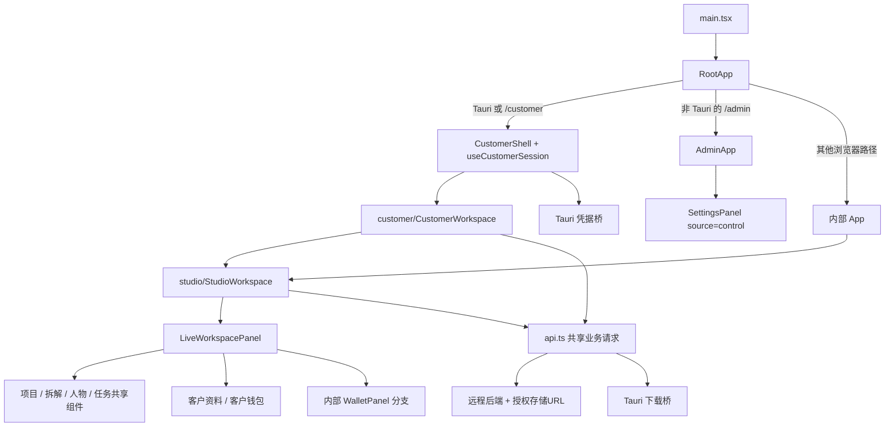

# 客户桌面前端与内部版边界源码审计

分析日期：2026-09-08。分析工作树：`乡墅爆款短视频复刻-客户版收敛分析`。源码基线：`bffc341`。

本附件只分析 `client/src`、`client/src-tauri` 及其直接构建入口；未修改应用代码、未运行付费接口、未构建或安装客户制品。结论的证据层级为 **CODE_PRESENT（源码和调用关系核验）**；引用测试文件表示已有测试位置，不能代替本轮通过记录或桌面实测。主报告核实的远端 `origin/main=2cacc92` 与此基线分叉，远端独有 2 个提交、本地独有 123 个提交；本地候选实现不能等同已经合入主线或已经上线的实现。

按 `andrej-karpathy-skills` 的原则，本方案优先保留已运行调用链，先消除双入口和错误依赖，再删除退出使用的代码，不重建整套桌面端，也不为了拆分引入新框架。

## 1. 结论

1. **客户云版已经是 Tauri 桌面前端连接远程服务的形态，不是只有浏览器页面。** 客户凭据通过原生安全存储持久化，下载也具有 Windows 原生保存与完成确认能力，应当保留 Tauri。
2. **两个版本共享大量业务页面和 API，不是删除某个目录就完成收敛。** 当前内部 `App` 和客户 `CustomerWorkspace` 都进入 `StudioWorkspace`；新工作台继续调用旧项目、拆解、人物和任务组件。`api.ts` 同时承载共享业务、内部身份、客户身份和一部分管理 API。
3. **主入口已经偏向客户版，但默认构建仍偏向本地版。** 所有 Tauri 环境都进客户登录，Cargo 默认仍编译本地 sidecar，默认配置仍打包启动脚本。客户覆盖配置关闭这些能力；必须把客户构建提升为唯一正式构建，而不是仅保留一个可选配置。
4. **客户工作区的钱包页面仍存在内部/客户分支接错。** 客户只传 `customerAccount`，钱包面板只看 `customerWallet`，导致“使用记录”进入内部钱包。当前生产客户响应裁剪内部定价字段，会触发前端“钱包定价配置不完整”；若只补字段，旧充值请求又会落到客户禁止使用的通用充值路由。
5. **管理端是客户产品的运营控制面，不属于应整体删除的内部本地版。** 激活码、客户、设备、会话、资金、费率、Provider 配置和审计均有管理页面。应使管理网页成为后端部署附属资源，与客户桌面制品隔离；后台仍属于同一个后端产品，不需要向客户再交付一个管理桌面。

## 2. 当前真实入口与依赖

| 代码事实 | 源码证据 | 收敛含义 |
|---|---|---|
| 唯一 Web 挂载入口创建 `RootApp` | [main.tsx:4](../../client/src/main.tsx#L4)、[main.tsx:12](../../client/src/main.tsx#L12) | 当前不是两个独立前端工程。 |
| `RootApp` 静态引入 `AdminApp` 和内部 `App` | [RootApp.tsx:2](../../client/src/RootApp.tsx#L2) | 客户入口不显示管理页，不等于客户构建图排除了管理代码。 |
| `isTauriRuntime()` 优先于 `/admin` 判断；任一 Tauri 窗口都进客户状态机 | [RootApp.tsx:33](../../client/src/RootApp.tsx#L33) | Tauri 的默认 `/` 已不能按旧描述当作内部登录入口。 |
| 浏览器 `/admin` 进 `AdminApp`，剩余路径回到内部 `App` | [RootApp.tsx:42](../../client/src/RootApp.tsx#L42) | 只替换桌面配置仍留下内部网页入口，应显式退休兜底。 |
| 内部 `App` 自动调用 `/api/auth/me`，允许输入内部令牌 | [App.tsx:55](../../client/src/App.tsx#L55)、[App.tsx:71](../../client/src/App.tsx#L71)、[App.tsx:116](../../client/src/App.tsx#L116) | 内部身份壳可以退出；不是所有 `App.tsx` 内容都能当场删除。 |
| 内部成功登录与客户成功登录都进入 `StudioWorkspace` | [App.tsx:134](../../client/src/App.tsx#L134)、[CustomerWorkspace.tsx:228](../../client/src/customer/CustomerWorkspace.tsx#L228) | 新工作台是共享业务资产。 |
| `StudioWorkspace` 和 `LiveWorkspacePanel` 的类型依赖旧 `WorkspaceShell` | [StudioWorkspace.tsx:9](../../client/src/studio/StudioWorkspace.tsx#L9)、[StudioWorkspace.tsx:91](../../client/src/studio/StudioWorkspace.tsx#L91)、[LiveWorkspacePanel.tsx:15](../../client/src/studio/LiveWorkspacePanel.tsx#L15) | 先将客户上下文类型从旧壳解耦，之后才可删旧壳。`import type` 本身不是运行时执行旧壳。 |
| 旧 `WorkspaceShell` 的生产渲染调用已退出，测试还会替换新工作台为它 | [App.test.tsx:11](../../client/src/App.test.tsx#L11)、[App.test.tsx:18](../../client/src/App.test.tsx#L18) | 旧壳测试绿灯不能证明新工作台同一条路径正常。 |

### 客户 JS 制品隔离

现有 `client/index.html → main.tsx → RootApp` 是同一个构建入口；`RootApp` 静态引用 `AdminApp`、`App`，管理页面进一步从 `AdminApp` 静态导入。当前 `vite.config.ts` 没有客户与管理的独立 HTML 构建入口，Tauri 客户覆盖配置也没有替换 `frontendDist`。

据此可以确认**源码构建依赖未分离**，不能声称“客户包里已经没有内部/管理代码”。本轮没有构建字节清单，因此不量化多余包大小，也不把源码依赖当作已安装制品扫描。后续需要独立客户与管理入口/制品，客户入口图不可引用 `AdminApp`、内部 `App` 或内部钱包；仅把 `/admin` 改成懒加载仍会发布可访问的管理 chunk，不能作为物理拆分验收。

另有反向运行时依赖：[CustomerWorkspace.tsx:16](../../client/src/customer/CustomerWorkspace.tsx#L16) 从 `RootApp` 导入 `customerToCurrentUser`。该映射应随客户身份归属移动到客户公共模块，否则拆客户入口时容易重新把整个根路由引回客户构建。

## 3. 客户桌面必须保留的原生能力

### 3.1 激活、设备凭据与会话

- 客户状态机包含检查、激活、登录、设备冲突、工作区、过期、被替换与设备撤销；第二设备配对独立接入。证据：[RootApp.tsx:84](../../client/src/RootApp.tsx#L84)、[RootApp.tsx:64](../../client/src/RootApp.tsx#L64)。
- `CustomerCredentialStore` 是本地凭据边界；Tauri 适配器调用 `customer_load_credentials`、`customer_save_credentials`、清会话、清全部凭据、设备实例 ID。证据：[useCustomerSession.ts:31](../../client/src/customer/useCustomerSession.ts#L31)、[useCustomerSession.ts:635](../../client/src/customer/useCustomerSession.ts#L635)。
- Windows 使用 DPAPI 封装文件；macOS 路径有 Keychain 实现；非支持平台不允许退回明文存储。证据：[customer_credentials.rs:103](../../client/src-tauri/src/customer_credentials.rs#L103)、[customer_credentials.rs:244](../../client/src-tauri/src/customer_credentials.rs#L244)。
- Windows 的设备实例 ID 同时存储于持久注册表位置以承接重装恢复。证据：[customer_credentials.rs:84](../../client/src-tauri/src/customer_credentials.rs#L84)。
- 浏览器适配器是内存凭据，每个实例重建 ID，不等同桌面持久设备认证。证据：[useCustomerSession.ts:685](../../client/src/customer/useCustomerSession.ts#L685)。因此不能以浏览器验收替代安装、重启、重装、换机验证。
- 前端会话 Hook 已有 `logout()`，但当前 `RootApp` 未把该操作传给客户工作区，工作区/个人中心未见消费它的退出按钮。证据：[useCustomerSession.ts:556](../../client/src/customer/useCustomerSession.ts#L556)、[RootApp.tsx:139](../../client/src/RootApp.tsx#L139)。如果单一客户产品要求主动退出，应补完整交互，不能认为服务端有 logout 路由就已完成。

收敛时保留凭据文件格式、客户 `identifier`、设备 ID 语义、过期与撤销区别。改变应用标识会改变应用数据归属，应视为安装迁移，而不是无影响改名。Windows 当前是实际交付目标：`devicePlatform()` 写死 `windows`，原生保存功能明确拒绝非 Windows；存在 Keychain 代码不代表已经有完整 macOS 客户版本。

### 3.2 本地选文件、预览和保存

- 文件上传在前端执行：先申请 `upload-intent`，再按后端返回 URL/headers 上传到存储，最后请求完成确认。[api.ts:2230](../../client/src/api.ts#L2230)、[api.ts:2397](../../client/src/api.ts#L2397)、[live.ts:632](../../client/src/studio/live.ts#L632)。客户不需要为上传运行本地 FastAPI。
- 下载生成结果先经后端权限接口取得 URL，下载请求 `credentials: "omit"`，不向存储/Provider 发送客户会话；获取 Blob 后交给 Tauri 原生保存流程。[api.ts:1948](../../client/src/api.ts#L1948)、[api.ts:2075](../../client/src/api.ts#L2075)。
- Rust 下载桥校验主窗口来源、Blob 所属 origin、保存目的地和完成事件，并确认实际文件非空。[video_downloads.rs:193](../../client/src-tauri/src/video_downloads.rs#L193)、[video_downloads.rs:240](../../client/src-tauri/src/video_downloads.rs#L240)、[video_downloads.rs:339](../../client/src-tauri/src/video_downloads.rs#L339)。
- `customer_credentials`、`video_downloads` 和窗口创建位于不带 `local-sidecar` 特性条件的公共 `run()` 代码中，删除 sidecar 后仍必须保留。[lib.rs:88](../../client/src-tauri/src/lib.rs#L88)。

前端保留文件选择、上传进度、取消、预览、保存位置、下载完成反馈。视频分析、首帧生成、音频提取、计费和业务数据库归后端。直接把 `client/src-tauri` 整体删除会损失设备认证与桌面交付能力。

## 4. 真正可以退出的本地服务层

| 项目 | 当前消费者与行为 | 退出顺序 |
|---|---|---|
| Cargo `default=["local-sidecar"]` 与该 feature | [Cargo.toml:12](../../client/src-tauri/Cargo.toml#L12)；控制 Rust 全部本地后端管理条件 | 先把客户构建变成唯一默认，再删除 feature 及条件包裹内的旧逻辑。 |
| `BackendProcess`、`LOCAL_API_ADDR`、`BOOT_COMMAND_ENV`、`local_api_ready/default_boot_command/boot_command/start_local_services` | [lib.rs:20](../../client/src-tauri/src/lib.rs#L20)；仅供本地端口探测、脚本启动、进程退出清理 | 删除整条局部调用链，保留 Tauri 窗口、凭据、下载注册。 |
| `resources/start-backend.sh`、`.bat` | [start-backend.sh:9](../../client/src-tauri/resources/start-backend.sh#L9)、[start-backend.bat:6](../../client/src-tauri/resources/start-backend.bat#L6)；要求本地 DB/用户 ID，bootstrap 后运行 API 与 generation worker | 客户安装包已经用 `resources=[]` 排除；只在确认全部内部打包脚本消费者退出后删除源码。 |
| `resources/ffmpeg/` 本地分发声明 | [start-backend.bat:17](../../client/src-tauri/resources/start-backend.bat#L17)；供 sidecar 的文案提取使用 | 退出客户安装包；后端媒体工具需求不得同步删除。 |
| 默认 Tauri 标识、resources、loopback CSP | [tauri.conf.json:5](../../client/src-tauri/tauri.conf.json#L5)、[tauri.conf.json:24](../../client/src-tauri/tauri.conf.json#L24)、[tauri.conf.json:30](../../client/src-tauri/tauri.conf.json#L30) | 与客户覆盖配置合并为单一正式配置；保留客户 identifier 和 HTTPS 策略。 |
| 客户覆盖配置 | [tauri.customer.conf.json:5](../../client/src-tauri/tauri.customer.conf.json#L5)、[tauri.customer.conf.json:20](../../client/src-tauri/tauri.customer.conf.json#L20)、[tauri.customer.conf.json:24](../../client/src-tauri/tauri.customer.conf.json#L24) | 作为保留基线，不可误删为“多余第二份配置”后退回本地默认。 |

安装迁移的现状也应明确：`customer-installer-hooks.nsh` 只识别 `$LOCALAPPDATA\短视频复刻工作台\uninstall.exe`，静默卸载失败会终止客户安装。它不是通用版本/路径发现，也不是本地项目与素材数据迁移。[customer-installer-hooks.nsh:1](../../client/src-tauri/customer-installer-hooks.nsh#L1)。实际曾发布产品名、安装路径、AppData、待完成任务及本地 SQLite/素材需列入迁移清单；仅发现这个 hook 不足以保证所有内部用户升级成功。

## 5. 共享业务不应因“内部文件名”删除

`StudioWorkspace` 通过 `LiveWorkspacePanel` 保留了这些生产调用：

| 能力 | 具体共享组件/适配器 | 客户关系 |
|---|---|---|
| 项目上传、项目详情、AI 拆解 | `ProjectsPage`、`AnalysisWorkspace`、`ProjectDetailFlow`；[LiveWorkspacePanel.tsx:100](../../client/src/studio/LiveWorkspacePanel.tsx#L100) | 客户仍从工作台与历史项目入口进入；保留。 |
| 人物库、人物与场景资产 | `CharacterLibrary`；[LiveWorkspacePanel.tsx:129](../../client/src/studio/LiveWorkspacePanel.tsx#L129) | 客户人物管理仍依赖；不能把旧人物界面随旧壳删除。 |
| 历史任务、下载、异常处理 | `TaskRecordsPanel`；[LiveWorkspacePanel.tsx:137](../../client/src/studio/LiveWorkspacePanel.tsx#L137) | 新任务中心有“历史任务与下载”转入；保留直到功能等价替代验收。 |
| 首帧/来源帧/参考图/提示词/批次 | 上述项目与分析组件调用相关 API 与子组件 | 内部与客户共用的核心视频链；名称无 `customer` 不代表可删。 |
| 客户钱包和充值 | `CustomerWalletPanel`、`CustomerRechargeDialog`、`CustomerProfilePanel` | 保留并修正钱包入口，统一客户上下文。 |
| 管理员 Provider/存储配置表单 | `SettingsPanel source="control"`；[SystemSettingsPage.tsx:44](../../client/src/admin/SystemSettingsPage.tsx#L44) | 表单应留在管理网页；只删除其 `workspace` API 分支。 |

### 新 Studio 的后端依赖并不限于 `/api/customer/*`

客户登录完成后，[CustomerWorkspace.tsx:53](../../client/src/customer/CustomerWorkspace.tsx#L53) 读取原生会话并 `attachCustomerSessionToken`，共享 `requestApi` 用 Bearer 请求项目、素材、任务等通用路由。[api.ts:1199](../../client/src/api.ts#L1199)、[api.ts:4320](../../client/src/api.ts#L4320)。因此后端如果只保留 `/api/customer` 路由，前端的大部分生产功能会断开。

| Studio 能力 | 调用与 API 证据 | 后端保留要求 |
|---|---|---|
| 首页聚合、项目、人物、任务、7/30 天分析、口播、素材 | [live.ts:793](../../client/src/studio/live.ts#L793) | `loadStudioData` 聚合九路依赖；部分失败能显示空态不表示功能完整。 |
| 项目复刻 | [api.ts:2198](../../client/src/api.ts#L2198)、[api.ts:2230](../../client/src/api.ts#L2230)、[api.ts:2740](../../client/src/api.ts#L2740) | 保留 `/api/projects`、assets、analysis、shot-cards、prompts、generation-batches 整链。 |
| 独立文生/图生/参考视频生成 | [StudioWorkspace.tsx:662](../../client/src/studio/StudioWorkspace.tsx#L662)、[api.ts:1686](../../client/src/api.ts#L1686) | 保留 capabilities、报价、独立任务与后端队列/计费，不在桌面执行 Provider。 |
| 口播、形象、音色及同意材料 | [api.ts:929](../../client/src/api.ts#L929)、[api.ts:961](../../client/src/api.ts#L961)、[api.ts:1101](../../client/src/api.ts#L1101) | 这些是当前客户可消费的新增服务能力，不属于内部 sidecar。 |
| 上传视频提取文案 | [api.ts:888](../../client/src/api.ts#L888)、[live.ts:635](../../client/src/studio/live.ts#L635) | 桌面上传资产，后端媒体工具和任务处理；不能连 ffmpeg 服务端依赖一起删。 |
| 云草稿、已保存文案、通知偏好 | [api.ts:755](../../client/src/api.ts#L755)、[api.ts:810](../../client/src/api.ts#L810)、[api.ts:845](../../client/src/api.ts#L845) | 保留 studio API、资产归属校验、持久化；区别于下述发布页面的会话草稿。 |
| 素材库上传、分组、删除与下载 | [api.ts:2284](../../client/src/api.ts#L2284)、[api.ts:2348](../../client/src/api.ts#L2348) | 保留存储意图、完成确认、可见权限及后端素材聚合。 |
| 爆款库、收藏、链接导入、预览与统计 | [api.ts:5366](../../client/src/api.ts#L5366)、[api.ts:5446](../../client/src/api.ts#L5446) | 保留 viral API、数据源配置及导入任务；不是前端静态卡片。 |

性能边界：`loadProjects()` 是拿到 `/api/projects` 全列表后才 `slice(0,24)`，并对最多八个项目补签名预览；不是服务器分页。[live.ts:303](../../client/src/studio/live.ts#L303)。任务列表使用 limit 20。客户规模扩大时，项目应在 API 契约层补分页，再对前端操作与查找进行验收；此处不据代码估计 QPS 或容量。

## 6. 已定位的收敛缺口

### F1：客户钱包接线错误，必须优先修复

真实链路：

1. `CustomerWorkspace` 仅传 `customerAccount`：[CustomerWorkspace.tsx:231](../../client/src/customer/CustomerWorkspace.tsx#L231)。
2. `StudioWorkspace` 将两个可选属性原样转发，没有自动把 account 作为 wallet：[StudioWorkspace.tsx:1525](../../client/src/studio/StudioWorkspace.tsx#L1525)。
3. 个人页“使用记录”打开 `wallet` 面板：[MainPages.tsx:1271](../../client/src/studio/MainPages.tsx#L1271)。
4. 该面板仅判断 `customerWallet`，缺失时渲染内部 `WalletPanel`：[LiveWorkspacePanel.tsx:145](../../client/src/studio/LiveWorkspacePanel.tsx#L145)。
5. 内部钱包读取 `getWallet()`，它对 `/api/wallet` 返回调用 `requireWalletPricing`，强制三个内部定价字段为正数：[WalletPanel.tsx:35](../../client/src/WalletPanel.tsx#L35)、[api.ts:1231](../../client/src/api.ts#L1231)、[api.ts:5143](../../client/src/api.ts#L5143)。

结合主报告对后端的核验：PG 客户生产模式的通用钱包读取允许客户并按本人隔离，但裁剪这些内部定价字段。因此前端会在数据解析阶段提示“钱包定价配置不完整，请联系管理员”。**这里不应误报“所有通用钱包 GET 一律 401”。** 该结论由双方源码组合推导，本轮未做客户桌面实测。

`WalletPanel` 还包含内部价展示和旧充值行为：[WalletPanel.tsx:126](../../client/src/WalletPanel.tsx#L126)、[WalletPanel.tsx:180](../../client/src/WalletPanel.tsx#L180)。如果只放宽定价字段校验，充值将走 `POST /api/recharge-orders`，[api.ts:1255](../../client/src/api.ts#L1255)；主报告后端核验该路由明确拒绝客户写入。修复方向应是只允许客户钱包/充值组件并统一客户上下文，保留后端客户充值专用路由保护。

已有 `RootApp` 测试验证激活进工作台及不出现内部令牌字段，并没有以这一断言覆盖“使用记录”路径。[RootApp.test.tsx:253](../../client/src/RootApp.test.tsx#L253)。收敛实现需要从真实 `RootApp` 完整挂载，使用生产形状的客户钱包响应验证两个钱包入口一致。

### F2：构建默认值与客户入口冲突

Rust 默认 local-sidecar 与 Tauri 总进客户入口同时存在。使用错误的默认打包命令可能交付“启动本地服务、显示客户激活”的混合制品。必须将客户配置、`--no-default-features`、远程 API URL 校验与制品内容扫描收敛为一条正式发布命令，再移除旧默认。

### F3：API 仍存在本地 URL 和内部身份后备分支

`resolveApiBaseUrl` 优先构建环境变量，其次 production+HTTPS 当前 origin，否则回落 `127.0.0.1:8000`。[api.ts:35](../../client/src/api.ts#L35)。客户桌面不应依赖这种浏览器/本地通用回退；缺少或错误的客户服务地址应在打包或启动阶段明确报错。要覆盖 Windows Tauri 使用 `http/https://tauri.localhost` 的情形，不能把 HTTPS 页面 origin 自动等同业务 API。

`workspaceAccessToken()` 中内部令牌优先于客户令牌，DEV 下还可回落员工身份。[api.ts:1227](../../client/src/api.ts#L1227)、[api.ts:4360](../../client/src/api.ts#L4360)。收敛后客户业务请求只接受客户会话；管理员请求继续用 Cookie+CSRF。需要保留开发测试的明确适配方式，但不能把开发旁路带入唯一正式客户路径。

上传辅助中 `isLocalApiUploadUrl()` 与针对本地 URL 注入内部/开发头的分支也要归入退出检查；直接上传存储时不得新增客户 Bearer，以免把会话发送给第三方存储。[api.ts:2414](../../client/src/api.ts#L2414)、[api.ts:4443](../../client/src/api.ts#L4443)。

### F4：管理端必须从客户制品移出，但不能删除管理能力

`AdminApp` 真实使用密码登录、一次性恢复、管理会话；菜单包含客户、激活码、设备、会话、资金、费率、记录、审计与服务配置。[AdminApp.tsx:49](../../client/src/AdminApp.tsx#L49)、[AdminApp.tsx:156](../../client/src/AdminApp.tsx#L156)、[AdminApp.tsx:208](../../client/src/AdminApp.tsx#L208)。管理适配器依赖 HttpOnly Cookie 和 CSRF 内存值，和内部员工 Bearer 完全不同。[api.admin.ts:1](../../client/src/api.admin.ts#L1)。

建议交付边界为：客户桌面制品；后端部署（包含授权运维管理网页）。管理源码仍可先在同一仓库维护，构建入口独立即可，不必把仓库拆成两个才算服务边界成立。若把管理页整删，发码、换绑、失效会话处理、费率维护与 Provider 运维均会丢失界面。

### F5：界面存在不应被误算为完成功能的项

- “发布”页面能编辑和保存当前会话草稿，但明确未同步云端，正式发布按钮禁用；这不是双版本拆分导致的缺口，也不能因前端页面存在就列为完整客户云能力。[ContentPages.tsx:2080](../../client/src/studio/ContentPages.tsx#L2080)、[ContentPages.tsx:2287](../../client/src/studio/ContentPages.tsx#L2287)。收敛任务应先保留已定义状态或按产品范围隐藏，不能顺势扩成第三方发布系统开发。
- 侧栏真实环境积分显示 `—`，审核数据才显示示例积分；不是已接真实余额。[StudioWorkspace.tsx:1453](../../client/src/studio/StudioWorkspace.tsx#L1453)。
- 开发审核入口只在 DEV 才 lazy 引入，真实请求失败不自动切样例。[RootApp.tsx:18](../../client/src/RootApp.tsx#L18)、[StudioWorkspace.tsx:228](../../client/src/studio/StudioWorkspace.tsx#L228)。审核页可作为开发工具保留，但不属于客户交付功能。
- 部分网络错误和设置加载文案仍要求“检查本地服务”，应跟随客户单一入口改为云服务可操作提示。[api.ts:4087](../../client/src/api.ts#L4087)、[SettingsPanel.tsx:125](../../client/src/SettingsPanel.tsx#L125)。

## 7. 文件级保留/改造/退休建议

| 分类 | 文件或符号 | 前置条件 |
|---|---|---|
| 保留 | `customer/*` 客户身份、配对、资料、钱包、充值 | 保留设备和会话语义，补真实入口联动测试。 |
| 保留 | `studio/*` 生产工作台及通用项目/人物/分析/生成组件 | 根据运行时调用保留，不按旧目录名称删除。 |
| 保留 | `src-tauri/src/customer_credentials.rs`、`video_downloads.rs`、图标、主窗口与下载能力配置 | 保持 customer identifier 与凭据迁移兼容。 |
| 保留到后端管理制品 | `AdminApp.tsx`、`admin/*`、`api.admin.ts`、`SettingsPanel` 的 control 分支 | 独立于客户桌面入口图；后台权限不靠前端隐藏代替。 |
| 改造 | `RootApp.tsx`、`main.tsx` 与构建入口 | 客户唯一默认；管理独立构建；去掉内部 App 兜底。 |
| 改造 | `CustomerWorkspace.tsx`、`StudioWorkspace.tsx`、`LiveWorkspacePanel.tsx` | 统一客户上下文，修复钱包，移除内部身份/钱包分支。 |
| 改造 | `api.ts` | 最小拆开客户业务传输和管理传输；剔除内部身份和本地回退；保留共享业务 DTO。 |
| 改造 | `SettingsPanel.tsx` | 仅保留后台 control 使用；不能整文件删除。 |
| 改造后退休 | `App.tsx` 的 `App`、旧 `WorkspaceShell` 及内部登录辅助 | 先迁出 Studio 的类型依赖、检查测试，生产无调用后退休。 |
| 改造后退休 | `WalletPanel.tsx` 及通用旧充值前端函数 | 先修正客户钱包消费者，核查其他导出调用者。仅移除内部前端不等同删除底层钱包账本。 |
| 退休 | `lib.rs` 的 local-sidecar 条件代码、Cargo feature、`start-backend.*` 客户本地启动资源 | 发布脚本和本地开发替代入口收口后删除。后端仍保留 API/Worker 进程。 |
| 合并配置 | `tauri.conf.json` 与 `tauri.customer.conf.json` | 以客户配置为最终正式基线；同步安装迁移与制品验证。 |
| 更新测试 | `RootApp.test.tsx`、`App.test.tsx`、客户/Studio/下载专项测试 | 从内部替身测试转为真实客户入口契约；不要直接删掉仍保护共享行为的用例。 |

以上是分析中的责任归属建议，不冻结未经账本确认的新应用文件名，也未实施移动/删除。

## 8. 建议实施顺序与前端验收

1. **先修客户钱包链和生产入口测试。** 从激活/恢复到工作台→使用记录→客户钱包→充值表单，保证客户路径绝不调用旧充值写路由；个人中心内的钱包与独立使用记录一致。
2. **提取客户上下文类型与映射。** 解除 `StudioWorkspace → App` 的类型绑定和 `CustomerWorkspace → RootApp` 的映射绑定，不更换业务组件。
3. **拆客户和管理入口/构建图。** 客户制品只含客户入口；管理静态资源跟随后端发布；开发审核工具与正式制品隔离。
4. **客户 Tauri 配置成为唯一正式默认。** 移除 local-sidecar、loopback 回退和本地启动资源。验收客户包不含 Python API、Worker、SQLite 业务数据、ffmpeg 本地后端分发目录或启动脚本。
5. **删除已无消费者的内部壳、钱包分支和 API 身份代码。** 保留后台角色以及后台服务配置；保存内部数据迁移/归档方案后再处理旧安装。
6. **跨层验收。** 浏览器组件测试之外，Windows 客户安装、首次激活、重启恢复、第二设备配对与切换、过期/撤销、上传、生成、断网恢复、下载保存/取消、升级旧客户包与旧内部包；后端实时配置、授权链和付费链分别出具证据。

必要的反向验收：客户安装后不监听本地业务端口、不产生本地业务数据库、不启动 API/Worker；客户令牌不能调用管理写路由；管理登录不依赖内部本地版；桌面业务请求只指向明确远程 API；本地导出文件保留，关闭桌面不终止云端已受理任务。

本轮不把源码检查提升为 AUTOMATED_VERIFIED / STAGING_VERIFIED / REAL_CHAIN_VERIFIED，更不声明 PRODUCTION_GO。

## 9. 待合分支对照，避免重复开发

应主报告协调要求，本轮只读执行 `git show cdfb499:<path>`，核查 `fix/frontend-completion-no-confirmation-20260907@cdfb499` 的已提交文件；没有读取或修改该分支工作树中的未提交改动。以下行号属于 `cdfb499`，不能用本附件前面的基线链接代替。

| 对照项 | `cdfb499` 已提交源码证据 | 对收敛方案的修正 |
|---|---|---|
| F1 客户“使用记录”进入内部钱包 | `client/src/customer/CustomerWorkspace.tsx:303-325` 仍仅传 `customerAccount`；`client/src/studio/StudioWorkspace.tsx:1794-1795` 仍原样转发两个属性；`client/src/studio/LiveWorkspacePanel.tsx:145-155` 仍只判 `customerWallet`；`client/src/studio/MainPages.tsx:1734-1735` 仍 `openLive("wallet")` | **该具体缺口尚无修复**，仍需统一客户面板属性和回归测试。不要将新增余额摘要误认为已修钱包面板。 |
| 主动退出 | `client/src/RootApp.tsx:143` 已传 `onLogout={session.logout}`；`client/src/customer/CustomerWorkspace.tsx:314` 已向账户上下文转传 | 已有候选接线，不应重写一套退出。整合该改动后核验按钮消费、凭据清理与服务端会话终止。 |
| 真实余额/资料摘要 | `client/src/studio/StudioWorkspace.tsx:295-317` 新增 `walletStore=customerAccount?.store ?? customerWallet?.store`、`walletSummary`、`accountSummary` | “基线侧栏仅显示 —”已有候选改进，应优先整合后验收，再判断剩余缺口。 |

以上仅确认待合提交中的对应实现存在或缺失，不说明它已合入 `origin/main`、已进入本轮 `bffc341` 基线或已经通过客户桌面验收。
