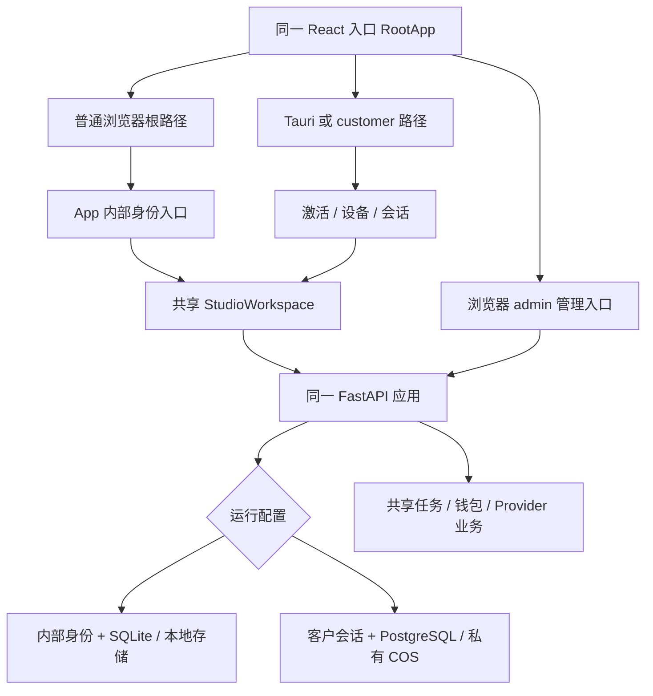
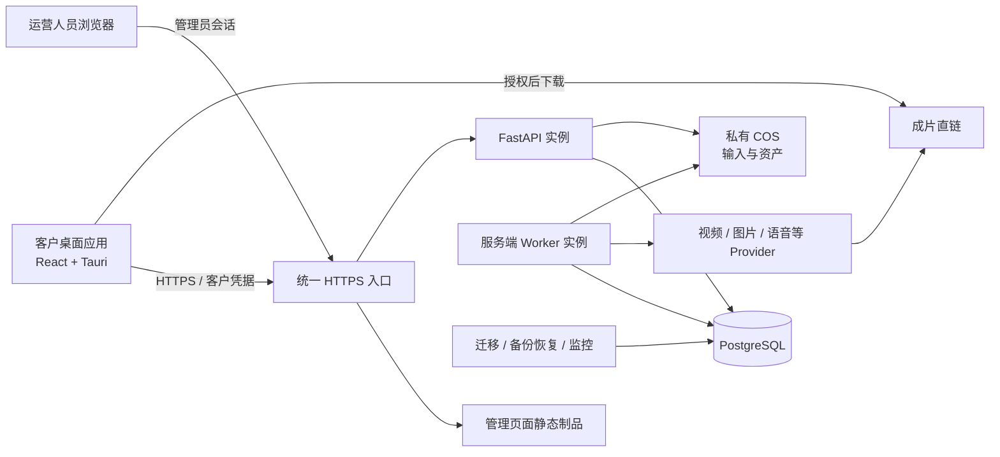

# 客户桌面与云端服务收敛分析报告

分析日期：2026-09-08。状态：**分析完成后的实施建议，不代表拆分已实施或客户版已上线。**

## 1. 结论与目标

可以收敛为一个客户产品：**客户桌面应用 + 云端后端服务**。当前两版并不是两套完整、独立的业务系统，而是同一套 React 工作台、FastAPI 业务和数据模型，叠加不同入口、身份、数据库与打包方式。

客户版已有激活、设备、会话、钱包、PostgreSQL、无本地服务的桌面构建以及服务端多实例配置。推荐以这些客户能力为基础，逐步退出内部身份、本地 Python/Worker、SQLite 运行方式与内部发行包；不重写已有视频业务，不复制一套新后端。

最终客户电脑只承担界面、文件选择/预览、凭据安全保存、下载和必要的系统交互；视频处理、任务执行、计费、密钥、数据库和权威业务状态留在服务器。

**管理后台仍需保留，作为后端服务的运维入口。** 发码、客户管理、设备恢复、计费、Provider 配置和审计是客户产品的支撑能力。它不应进入客户桌面制品，也不等同于要退役的内部本地工作台。后端内部仍有 API 和 Worker 等不同进程；“一个后端服务”不等于把所有操作塞进一个 Web 进程。

推荐先保持一个 Git 仓库、明确前后端构建与部署边界。当前共享 API 类型、迁移、测试和发布版本联动较多，立即拆成两个仓库会增加跨仓同步成本；需要独立团队权限或独立发布节奏时再考虑物理拆仓。

## 2. 本次分析基线与覆盖边界

| 对象 | 当前证据 |
| --- | --- |
| 专用分析分支 | `codex/customer-cloud-convergence-analysis-20260908` |
| 独立工作目录 | `/Users/honor.pei/Documents/订单项目/乡墅爆款短视频复刻-客户版收敛分析` |
| 分析源代码 | `bffc3419f9d89bf76fd4ad1bdad65dd824a44553`，来自用户当前 `feat/viral-module-launch-20260907` |
| 原工作目录 | 创建工作树时干净；未切换其分支、未合并或覆盖其代码 |
| 本地 main | `aab50997323f73efb6d63de61ea07005ae0ca4a5`，比分析基线少 13 个提交 |
| 已 fetch 的 origin/main | `2cacc920fb68797471c6beccb62f4f7ea4702f3e` |
| 与远端主线的差异 | 分析基线独有 123 提交、远端独有 2 提交；净内容差异 799 文件。提交计数不是未合并功能数，不能忽略 squash/cherry-pick |
| 迁移链差异 | 分析基线静态单 head 为 `078_viral_module_launch`；远端为 `055_customer_batch_visibility` |

因此，本报告评估的是**当前开发候选中的两个运行模式**，不是对“远端主线已经具备全部这些功能”的确认。正式实施须先与现有分支合并任务对齐发布基线，不能将整个分析分支连同其 123 个历史提交直接推到主线。

已阅读 V3 六份正本的任务/文件/架构/验收关键条款，并追踪入口、API、身份、业务调用、迁移、存储、Worker、构建和运维。逐项源码证据在三个附件。对范围内文件保存 SHA-256 指纹作为可复核快照；文件扫描不等于逐行人工审阅所有代码，也不替代生产运行验证。

其他人物、素材、口播、前端收口和发布模块分支的已提交端点登记在 [source-baseline.json](source-baseline.json)。未合并分支及其未提交工作不混入本次基线；某项在本基线缺失，不等于整个项目从未开发。

## 3. 两个版本现在实际怎样连接

| 边界 | 内部兼容模式 | 客户模式 | 收敛动作 |
| --- | --- | --- | --- |
| 前端入口 | 浏览器兜底进入 `App`，支持内部 token/开发身份 | Tauri 或 `/customer` 进入客户状态机 | 普通客户入口也统一到客户壳；退出内部登录 |
| 业务界面 | `App → StudioWorkspace` | `CustomerWorkspace → StudioWorkspace` | 保留共用业务页面，消除依赖旧壳类型和内部钱包的分支 |
| 桌面构建 | Cargo 默认 `local-sidecar`，配置携带本地后端资源 | 客户配置清空资源，显式 `--no-default-features` | 客户构建成为唯一默认发行方式 |
| 身份 | 内部 Bearer、固定桌面用户、开发头 | 激活开户、设备凭据、短期在线 session、事务内 fencing | 客户运行时只认可客户身份，运维走管理员会话 |
| 数据 | SQLite 或非生产 PG 兼容 | PostgreSQL 权威状态 | 移除生产回退；数据处理后再退役 SQLite 适配 |
| 运维 | 旧共享代理身份、单机服务/SQLite 备份 | 管理员会话、API@/Worker@、PG 备份恢复 | 保留客户运维能力，退出内部专属运维入口 |

入口依据：[RootApp.tsx](../../client/src/RootApp.tsx#L22)、[App.tsx](../../client/src/App.tsx#L48)；路由依据：[main.py](../../server/app/main.py#L325)；认证依据：[auth.py](../../server/app/auth.py#L94)、[control_auth.py](../../server/app/control_auth.py#L73)。

当前有一处结构上的错配风险：React 对所有 Tauri 运行时都进入客户壳，但默认 Rust 构建仍启用本地 sidecar。因此仅保留客户 URL 或只改安装包名字，不能完成版本收敛。

## 4. 目标结构与职责

| 部分 | 保留职责 | 权威状态与边界 |
| --- | --- | --- |
| 客户桌面 | 激活登录、两设备提示/切换、工作台、项目创作、人物素材、任务、钱包、保存文件 | 安全存储设备凭据；界面缓存可重建。关应用不应终止已入队任务 |
| 后端 API | 身份权限、业务 CRUD、上传授权、任务提交/查询、报价、计费、设备管理 | 服务器决定 owner、权限、金额与状态，前端参数必须校验 |
| 后端 Worker | 视频/图片/口播及相关异步任务，重试、状态恢复、结算 | 保持既有领域边界；逐类验证领取、租约、重复提交和结算，不把一个队列的测试推广至全部任务 |
| 数据和对象 | PG 用户/项目/版本/任务/账务；COS 输入视频、源帧、人物、首帧等 | `local://` 历史对象要单独迁移；客户安装目录不做共享业务存储 |
| 管理与运维 | 发码、设备核验、费率和配置、对账、审计、告警、备份恢复 | 独立管理员入口与制品；不共用客户 session，不保留旧共享管理员身份 |

现有代码的生成视频结果已走 **Provider 直链交付**，并设 `archive_status=DIRECT`、`quality_status=NOT_REQUIRED`；不要因为历史说明仍写“COS 归档质检”，在收敛时重新引入已取消的视频后处理。输入和人物/首帧资产的存储、权限、质检仍要保留。依据：[generation_worker.py](../../server/app/generation_worker.py#L1048)、[generation.py](../../server/app/generation.py#L5142)。

### 4.1 前端与管理端的制品隔离

当前 `RootApp` 静态引用 `App` 和 `AdminApp`，同一个前端构建图包含内部入口和管理代码。隐藏菜单或不进入 `/admin`，不足以证明客户包已剔除这些内容。

建议在现有 `client` 中划分客户入口与管理员入口，并独立构建：客户 Tauri 只加载客户资产；管理静态页面随服务器部署。共享 UI 和 API 类型继续共用。新增入口文件、输出目录的具体命名应在实施工作包中先补入冻结文件映射，不复制另一套工作台。

### 4.2 运行配置收敛

保留服务地址、PG、私有 COS、Provider、费率、任务并发和凭据密钥等服务端配置；客户桌面仅获知可公开服务地址及业务可见参数。`VITE_` 构建变量不能承载服务器密钥。

删除内部模式前，应让缺 PG、缺客户安全配置、错误 API 地址直接失败，不再从配置缺失回退至 SQLite、固定用户或本地服务。本地开发也使用客户语义和隔离测试数据；开发环境无需满足全部生产 HA 部署条件，但不得生成可发布的身份绕过包。

## 5. 保留、改造与退休清单

| 模块/文件 | 处理 | 原因与先决条件 |
| --- | --- | --- |
| `client/src/studio/`、项目/分析/人物/首帧相关组件 | 保留、修复客户接线 | 两版共用业务能力，并非内部版专属页面 |
| `client/src/customer/`、`customer-state.ts`、`customer_credentials.rs` | 保留 | 客户身份生命周期与凭据存储，不能只留激活表单 |
| `RootApp.tsx`、`main.tsx`、前端构建配置 | 改造 | 统一客户入口并隔离管理构建图 |
| `App.tsx` | 分符号处理 | 退休内部 `App`；先解除 `WorkspaceShell` 的类型/组件消费者，不能整文件先删 |
| `api.ts` | 分通道收敛 | 业务请求绑定客户 session；保留客户/管理/匿名回调的不同认证语义，删除内部 token 优先链 |
| `WalletPanel.tsx` 等旧界面 | 先替换消费者，再退休 | 客户使用记录尚会落到旧钱包；不能删后才补入口 |
| `AdminApp.tsx`、`client/src/admin/`、`SettingsPanel.tsx` | 保留、与客户制品分离 | 客户运营和 Provider 设置有真实消费者 |
| Tauri `lib.rs`/`Cargo.toml`/两份配置、内部 launcher | 改造后退休本地启动部分 | 保留安全存储、指纹、下载/取消/打开目录；客户包不携 Python、API、Worker、SQLite |
| `auth.py`、`customer_fence.py`、`control_auth.py` | 精确裁剪 | 保留 session 校验、事务 fencing、管理员身份，删除内部/开发/共享代理分支 |
| `internal_accounts.py` | 解除消费者后退休内部 token 能力 | 控制面账户列表、用户初始化、钱包初始化需先分类；必要客户能力迁入已有合适模块 |
| `internal_billing.py` | **保留核心，不按名称删除** | 客户视频、口播仍依赖预占、结算、释放；本轮不建议为名字单独重写账务 |
| `generation*`、`oral*`、`independent*`、`script_from_audio*`、人物/素材/爆款模块 | 保留 | 业务能力按客户 owner/session/任务链验收；新增业务与结构收敛分开追踪 |
| `db.py`、`db_pg.py`、`db_portable.py` | 先固定 PG，再裁剪兼容 | `BusinessConnection` 与事务接口仍共用；大量测试使用 SQLite |
| `storage.py`、`media_routes.py`、`local_settings_key.py` | 分符号处理 | 本地存储和历史文件可退休；签名下载/服务端密钥管理不能因 local 名称直接删 |
| `server/migrations/versions/` | **保留已发布历史** | `022` 同时创建内部 token 与客户钱包/订单/流水；删除表只能用新的可审迁移 |
| `deploy`/systemd/CI/发行脚本 | 保留客户路径，退休内部发行路径 | 客户 HA、PG PITR、监控保留；旧单机 SQLite 备份与内部 NSIS退出默认发布 |
| 旧数据、迁移工具、证据 | 完成迁移后归档 | 不随源码清理删除未核对数据；既有账务和审计不丢失 |

详细符号、调用关系和定位参见 [前端审计](frontend-audit.md)、[后端审计](backend-audit.md)、[数据与部署审计](data-deploy-audit.md)。

## 6. 当前需要先解决的缺口

### 6.1 客户钱包落入旧内部组件：优先修复

当前调用链：`CustomerWorkspace` 只传 `customerAccount` → `StudioWorkspace` 未补 `customerWallet` → 使用记录打开 wallet → `LiveWorkspacePanel` 选择旧 `WalletPanel` → `getWallet()` 请求 `/api/wallet` 并强制校验内部定价。

服务器允许客户按本人身份读取旧钱包地址，但刻意将三个内部费率字段设为空；前端 `requireWalletPricing()` 要求其均为正数，故这一组合会进入“钱包定价配置不完整”错误分支。若仅绕过定价检查，旧充值 POST 还会被服务器以 `CUSTOMER_RECHARGE_ROUTE_REQUIRED` 拒绝。

结论是**客户组件与接口接线错误**，不是客户身份应该获得内部管理权限。应统一客户钱包上下文，让全部客户钱包入口进入 `CustomerWalletPanel` 和客户充值接口。该结论已由前后端源码交叉核对，尚未在真实桌面点击复现。

另外只读对照 `fix/frontend-completion-no-confirmation-20260907@cdfb499`：该钱包面板问题仍存在；主动退出、真实余额/资料摘要已有候选接线。后两项应先整合再验收，避免重写；详见前端附件 §9。

证据：[LiveWorkspacePanel.tsx](../../client/src/studio/LiveWorkspacePanel.tsx#L145)、[api.ts](../../client/src/api.ts#L1231)、[定价检查](../../client/src/api.ts#L5143)、[wallet_routes.py](../../server/app/wallet_routes.py#L79)、[recharge_routes.py](../../server/app/recharge_routes.py#L275)。

### 6.2 默认构建与客户构建仍并存

客户无 sidecar 构建已有，但默认构建、配置、CI 仍维护内部包。目标完成时必须从默认命令、编译特性、资源内容和最终安装行为四层证明只剩客户发行方式，不能只停掉一个启动调用。

### 6.3 本地数据迁移不是数据库复制

现有 SQLite→PG 工具仅适用于受限的空目标或相同快照重放，不会把历史 `local://` 对象文件迁到 COS，也不是向已有客户 PG 合并账号和钱包的工具。内部用户与激活客户不会自动成为同一账号。必须先决定数据保留清单和身份映射，再实施迁移。

### 6.4 配置交付不等于新服务器可一键部署

客户 systemd、Nginx、PG 迁移与 PITR 脚本已存在。现有 git rollout 仍依赖仓库外的 compose/镜像环境；新机还需要完整配置、首次管理员、密钥供应、媒体工具和备份等交付步骤。服务器需具备 `ffprobe` 与实际业务需要的 `ffmpeg`；不能依赖已剔除的客户端 FFmpeg。

### 6.5 功能完成度必须与架构收敛分开

本基线发布管理仍显示“保存到当前会话，未同步到云端”和“正式发布（接口未接通）”，见 [ContentPages.tsx](../../client/src/studio/ContentPages.tsx#L2288)。另有 `feat/c5-publish-module` 候选分支，不能据此重复开发，也不能将其未合入实现当作当前客户版已可用。

工作台、爆款、文案、视频创作、人物、素材、任务、钱包、数据看板等入口应保留既定业务范围。每个模块还需在发布基线用客户身份验收；架构拆分成功不自动补齐业务缺口。此前“首页可浏览、点击私有内容才激活”的方案在旧审计中有记录，本基线仍是整屏激活；如继续落实，应单列入口交互任务，覆盖私有请求延迟、取消留页、成功续接，不能借此伪造登录身份。

### 6.6 任务种类不共享同一套完整公平调度

独立视频生成写入 `generation_batches` 并复用视频队列；口播共享用户并发槽与跨类型上限，但其代码明确说明跨 H3/口播完整轮转仍待完善。图片、文案改写、音频提取使用各自任务表和租约，不等同于全部走视频公平游标。应逐类保留并验收，不把 T25 的视频队列测试当作“全产品异步任务公平”的证据。依据与各类领取位置见后端附件。

### 6.7 升级时不能先卸载再决定历史数据去向

现有客户安装 hook 仅识别固定旧路径并静默调用旧卸载器，不是通用安装发现或数据迁移工具。需盘点实际已发布包的 identifier、安装位置、AppData/Keychain、数据库和素材目录；在旧包升级演练中证明数据先归档/迁移，凭据与任务处置有明确结果，再允许卸载旧包。客户版升级应保持现有客户 identifier 和凭据命名空间，不能因更名造成用户被当成新设备。依据：[customer-installer-hooks.nsh](../../client/src-tauri/customer-installer-hooks.nsh#L4)。

凭据兼容不仅是保留应用 identifier：Windows 的 `customer-credentials.bin`、`device-instance-id`、DPAPI entropy 和设备注册表键名都需稳定；macOS Keychain 的 service 与按目录派生的 account namespace 也需稳定或提供经过验证的迁移。对应位置：[凭据文件与DPAPI常量](../../client/src-tauri/src/customer_credentials.rs#L28)、[设备注册表](../../client/src-tauri/src/customer_credentials.rs#L268)、[Keychain service](../../client/src-tauri/src/customer_credentials.rs#L583)、[Keychain account](../../client/src-tauri/src/customer_credentials.rs#L700)。

## 7. 数据与历史版本处理方案

执行前先做只读盘点，不读取或输出实际密钥、激活码、token。

1. 列出内部 SQLite、已有 PG、对象目录、备份及对应迁移版本；统计用户、项目、人物、版本、任务、钱包和未完操作。
2. 分类为无需继承的演示数据、需继承的业务资产、必须保留的账务/审计。用户归属冲突逐条解决，不能按显示名合并。
3. 无需迁入的数据保存可恢复的离线归档；这不意味着删除当前数据或继续发行内部版。
4. 目标空 PG 时，按现有工具的 head/空库/重放前置条件，在隔离副本演练导入和对账。已有客户 PG 时，需要专门的合并映射与幂等导入方案，禁止直接覆盖或全表清空。
5. 单独复制输入视频、源帧、人物、首帧等实际文件到授权的私有 COS；保存旧引用→新对象映射，核对文件数量、哈希、大小、owner 和可读性。仅数据库行相等不能证明资产完好。
6. 排空或对账未完成任务与钱包冻结。`SUBMISSION_UNCERTAIN` 等提交不确定操作不得自动再调付费 Provider。内部设备/session 凭据不迁成客户凭据。
7. 停写窗口完成最终增量、账实核对和入口切换；确认客户能读取旧项目/人物/结果，旧 token 和旧启动器不再获得生产权限。
8. 稳定观察后再退出 SQLite运行时、旧 token 运行时及旧运维脚本。已发布迁移链、审计历史和受保护备份保留。

现有 PG 分支迁移链明显不同。新 revision 必须基于最终发布 head 追加，不能直接假定下一个编号，也不能为了源码整洁重新编号已部署 revision。

回滚要分层：代码/客户安装包可回到上一个兼容发布；数据库已写入客户、充值或账务后，不能恢复旧 SQLite 或旧快照来抹掉已发生交易。按扩展→切换→清理分阶段迁移，回退流量、停止风险写入、保留前向 schema，必要补偿走审计单据。

## 8. 建议实施工作包与先后关系

本节是实施准备清单，不新增或冒充 V3 的 TXX 完成记录。实际任务编号、新文件映射与验收证据应在实施前同步六份正本。

| 工作包 | 主要改动范围 | 依赖 | 可验收出口 |
| --- | --- | --- | --- |
| W0 固定发布基线 | refs/候选分支/迁移链/现有功能、已发客户端及实际部署拓扑 | 无 | 明确已合/待合功能、迁移单 head、旧客户端 method-path 清单；冻结 systemd 或容器的默认交付路径，保护原 WIP |
| W1 锁定客户回归 | 客户入口、钱包、session/API、打包、PG业务专项 | W0 | 先写能暴露旧钱包与内部入口的失败测试，建立未授权读写拒绝基线 |
| W2 客户前端单入口 | `RootApp`、客户壳、`StudioWorkspace`/旧类型、钱包/API调用 | W1 | 客户全部入口使用客户身份；工作台主功能保留，取消/重登/切换正确 |
| W3 桌面与管理构建分离 | Vite/入口、Tauri Cargo/config、CI制品 | W2 | 客户包不含管理/内部入口与本地后端资源；管理站点仍可用 |
| W4 后端认证与配置收敛 | `auth`/`customer_fence`/`control_auth`/`bootstrap`/旧token消费者 | W1；与W2按接口协同 | PG客户模式成为运行契约；旧内部凭据拒绝；管理员和支付回调语义保留 |
| W5 数据演练与迁移 | 既有迁移工具、用户映射、对象映射、账务核对 | W0；W4兼容前置完成 | 数据/文件/owner/钱包对账，未完任务处置，隔离恢复演练可复现 |
| W6 退出内部运行和发行 | SQLite兼容、local-sidecar、内部scripts/CI、过时文档 | W3、W4、W5 | 不再有内部产品启动/发行通道；共享代码与历史迁移仍完整 |
| W7 完整客户验收 | PG+前后端全门禁、签名包、真实环境与业务链 | W6 | 按代码→staging→真实链路→灰度逐级取证 |

W2 与 W4可在固定接口后并行；W3不能先删客户凭据与下载依赖；W5不能在身份映射未明确时写目标库；W6不得早于数据和替代消费者验收。一个工作包可细分多个单一目的 PR，迁移与纯前端裁剪避免混成一个难回滚提交。

### 客户端与服务器不能假设同时升级

发布顺序应为兼容后端 → 新客户安装包 → 观察旧客户调用 → 最后退休无消费者的兼容接口。先列最低支持客户版本，以及旧客户配新后端、新客户配旧兼容后端两个组合的结果；不兼容版本应明确提示升级，不能静默回退内部身份。本轮没有验证自动更新机制，方案不能依赖“所有客户会自动同步更新”。

独立复核在当前源码未找到 updater、最低客户端版本或请求版本标识的完整实现。实施时需先补可核验的版本清单/分发确认或版本观测与提示机制；在无法证明旧客户已退出之前，继续保留它依赖的兼容端点。不能将拟新增机制当作已经可用的发布保障。

尤其不能看到 URL 没有 `/customer` 前缀就删除：项目、素材、任务、下载等共用路由仍由客户调用。旧内部专用入口是否可移除，需要将已发布客户版本、管理页面、支付回调和运维脚本都纳入消费者清单；发现仍有合法客户消费者时，先替换并验证兼容窗口。

结构改造和真实环境准备的耗时取决于最终合并基线、内部历史数据规模及外部服务条件；本轮不以缺少实测的数据给出固定天数或并发容量保证。

## 9. 最终验收标准

| 验收面 | 必须证明的行为 |
| --- | --- |
| 客户包 | 干净电脑无需 Python/数据库/本地后端；唯一客户安装身份；安装、升级、卸载、重启凭据与下载保存均实机通过 |
| 制品内容 | 无内部登录和管理页面构建依赖、无本地API/Worker启动脚本与服务器密钥；默认构建即客户构建 |
| 身份 | 首次激活、已绑定登录、第二设备批准、第三设备拒绝、显式切换、心跳、过期/解绑、旧会话迟到写拒绝 |
| 客户功能 | 项目/复刻、独立生成、人物、首帧、口播、文案、素材、爆款、任务、钱包各走实际客户接口；钱包所有入口无内部费率错误 |
| 异步业务 | 关闭客户端不丢任务；各任务种类跨Worker不重复付费提交、不重复结算；失败释放、未知提交保留人工核验 |
| 数据 | PG唯一业务真源；用户映射、项目版本、人物资产、文件、钱包余额/冻结/流水一致；旧凭据不得跨用户读取 |
| 运维 | 管理员/auditor权限、客户运营、Provider配置、告警、PG备份恢复和真实双API/四Worker等冻结部署门通过 |
| 外部与发布 | 经授权的真实Provider/ZPay/COS、签名客户包和灰度证据绑定同一发布版本；符合V3证据层级 |

实施阶段：开发迭代跑受影响专项；任务收尾先启动独占 PG fixture，再由 `npm run check` 承载一次全量服务端测试，不能同时启动两个全量套件争用共享库；客户构建、Windows、依赖审计及E2E按实际 CI 门禁补齐。删内部 tests 前，必须将其仍保护的共享行为迁到客户/PG测试，不能靠删测试获得全绿。

## 10. 本轮交付与验证

本轮只新增分析与证据文件，没有修改前后端业务、认证、数据库、CI或部署配置，没有执行数据迁移、真实付费调用、生产发布或分支合并。

- 主报告：本文件。
- 源码附件：[前端审计](frontend-audit.md)、[后端审计](backend-audit.md)、[数据/部署审计](data-deploy-audit.md)。
- 固定快照：[source-baseline.json](source-baseline.json)，包含代码指纹、refs与迁移解析结果。
- 已执行：客户桌面无 sidecar、API地址校验、Nginx/多实例systemd/单所有者迁移等现有专项，**24 passed / 14 deselected / 1 warning**。运行使用现有 Python 3.13 虚拟环境；不是 CI Python 3.12 全门禁。详见 [targeted-verification.json](targeted-verification.json)。
- 未执行：完整PG/前端/后端全套、Windows或macOS真实安装、线上HA、真实Provider/ZPay/COS、签名与灰度；本报告不提升既有 V3 任务证据等级。
- 报告完整性检查通过：128 个本地链接、118 处源码行号引用有效，414 个输入文件指纹无漂移，仓库密钥扫描及报告凭据特征扫描通过。独立复核发现的发布兼容与部署前置条件已补齐，无剩余阻断项。结果见 [report-validation.json](report-validation.json)。

**建议采用该目标架构，先完成 W0–W1，再进行客户入口、钱包和构建的第一批收敛；内部运行时的彻底删除放在替代能力与数据验收之后。**
