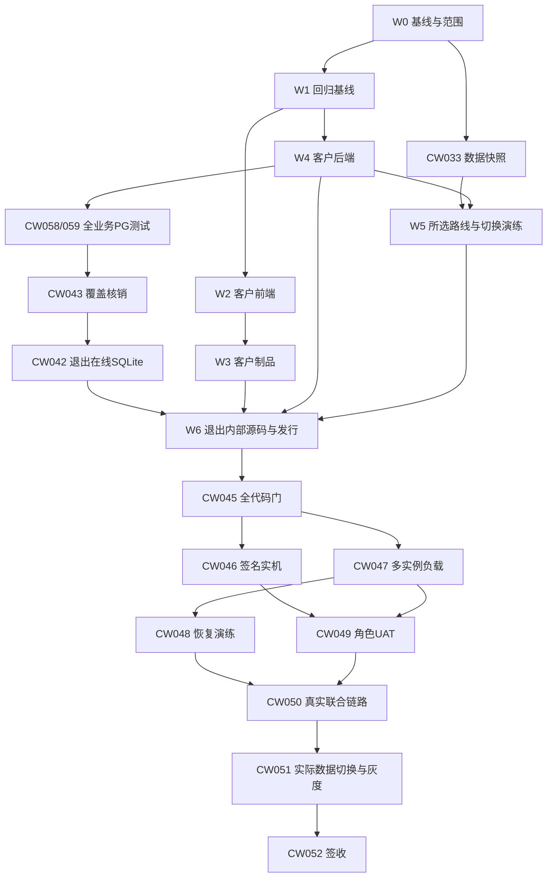

# 客户版收敛详细任务清单与验收完工标准

编制日期：2026-09-08。文档版本：V2（PostgreSQL全面统一）。交付范围：任务细化与验收设计，**不表示已执行这些改造、迁移或发布**。

依据：[收敛分析报告](客户桌面与云端服务收敛分析报告.md)、[前端附件](frontend-audit.md)、[后端附件](backend-audit.md)、[数据与部署附件](data-deploy-audit.md)。分析文档提交为 `d93c088`，源码快照为 `bffc341`；实施时由 CW-001 重新固定发布基线，不能把旧分支状态当作最新状态。新增约束依据：[PostgreSQL唯一数据库规范](../../docs/PostgreSQL唯一数据库实施与验收规范.md)与[本轮文档评审](PostgreSQL全面统一文档评审报告.md)。规范依据：[V3任务账本](../../docs/客户版任务清单-V3.md)、[V3文件映射](../../docs/客户版代码开发清单-V3.md)、[V3验收规格](../../docs/客户版测试与验收规格-V3.md)。

## 1. 目标和使用规则

最终只交付客户桌面应用与后端服务。**用户已确定：开发、业务数据库测试、CI、staging和生产全部使用PostgreSQL；SQLite不再是任何当前业务环境的选项。** 原始SQLite只读归档或作为独立迁移输入；必要schema规范化只写隔离工作副本，之后重新封存只读。管理网页作为后端运营入口保留；API、Worker、迁移、备份等仍可作为同一后端工程的独立进程。保留共用视频、人物、素材、钱包等能力，退出内部产品登录、sidecar、SQLite在线模式和内部发行包。先保持同一仓库的逻辑/制品分离。

本清单共 **8个阶段、60项细化任务**。CW编号是本次收敛的工作分解编号，不替代原T01—T45或其他已经登记的任务。**实施状态真源仍是V3任务账本**，由CW-006登记映射；本文件与CSV是静态任务定义，不另建第二套完成状态。现有能力按复用、修复、整合、复验处理，不代表60项都需要从零开发。原CW-001—052完整保留，新增CW-053—060分别承载数据库依赖、查询类型、事务连接池、旧PG升级、CLI、两组业务测试和历史工具隔离；它们有独立文件/证据与前置条件，不能只靠改数据库连接地址完成。

每项任务写明工作内容、文件范围、前置任务、验收标准、完工标准、证据和责任角色；“主责”须在领取时填入具体负责人。验收人应不同于实现人；涉及身份、账务、并发、迁移、凭据的改动须独立复核。

条件任务 CW-014、CW-034—CW-037 不一律执行：必须依据CW-002/CW-005及实际盘点选择。A/B/C只选择历史数据的处置方式，最终业务与验收目标库始终为PG；一个数据批次A/B/C互斥，不同批次可不同；有待保留local资产就必须执行CW-037。条件不适用时，记录批次/功能范围、事实依据、确认人及被其他任务覆盖的验收责任。**不适用不是测试通过，缺资源/失败/尚未开发也不能登记为不适用。**

CW-002还应明确尚未完整实现的发布管理和跨类型公平增强是否属于本次补齐范围：默认保留现有能力及诚实的未接通状态，不顺势扩建新业务。若纳入补齐，先追加具体子任务、文件和验收用例，完成前不得关闭CW-018/CW-049。此前游客浏览要求若继续保留，CW-014必须执行。

## 2. 阶段总览与出口

| 阶段 | 编号 | 数量 | 主要结果 | 阶段出口 |
| --- | --- | ---: | --- | --- |
| W0 基线与范围 | CW-001—006、053 | 7 | 唯一发布基线、产品/平台范围、旧客户兼容、部署和数据路线 | 所有删除/迁移前置决策明确，任务与文件映射登记 |
| W1 回归保护 | CW-007—011 | 5 | PG客户测试、真实UI、权限/账务/队列、构建合同 | 共享行为已锁定；钱包等缺陷有有效失败用例 |
| W2 客户前端 | CW-012—018 | 7 | 单入口、客户上下文/API/钱包/会话和完整业务页面 | 全部保留客户入口正常，内部身份不参与 |
| W3 桌面制品 | CW-019—024 | 6 | 客户/管理构建隔离、唯一Tauri默认、凭据下载、升级包 | 唯一客户制品、无sidecar，升级/凭据合同成立 |
| W4 客户后端 | CW-025—032、054—057 | 12 | 全环境PG、查询/事务/schema/CLI、认证/计费/Worker/COS与部署 | PG运行合同完整，客户共享业务和旧PG升级通过 |
| W5 数据准备 | CW-033—039、060 | 8 | 快照、选中路线、对象与账务、数据切换演练 | 副本演练成功，实际切换/回滚手册可执行 |
| W6 退出内部模式 | CW-040—044、058—059 | 7 | 两组共享业务测试迁PG、内部源码/发行清理、CI与文档 | 内部产品不可由正式构建/运行入口启动；客户兼容能力保留 |
| W7 完整交付 | CW-045—052 | 8 | 全门禁、签名实机、真实HA/恢复/UAT/外部链路、切换灰度 | 四级完工门全部满足，业务及运维签收 |

编号表示任务身份，不表示简单按数字顺序执行。例如 CW-016可在有效回归基线就绪后优先修复，CW-043必须先于CW-042。只有在依赖满足时才可领取。

## 3. 单项任务的通用完工要求

对代码任务，下列要求与各任务自己的完工标准**同时满足**：

1. 实际改动和已登记范围一致，共用消费者已核对；功能没有因为删目录、删接口或改默认身份丢失。
2. 新功能/缺陷先有失败测试或回归锁，再实现并转绿。CW-008/CW-011的“红灯基线完成”只是测试子任务证据，必须与后续修复在同一可验证增量交付，不能独立把失败测试合入受保护主线。
3. 必需的静态、类型、格式、单元、集成、构建检查为0失败；全部TEST-PG类数据库行为用例必须真实PG执行，缺PG应非0失败，SQLite替代和数据库不可达skip均为0；TEST-IMPORT/TEST-HISTORY历史工具检查另列且同样必须通过。warning逐项说明，不能把弃用警告隐藏成0问题。
4. 安全扫描和自查完成；身份、账务、并发、迁移有独立复核。未解决的越权、错账、数据丢失、重复付费或状态恢复问题均阻断完工。
5. 回滚边界明确且与实际schema/对象/客户端兼容；纯代码可撤销，数据/支付变更不能靠快照恢复抹去已确认事实。
6. 正本、接口/配置说明、失败和通过日志、候选SHA/产物哈希/环境、未测试项、外部授权记录齐备；使用中文Lore提交。一个PR承载一个已登记逻辑任务，账本和迁移变更串行处理。
7. 逐项满足PG-01—12在当前层级的要求，并记录PG版本、schema起止head、隔离ID、旧用例替代与例外清单。达到本任务要求的证据层级才可关闭；需要外部环境的任务不得以本地stub通过替代。

纯盘点/决策/文档任务按其清单、一致性、可执行性和签收验收，不要求为了写文档运行应用全量测试。所有任务证据遵循V3任务账本§14模板，字段见文末。

## 4. 详细任务清单

## W0 基线与范围

### CW-001 固定代码与迁移发布基线

- 主责与基线：集成负责人；已有多个分支，需重新对齐。
- 前置任务：无。
- 执行条件：必需。
- 工作内容：核对 main、当前候选、人物/素材/口播/前端收口/发布等已提交分支；按实际补丁确认复用与缺口，固定本次实施 SHA 和唯一 Alembic head，保存 WIP 可恢复快照。
- 涉及文件/对象：git refs；server/migrations/versions/；source-baseline.json。
- 验收标准：列出每个候选的保留、已合或待整合结论及依据；在所选基线复核迁移无多 head、无已发布 revision 改写；恢复抽查能找回受保护的原改动。 数据库源码与规范分别固定版本；旧报告的SQLite/PG并存只记现状，不作为新PG唯一目标。
- 完工标准：发布基线、补丁来源和迁移图经集成复核签字，后续任务统一引用该 SHA；不能把分析分支历史整体当作待合补丁。
- 必交证据：refs/补丁清单、迁移图、备份恢复记录；目标证据层级：决策与静态核验。

### CW-002 冻结产品、平台和业务范围

- 主责与基线：产品负责人 + 架构负责人；需范围确认，已有业务优先保留。
- 前置任务：CW-001。
- 执行条件：必需。
- 工作内容：确认只交付客户桌面与后端服务、管理网页归后端；数据库类型已由用户确定为PostgreSQL，开发/测试/CI/staging/生产一律适用。只冻结业务/平台、游客浏览、发布管理和各类任务的计费公平范围，不再把数据库类型作为待选择项。
- 涉及文件/对象：client/src/studio/types.ts；client/src/studio/StudioWorkspace.tsx；分析报告 §4、§6。
- 验收标准：功能/平台逐项登记保留、待补或不支持；数据库范围遵守PG-01—12，所有数据库行为测试用真实PG，SQLite仅允许登记的离线历史输入/兼容。发布与游客范围按既有决策，不把文档确认称为代码已完成。
- 完工标准：范围表有明确负责人结论；每个保留功能映射到 CW-018/CW-049 的验收行；所有条件任务均有启用依据或可追溯的不适用理由。
- 必交证据：功能/平台/条件任务范围表；目标证据层级：决策与静态核验。

### CW-003 盘点已发客户端和接口兼容窗口

- 主责与基线：桌面负责人 + 后端负责人；现有代码未证明自动升级机制。
- 前置任务：CW-001。
- 执行条件：必需。
- 工作内容：列出实际分发的客户端版本、制品哈希、安装身份/目录及其 method-path、字段和认证契约；建立旧客户→新后端、新客户→上一兼容后端矩阵，确定升级提示及版本退出证据。
- 涉及文件/对象：client/src/api.ts；client/src-tauri/tauri.customer.conf.json；client/src-tauri/src/customer_credentials.rs。
- 验收标准：每个仍受支持的发行版本均有接口消费者清单；不兼容组合返回明确升级结果且不回退内部身份；不能仅凭新包生成、懒加载或未观测到请求就宣布旧端点无人使用。
- 完工标准：兼容窗口及退出判据已冻结；合法旧客户所需端点进入允许清单，删除任务受其约束；无自动更新时明确分发确认/版本观测办法。
- 必交证据：版本接口矩阵、凭据命名空间清单、兼容退出规则；目标证据层级：决策与静态核验。

### CW-004 冻结部署主线与可量化运行指标

- 主责与基线：运维负责人 + QA；配置存在，真实拓扑待核对。
- 前置任务：CW-001、CW-002。
- 执行条件：必需。
- 工作内容：核对实际 systemd/容器、仓库外 compose、镜像、服务器、域名、PG/COS及密钥供应；选择唯一默认交付路径，定义负载、每类队列等待阈值、RTO/RPO、灰度时长和回滚触发值。 同时冻结开发/测试/CI/staging/生产的PG16版本、独立库/角色/连接目标、连接池与超时；应用、迁移、备份和测试身份分工明确。
- 涉及文件/对象：deploy/；docs/客户版测试与验收规格-V3.md §8；docs/客户版部署与灰度手册.md。
- 验收标准：默认部署路径能解释 API、Worker、迁移、管理资源、备份和监控的归属；发布阈值含数值、采样窗口、场景和负责人，不能仅写正常/稳定/足够快；使用正本建议值时注明待目标机定标。 不同环境不共用业务库；目标PG容量与连接预算按API/Worker进程数合计，迁移锁须覆盖多主机入口，不能只依赖单机flock。
- 完工标准：拓扑与指标表完整冻结；未选部署方式或未定关键阈值时，不准删除旧部署脚本或进入负载/灰度验收。
- 必交证据：部署拓扑、资源清单、指标与灰度参数表；目标证据层级：决策与静态核验。

### CW-005 选择全部采用 PG 的历史数据处理路线

- 主责与基线：数据负责人 + 业务负责人；真实数据尚未盘点。
- 前置任务：CW-001、CW-002。
- 执行条件：必需。
- 工作内容：只读盘点内部SQLite、现有PG、历史资产和未完任务的价值与归属；数据库统一PG已经确定，A仅保留客户PG并归档内部数据、B迁入空PG、C合并已有PG；按批次选择历史处置，不能选择继续SQLite运行。
- 涉及文件/对象：server/scripts/sqlite_to_postgres.py；server/scripts/reconcile_customer_billing.py；data-deploy-audit.md §3。
- 验收标准：每个数据批次明确来源、目标、owner、需要保留的业务及路线；不得按用户名自动合户；不得把现有空库导入工具当作已有客户库合并工具；敏感实际数据不写入任务 CSV。 每条路线的最终业务库与数据库验收库均为PG；原SQLite只读保护，必要规范化写隔离副本。
- 完工标准：形成业务认可的数据批次清单和条件任务选择表；无遗留数据也必须有盘点证据，不能口头跳过数据验收。
- 必交证据：脱敏数据清单、路线选择及业务确认记录；目标证据层级：决策与静态核验。

### CW-006 登记实施任务、文件映射和验收责任

- 主责与基线：项目负责人；本清单是细化提案，尚未写入状态账本。
- 前置任务：CW-001、CW-002、CW-003、CW-004、CW-005、CW-053。
- 执行条件：必需。
- 工作内容：将 CW 编号映射到 V3 正本的新增/修订工作包，登记 Owner/Reviewer、真实文件路径、先后依赖和回滚界限；纠正成片 DIRECT 与旧 COS 归档说明的冲突，保留历史证据原文。
- 涉及文件/对象：docs/客户版任务清单-V3.md；docs/客户版代码开发清单-V3.md；docs/客户版开发计划-V3.md；docs/客户版激活码完整开发文档-V3.md；docs/客户版测试与验收规格-V3.md；docs/CUSTOMER-TASK-EVIDENCE-V3.md；docs/PostgreSQL唯一数据库实施与验收规范.md；README.md；AGENTS.md。
- 验收标准：新文件名先登记再实现；每项任务只引用唯一状态账本，证据使用 §14 模板；真实调用、生产迁移、发码和发布的已有授权范围有记录，授权未到不影响本地准备工作。 CW-001—060状态只在正本登记，PG-01—12的文件与验收映射完整；历史T03—T09/SQLite通过记录保持原文，不自动升级为全环境PG证据。
- 完工标准：范围、文件、责任、验收与回滚无相互矛盾；执行清单获登记，后续不再以这份静态 CSV 独立更新完成状态。
- 必交证据：正本变更、任务映射、Owner/Reviewer与证据位置；目标证据层级：文档验收。

### CW-053 登记全量数据库依赖与历史 SQLite 例外

- 主责与基线：架构负责人 + QA；旧33模块与92测试文件数字是历史扫描口径。
- 前置任务：CW-001、CW-002。
- 执行条件：必需。
- 工作内容：扫描所有业务表、API/Worker/管理CLI/备份/部署/测试/桌面依赖；区分实际连接、SQL方言、row/异常类型、共享工具与已发布迁移；建立TEST-LOGIC/TEST-PG/TEST-IMPORT/TEST-HISTORY分类、PG-01—12映射和精确SQLite历史允许清单。
- 涉及文件/对象：server/app/；server/tests/；server/scripts/；server/migrations/；scripts/；deploy/；client/src-tauri/。
- 验收标准：每个数据库消费者及fixture有归类、替代方式和责任；运行分支与纯类型引用分开统计；例外精确到文件/符号/用例且无整个目录豁免；线上未知数据单列，静态扫描不冒充盘点完成。
- 完工标准：数据库迁移面和例外范围完整复核；新业务或新数据库测试不能使用SQLite，后续收尾对照同一清单核销。
- 必交证据：源码/调用关系、测试分类与例外表、PG合同映射；目标证据层级：静态依赖与范围核验。

## W1 回归保护

### CW-007 建立全业务 PostgreSQL 测试基座与缺库硬门

- 主责与基线：测试负责人 + 后端负责人；已有 PG 测试需复用和完善。
- 前置任务：CW-006。
- 执行条件：必需。
- 工作内容：依CW-053将测试/fixture分为TEST-LOGIC纯逻辑、TEST-PG当前业务、TEST-IMPORT离线导入、TEST-HISTORY历史兼容。统一PG16测试库生命周期、合法客户/管理/session/钱包种子；TEST-PG类必须显式TEST_POSTGRESQL_URL并可连接，保留OS凭据和外部服务替身隔离。
- 涉及文件/对象：server/tests/conftest.py；server/tests/test_db_pg.py；server/tests/test_postgres_migrations.py；server/tests/test_customer_fencing.py；server/pyproject.toml；scripts/pg-fixture.sh。
- 验收标准：无PG/错DSN/不安全目标时preflight非0失败，不skip或回退SQLite；测试host/库名前缀及范围明确，清理拒绝非测试库；至少2客户3设备可重复建种；连续2次及中断后重跑一致，2个独立专项不互删/串数据；共享全量fixture只允许1个suite运行。
- 完工标准：所有TEST-PG类可复用同一PG基座并记录版本/head/隔离ID；TEST-IMPORT/TEST-HISTORY目标与对账用PG且分栏报告；默认开发身份不再替代客户数据库测试，无缺库伪绿。
- 必交证据：逐类fixture表、缺库/错目标失败证据、连续与中断复验、隔离清理日志；目标证据层级：AUTOMATED_VERIFIED。

### CW-008 锁定真实客户界面回归及钱包失败用例

- 主责与基线：前端测试负责人；旧壳测试不覆盖新工作台钱包路径。
- 前置任务：CW-006。
- 执行条件：必需。
- 工作内容：从真实 RootApp/CustomerWorkspace 挂载客户工作台，锁定使用记录与个人中心钱包入口、资料、退出和会话恢复；对钱包错误补能在当前缺陷上失败的测试。
- 涉及文件/对象：client/src/RootApp.test.tsx；client/src/customer/CustomerWorkspace.test.tsx；client/src/studio/StudioWorkspace.test.tsx；client/src/studio/LiveWorkspacePanel.test.tsx。
- 验收标准：测试不把 StudioWorkspace 替换为旧 WorkspaceShell；模拟生产形状客户钱包响应，复现内部定价校验错误；确认两个客户钱包入口的预期接口、组件及充值动作。
- 完工标准：缺陷测试红灯日志与后续修复通过条件已保存；原有客户页面行为基线明确，不能靠改成内部响应形状消除失败。
- 必交证据：失败测试/原始失败输出、客户入口覆盖表；目标证据层级：回归基线，修复后转绿。

### CW-009 锁定身份、权限及事务 fencing 不变量

- 主责与基线：后端测试负责人；已有安全测试需逐路由延伸。
- 前置任务：CW-007。
- 执行条件：必需。
- 工作内容：按匿名、客户A/客户B、管理员、只读审计员、旧内部身份建立读取和写入矩阵；覆盖会话在入口验证后被切换、迟到 heartbeat/logout/业务写及幂等重放；将V3验收规格§6每条安全要求登记为不可省略子用例。
- 涉及文件/对象：server/tests/test_customer_fencing.py；server/tests/test_customer_security.py；server/tests/test_internal_access_tokens.py；server/tests/test_admin_auth.py。
- 验收标准：越权读写、旧 token、被撤销设备、过期 lease、旧 epoch 写入全部拒绝且无业务副作用；客户 token 不能进行管理写，auditor 不能写；逐项验证CSRF、CORS、Host/Forwarded Header信任、Cookie属性、session fixation、epoch回退、重放、配对批准不可转用、枚举限流、管理员真实actor/原因/确认/幂等、密钥轮换旧key验证窗；码和设备/session token明文不进入日志、Sentry、CSV、数据库dump或LocalStorage；支付回调独立鉴权有测试。
- 完工标准：待保留路由授权矩阵、事务内重验和V3§6安全子矩阵全部有用例及结果；行为测试与代码复核通过后才可退出兼容分支，密钥扫描不能代替安全行为测试。
- 必交证据：角色×method-path矩阵、V3§6逐条用例映射、PG竞态/拒绝及脱敏输出证据；目标证据层级：AUTOMATED_VERIFIED。

### CW-010 锁定账务与各类异步任务恢复基线

- 主责与基线：后端测试负责人；H3/独立、口播、图片和文案队列机制不同。
- 前置任务：CW-007、CW-002。
- 执行条件：必需。
- 工作内容：分别覆盖 H3/独立生成、口播、图片、分析/改写/ASR的提交、领取、崩溃、超时、未知提交和回写；计费任务锁定 RESERVE/SETTLE/RELEASE，不计费任务与成本记录分开。 所涉及账务与任务恢复基线均为TEST-PG，使用真实PG及独立多连接；外部Provider可以受控替身，数据库不得替代。
- 涉及文件/对象：server/tests/test_worker_crash_recovery.py；server/tests/test_wallet_billing_service.py；server/tests/test_oral_domain.py；server/tests/test_independent_creation.py；server/tests/test_customer_queue_fairness.py。
- 验收标准：同一操作重放不新增收费任务；成功只结算一次，已确认未收费失败只释放一次；SUBMISSION_UNCERTAIN 保留核验且不盲重提；断开客户会话不取消已受理云任务；混合任务按冻结策略检查并发和饥饿。 先在真实PG固定现有行为；缺陷场景保存失败日志，后续修复必须在同一可验证增量转绿。
- 完工标准：每类任务均有专属用例和允许的替身说明；未用 H3 测试替代其他任务类别，未把 Provider 成本记录等同钱包流水。 数据库基线不得由SQLite、mock持久化或缺PG跳过充当。
- 必交证据：任务类别矩阵、状态/账务差额断言、崩溃恢复日志、TEST-PG环境/多连接及失败到通过证据；目标证据层级：AUTOMATED_VERIFIED。

### CW-011 锁定唯一客户构建和安装升级契约

- 主责与基线：桌面测试负责人；已有双包契约需要修改。
- 前置任务：CW-003、CW-006。
- 执行条件：必需。
- 工作内容：增加客户构建图、无 sidecar、API origin失败、凭据路径兼容、旧包升级安全和原生下载的回归合同；保存当前安装配置与客户标识。
- 涉及文件/对象：server/tests/test_customer_ha_smoke.py；server/tests/test_build_contracts.py；client/src-tauri/；package.json。
- 验收标准：错误/缺少服务地址导致构建或启动明确失败；契约能识别内部 App/AdminApp 被打入客户制品和本地启动资源残留；旧客户凭据命名空间变更能被测试发现。
- 完工标准：新的唯一客户目标合同可复用；旧双包合同的共享断言已识别，尚未删除保护客户的用例。
- 必交证据：构建失败基线、安装与凭据合同、制品检查规则；目标证据层级：回归基线，收敛后转绿。

## W2 客户前端

### CW-012 解除客户工作台对旧入口的类型依赖

- 主责与基线：前端负责人；共享类型和映射位于旧入口文件。
- 前置任务：CW-008。
- 执行条件：必需。
- 工作内容：将 Studio/LiveWorkspacePanel 所需上下文类型、customerToCurrentUser 等映射迁至已登记的客户公共位置；消除 CustomerWorkspace 反向引用 RootApp 与类型耦合 App。
- 涉及文件/对象：client/src/App.tsx；client/src/RootApp.tsx；client/src/customer/CustomerWorkspace.tsx；client/src/studio/StudioWorkspace.tsx；client/src/studio/LiveWorkspacePanel.tsx。
- 验收标准：TypeScript编译通过；客户入口依赖图不再通过类型/映射重新引入内部壳；项目、人物、任务等共用组件仍能挂载，owner和role不变。
- 完工标准：共享职责有唯一归属、无为保留旧入口而产生的循环依赖；删除旧 App 的前置条件已记录。
- 必交证据：依赖图、类型检查与组件专项；目标证据层级：AUTOMATED_VERIFIED。

### CW-013 统一客户入口与路由恢复

- 主责与基线：前端负责人；Tauri进客户壳，浏览器仍有内部兜底。
- 前置任务：CW-012、CW-002。
- 执行条件：必需。
- 工作内容：将正式客户入口统一至客户状态机，删除普通根路径内部登录兜底；覆盖 /customer、刷新、深链接、历史hash及配对返回；管理入口移交独立管理构建。
- 涉及文件/对象：client/src/RootApp.tsx；client/src/main.tsx；client/src/customer/customer-state.ts；client/src/customer/CustomerPairingFlow.tsx。
- 验收标准：客户启动、刷新、后退和深链接不出现内部令牌输入；未认证不发私有业务读写；配对取消与成功返回明确；错误路由不绕过身份验证。
- 完工标准：入口矩阵全部通过，正式客户路径均落到同一套状态机；不是仅隐藏内部登录文案。
- 必交证据：路由状态矩阵、真实客户入口组件/E2E记录；目标证据层级：AUTOMATED_VERIFIED。

### CW-014 落实游客浏览与点击激活的交互规则

- 主责与基线：产品负责人 + 前端负责人；前次有方案，本基线仍整屏激活。
- 前置任务：CW-013、CW-009。
- 执行条件：条件：CW-002明确保留游客浏览要求。
- 工作内容：若启用游客模式，允许浏览公开壳和功能入口；私有内容读取、自动保存、轮询、上传和生成前统一门禁，保存目标动作；未启用则沿用客户整屏激活。
- 涉及文件/对象：client/src/RootApp.tsx；client/src/studio/StudioWorkspace.tsx；client/src/studio/LiveWorkspacePanel.tsx；client/src/customer/。
- 验收标准：网络记录证明游客不请求私有列表、不伪造customer身份；取消留在原页且无写入；激活成功只恢复一次原目标；刷新、深链接和多入口同样受保护。
- 完工标准：启用时完整用例通过；不启用时以CW-002决策登记不适用，不能把N/A当作已实现游客功能。
- 必交证据：条件决策、网络请求断言、取消/续接E2E；目标证据层级：条件启用则AUTOMATED_VERIFIED。

### CW-015 统一客户 API 地址、凭据和错误恢复

- 主责与基线：前端负责人；api.ts仍有内部token优先和loopback回退。
- 前置任务：CW-009、CW-012、CW-003。
- 执行条件：必需。
- 工作内容：业务请求统一用客户会话，管理请求保留独立Cookie/CSRF；移除正式客户内部 token/开发身份/localhost后备路径；保留token owner生命周期和401/409/429恢复。
- 涉及文件/对象：client/src/api.ts；client/src/api.admin.ts；client/src/customer/useCustomerSession.ts；scripts/require_customer_api_base.mjs。
- 验收标准：缺服务地址、网络断开、会话过期/被替换及429均有确定提示和重试；旧组件卸载不清理新session；直传/下载COS或Provider时不携客户Bearer；敏感凭据不进入Web Storage、日志或前端制品。
- 完工标准：所有正式客户业务调用都满足地址/身份合同；错误处理不回退内部身份；相关专项及敏感信息检查通过。
- 必交证据：请求头/目标URL断言、生命周期和错误场景日志；目标证据层级：AUTOMATED_VERIFIED。

### CW-016 修复客户钱包两个入口与充值接线

- 主责与基线：前端负责人 + 后端复核；已定位的跨层契约错误，候选分支仍存在。
- 前置任务：CW-008、CW-009。
- 执行条件：必需；优先修复。
- 工作内容：统一 customerAccount/customerWallet 上下文，使使用记录、个人中心和充值入口均使用 CustomerWalletPanel/CustomerRechargeDialog 与客户钱包、客户充值接口。
- 涉及文件/对象：client/src/customer/CustomerWorkspace.tsx；client/src/studio/LiveWorkspacePanel.tsx；client/src/studio/MainPages.tsx；client/src/api.ts；server/app/wallet_routes.py；server/app/recharge_routes.py。
- 验收标准：CW-008红灯转绿；两个入口都显示正确余额/计价/流水，无内部定价错误；充值不发POST /api/recharge-orders；过期session、重复点击、未支付、关闭与支付成功刷新均正确；后端拒绝旧客户充值写规则保持。
- 完工标准：两个入口端到端同一客户结果一致，禁止通过放开内部费率或权限规避问题；受影响账务/API回归通过。
- 必交证据：红绿证据、两入口请求记录、充值与订单状态用例；目标证据层级：AUTOMATED_VERIFIED。

### CW-017 整合客户会话、资料和主动退出

- 主责与基线：前端负责人 + 认证负责人；logout/余额摘要在候选分支有实现。
- 前置任务：CW-015、CW-001。
- 执行条件：必需。
- 工作内容：先整合候选中的退出、余额/资料摘要，再补齐激活、重启恢复、登录冲突、设备配对/切换、解绑和失效界面；明确区分session失效、设备撤销与凭据存储损坏。
- 涉及文件/对象：client/src/customer/useCustomerSession.ts；client/src/customer/customer-state.ts；client/src/customer/CustomerWorkspace.tsx；client/src/studio/MainPages.tsx。
- 验收标准：正常升级/重启及保留或可验证恢复身份的重装不新增设备槽；双设备普通登录不静默踢人，显式切换使旧会话写入失效，第三设备拒绝；在线logout成功立即释放服务端session，本地仅清session并保留device credential和device-instance-id；SESSION_EXPIRED/REPLACED同样保留设备凭据，DEVICE_REVOKED清device/session凭据但不把稳定标识当凭据删除；网络或存储失败有明确结果，不把本地退出称为服务端已释放，迟到logout不影响新session；资料/余额与服务端一致。
- 完工标准：已发客户登录生命周期和所有支持OS的凭据桥专项通过；候选已完成内容未被重复替换或遗漏。
- 必交证据：候选复用记录、session事件×清理材料矩阵、退出故障及设备竞态用例；目标证据层级：AUTOMATED_VERIFIED。

### CW-018 保留客户业务页面并修正云端交互

- 主责与基线：前端负责人 + 产品QA；共用旧业务组件仍被新Studio消费。
- 前置任务：CW-013、CW-015、CW-016、CW-017。
- 执行条件：必需。
- 工作内容：按功能矩阵保留项目/复刻、独立创作、人物/首帧、口播、文案、素材、爆款、任务、钱包和看板；修正要求检查本地服务的文案；未完成发布功能保持诚实状态。
- 涉及文件/对象：client/src/studio/；client/src/ProjectsPage.tsx；client/src/AnalysisWorkspace.tsx；client/src/ProjectDetailFlow.tsx；client/src/CharacterLibrary.tsx；client/src/TaskRecordsPanel.tsx。
- 验收标准：每个保留入口的列表→详情→表单→提交→结果/失败→继续操作可达；保留项目/人物/版本/首帧/批次关联；加载、空态、断网重试、取消和迟到响应不串用户/项目；未接通能力不伪装成功。
- 完工标准：下文F01—F12功能矩阵的本地/自动化栏逐项取证；新增功能或候选缺口明确进入独立任务，不以架构收敛掩盖。
- 必交证据：功能矩阵、页面/网络记录、组件与业务E2E；目标证据层级：AUTOMATED_VERIFIED。

## W3 桌面制品

### CW-019 分离客户与管理员前端构建制品

- 主责与基线：前端构建负责人；当前RootApp静态包含内部和管理入口。
- 前置任务：CW-012、CW-013、CW-011。
- 执行条件：必需。
- 工作内容：在现有client内使用登记的客户/管理独立入口和输出，客户依赖图移出AdminApp/内部App/旧钱包；管理静态资源随服务器交付，共用组件和类型继续复用。
- 涉及文件/对象：client/src/main.tsx；client/src/RootApp.tsx；client/src/AdminApp.tsx；client/vite.config.ts；client/package.json。
- 验收标准：生产构建依赖图及解包文件均无管理/内部入口；不是用懒加载留管理chunk；管理站点的全部保留页面独立可用；共享API类型无漂移。
- 完工标准：两类静态制品归属明确、自动构建可复现；客户包中管理代码排除检查和管理回归通过。
- 必交证据：构建依赖清单、产物文件清单/哈希、管理页面测试；目标证据层级：AUTOMATED_VERIFIED。

### CW-020 将客户 Tauri 配置变成唯一默认

- 主责与基线：桌面负责人；客户配置已存在，默认仍是内部模式。
- 前置任务：CW-019、CW-011。
- 执行条件：必需。
- 工作内容：以现有客户identifier、窗口、HTTPS策略和无本地资源配置为基线，收敛默认build/dev/check命令；开发与正式环境可不同，但不再代表两种发行产品。
- 涉及文件/对象：client/src-tauri/tauri.conf.json；client/src-tauri/tauri.customer.conf.json；client/src-tauri/Cargo.toml；package.json。
- 验收标准：默认构建就得到客户包，不要求操作者记住:customer；无本地API地址回退；客户identifier、版本链及窗口权限保持；客户WebView正确连接明确的HTTPS后端。
- 完工标准：唯一默认配置和命令合同通过；旧配置不再能意外生成内部发行包，文档与脚本一致。
- 必交证据：默认命令日志、配置diff、客户构建合同；目标证据层级：AUTOMATED_VERIFIED。

### CW-021 移除桌面本地 API/Worker 启动资源

- 主责与基线：桌面负责人；local-sidecar被特性开关保留。
- 前置任务：CW-020、CW-011。
- 执行条件：必需；仅源码/制品裁剪，不触碰旧安装数据。
- 工作内容：删除BackendProcess、端口探测、启动脚本、退出清理等本地后端链及local-sidecar特性；清理内部后端资源声明，保留窗口、客户凭据和下载桥。
- 涉及文件/对象：client/src-tauri/src/lib.rs；client/src-tauri/Cargo.toml；client/src-tauri/resources/start-backend.sh；client/src-tauri/resources/start-backend.bat。
- 验收标准：客户安装包不含server/.venv/Python/FFmpeg后端分发/SQLite业务库/启动脚本；运行不启动本地API或Worker、不监听本地业务端口、不创建业务数据库；文件选择、凭据、下载仍工作。
- 完工标准：源码消费者已解除且产物实物检查通过；旧安装和数据实际清理仍受CW-024/CW-039/CW-051约束，不能随代码删除顺手卸载。
- 必交证据：依赖搜索、解包检查、进程/端口/文件系统快照；目标证据层级：AUTOMATED_VERIFIED。

### CW-022 保持客户凭据与设备身份升级兼容

- 主责与基线：桌面负责人 + 安全复核；现有Windows/macOS命名空间必须保护。
- 前置任务：CW-003、CW-020。
- 执行条件：必需；覆盖CW-002全部支持平台。
- 工作内容：保留或显式迁移app_data_dir/identifier、customer-credentials.bin、device-instance-id、DPAPI entropy、Windows注册表、macOS Keychain service/account；保留凭据错误恢复。
- 涉及文件/对象：client/src-tauri/src/customer_credentials.rs；client/src-tauri/tauri.customer.conf.json；client/src/customer/useCustomerSession.ts。
- 验收标准：逐个旧版本升级、重启及保留或可验证恢复身份的重装后，device_id和slot仍映射原绑定，不新增槽位；新建session时epoch按服务端规则单调变化、不回退，旧会话不能复活；身份材料丢失或撤销时经明确恢复/审计流程处理，不仅凭指纹或激活码挤占槽位；旧密文可读或安全迁移，跨OS用户不可解密他人凭据；损坏/拒绝Keychain访问时提示恢复、不转明文或删除稳定标识冒充新设备；logout/失效/撤销按CW-017清理矩阵执行。
- 完工标准：OS原生专项和版本升级样本通过；任何命名空间变化均有迁移/回滚证据，单纯保持应用名不算通过。
- 必交证据：各OS凭据测试、升级/重装前后device_id/slot/epoch对照、损坏与撤销恢复、迁移/回滚记录；目标证据层级：AUTOMATED_VERIFIED，实机在CW-046复验。

### CW-023 保留上传、预览及原生下载完整体验

- 主责与基线：桌面负责人 + 前端QA；原生下载属于客户能力。
- 前置任务：CW-015、CW-020。
- 执行条件：必需。
- 工作内容：保留文件选择、取消、上传进度、签名预览、保存位置、下载完成与打开目录；保证直链交付不依赖客户端FFmpeg或业务数据库。
- 涉及文件/对象：client/src/api.ts；client/src-tauri/src/video_downloads.rs；client/src/TaskRecordsPanel.tsx；client/src/studio/ContentPages.tsx。
- 验收标准：上传/下载成功以实际非空文件与后端结果证明；取消不报告成功且清理临时文件；断网、过期URL、写权限不足、重复点击有确定恢复；对外对象请求无客户Bearer。
- 完工标准：每个支持平台的下载桥及失败用例通过，保留用户选择路径和可信完成反馈；不以弹出保存框当作保存成功。
- 必交证据：网络请求、文件哈希/大小、取消与失败测试；目标证据层级：AUTOMATED_VERIFIED，实机在CW-046复验。

### CW-024 建立唯一签名安装包与安全升级流程

- 主责与基线：发布负责人；旧hook仅识别一个固定卸载路径。
- 前置任务：CW-021、CW-022、CW-023、CW-003、CW-005。
- 执行条件：必需；本任务先在隔离测试机演练。
- 工作内容：完善客户签名制品、升级和卸载规则；在旧内部/旧客户安装样本上验证数据保护、已运行进程检测、卸载失败阻断、安装回滚和版本分发记录。
- 涉及文件/对象：client/src-tauri/customer-installer-hooks.nsh；client/src-tauri/；.github/workflows/ci.yml；发行与签名流程。
- 验收标准：所有实际支持的旧安装路径有覆盖；未经已验证归档/迁移不先卸载；失败可恢复旧客户或保留可读数据；凭据不丢、支持版本不重复占设备；未签名包只能标内部测试。
- 完工标准：唯一客户制品含版本、平台、签名和SHA记录；升级/卸载运行手册可执行，真实存量数据切换等待CW-051。
- 必交证据：签名/哈希、旧包升级矩阵、卸载失败与恢复录像/日志；目标证据层级：AUTOMATED_VERIFIED，真实签名实机在CW-046。

## W4 客户后端

### CW-025 将所有环境后端固定为 PostgreSQL

- 主责与基线：后端负责人；PG分支已具备，SQLite回退仍存在。
- 前置任务：CW-007、CW-009、CW-053。
- 执行条件：必需。
- 工作内容：统一API/Worker/开发入口/管理运行的PG配置；退出DB_PATH和sqlite://解析、缺配置本地回退与自动建SQLite；迁移使用单一显式PG入口。开发仅放宽允许的外部替身/环境配置，不放宽数据库类型。
- 涉及文件/对象：server/app/db.py；server/app/db_pg.py；server/app/db_portable.py；server/app/bootstrap.py；server/app/auth.py；server/app/main.py；server/app/generation_worker.py；package.json。
- 验收标准：开发与生产模式分别验证有效PG可读写；缺DSN、SQLite URL、DB_PATH（含与PG混配）、PG不可达、错误schema均不得接业务/回落SQLite或创建.db/WAL；API/Worker启动不自动竞争schema；读写进入同环境PG，桌面不获得PG DSN。
- 完工标准：PG-01运行入口验收通过；SQL/类型与事务契约由CW-054/055补齐，历史工具由CW-060隔离；最终SQLite在线实现移除须等CW-043覆盖完成。
- 必交证据：逐环境启动拒绝矩阵、连接与落库证据、PG配置/角色清单、schema readiness日志；目标证据层级：AUTOMATED_VERIFIED。

### CW-026 收敛客户读写认证并保留 fencing

- 主责与基线：认证负责人 + 独立安全复核；不能只改请求入口dependency。
- 前置任务：CW-025、CW-009、CW-003、CW-055。
- 执行条件：必需。
- 工作内容：统一客户业务读取session验证和写入事务内重验；移除正式运行的内部Bearer、固定桌面身份与开发头旁路；逐路由核对owner、epoch、lease及重放。
- 涉及文件/对象：server/app/auth.py；server/app/customer_auth.py；server/app/customer_fence.py；server/app/permissions.py；各保留业务路由。
- 验收标准：有效客户读写成功且仅限本人；两个客户越权、旧内部token、开发身份头、解绑/过期/被替换会话全部失败；入口校验后发生切换的迟到写也不落库；幂等重放不跳过授权。
- 完工标准：全部保留客户读写路由完成矩阵核验；安全专项通过且独立复核无未决身份/并发问题。
- 必交证据：method-path授权矩阵、PG竞态日志、安全复核；目标证据层级：AUTOMATED_VERIFIED。

### CW-027 保留并隔离客户管理后台权限

- 主责与基线：管理后端负责人；control仍承担客户运营能力。
- 前置任务：CW-019、CW-026。
- 执行条件：必需。
- 工作内容：保留发码、客户、设备恢复、费率、配置、订单、成本、审计和对账；管理统一逐管理员session/CSRF、auditor只读，退出共享代理管理员身份。
- 涉及文件/对象：server/app/control_auth.py；server/app/control_routes.py；server/app/admin_auth_routes.py；server/app/admin_write_contract.py；server/app/admin_*；client/src/admin/。
- 验收标准：管理端可完成保留操作且actor/reason可追溯；客户凭据无法管理写，auditor写请求拒绝，缺CSRF或过期admin session拒绝；旧X-Control-Proxy-Token不恢复共享管理员权限。
- 完工标准：客户运营功能不丢失，管理网页与客户端制品/身份均隔离；全部管理写路由与审计回归通过。
- 必交证据：管理角色矩阵、操作审计、管理E2E；目标证据层级：AUTOMATED_VERIFIED。

### CW-028 迁移共享设置工具并审计旧路由消费者

- 主责与基线：后端负责人；settings_routes内有control直接复用的函数。
- 前置任务：CW-026、CW-027、CW-003。
- 执行条件：必需。
- 工作内容：梳理旧设置/钱包/充值等路由及配置辅助函数消费者；将共用工具移到已登记的现有合适模块，保留客户与管理所需契约；生成可删路由与合法兼容路由清单。
- 涉及文件/对象：server/app/settings_routes.py；server/app/control_routes.py；server/app/settings.py；server/app/main.py；server/app/wallet_routes.py；server/app/recharge_routes.py。
- 验收标准：管理Provider配置测试、配置合并等在迁移后结果一致；通用/api/projects等客户路由不因缺customer前缀被删；仍被受支持客户调用的端点可用或明确要求升级，内部专用路由没有遗漏消费者。
- 完工标准：每个候选删除端点都有调用证据和替代路径；共享工具只留一份实现；最终取消注册由CW-041执行。
- 必交证据：函数/路由消费者清单、合同测试、兼容允许清单；目标证据层级：AUTOMATED_VERIFIED。

### CW-029 保全客户钱包、扣费和支付回调

- 主责与基线：账务负责人 + 独立复核；internal_billing是共享核心。
- 前置任务：CW-010、CW-026、CW-016。
- 执行条件：必需。
- 工作内容：保持internal_billing的预占/结算/释放和历史价格快照；客户续充走专用接口，支付回调继续独立验签与幂等；明确视频DIRECT交付、客户隐藏记录与管理审计的差异。
- 涉及文件/对象：server/app/internal_billing.py；server/app/generation.py；server/app/oral.py；server/app/payment_routes.py；server/app/recharge_routes.py；server/app/wallet_routes.py。
- 验收标准：同一支付回调/任务结果重复和乱序到达不重复记账；成功、确认失败、取消、未知提交各自账务正确；余额/冻结/流水逐用户差额为0；拒绝伪造价格、跨用户订单或未验签回调；客户删除记录不抹管理费用证据。
- 完工标准：账务与回调自动化零回归且独立复核通过；未改写022等历史迁移，未以客户端显示金额代替服务端裁决。
- 必交证据：支付/任务状态矩阵、账务核对报表、复核意见；目标证据层级：AUTOMATED_VERIFIED，真实链路在CW-050。

### CW-030 逐类核验并收敛 Worker 调度和恢复

- 主责与基线：Worker负责人；各类任务共享程度不同。
- 前置任务：CW-010、CW-002、CW-025、CW-029、CW-054、CW-055。
- 执行条件：必需；新增公平能力按CW-002范围决定。
- 工作内容：保留服务端PG Worker及每类任务领取/租约/恢复；按冻结策略核验H3/独立、口播、图片、分析/文案任务的并发和公平，修复收敛导致或已确认的范围内缺口。 明确移除run_sqlite_worker_round/run_forever/--db-path的正式可达路径，开发Worker也只连接PG；不得重写已有客户公平队列。
- 涉及文件/对象：server/app/generation_worker.py；server/app/generation.py；server/app/oral_worker.py；server/app/image_tasks.py；server/app/script_rewrite.py；server/app/script_from_audio.py。
- 验收标准：多Worker不重复领取/重复付费；迟到结果不能覆盖新lease；两设备不增加同用户并发；不同用户按各类已冻结等待阈值持续推进；关闭客户端不停止已受理任务；未知提交不会盲重提。
- 完工标准：每种保留任务都有领取、重试、计费/非计费、失败恢复证据；跨口播完整轮转若尚未实现，不得用共享并发槽冒充，必须按范围补齐或明确限制并通过相应验收。
- 必交证据：逐类/混合任务压测、租约和Provider请求次数、恢复记录；目标证据层级：AUTOMATED_VERIFIED。

### CW-031 固定云端资产存储与授权下载

- 主责与基线：存储负责人；客户COS已具备，local兼容仍存在。
- 前置任务：CW-025、CW-009。
- 执行条件：必需。
- 工作内容：客户持久资产固定私有COS；保留共用签名与撤销校验，明确本地临时处理文件可重建；关闭正式服务本地持久存储回退，旧local资产进入数据迁移清单。
- 涉及文件/对象：server/app/storage.py；server/app/media_routes.py；server/app/media.py；server/app/rbac_routes.py；server/app/bootstrap.py。
- 验收标准：API A上传后API B/其他Worker可读；跨用户/撤销会话不能读取私有资产；签名过期有明确重获方式；COS不可用不偷偷写本地；临时文件不作为跨进程真源；成片仍按DIRECT合同交付。
- 完工标准：资产授权、跨实例可读和故障专项通过；所有仍引用local的持久数据可追溯到CW-037，未因local函数名删除云端签名能力。
- 必交证据：资产权限矩阵、跨节点用例、对象与临时目录检查；目标证据层级：AUTOMATED_VERIFIED。

### CW-032 交付可重建的后端服务与安全配置

- 主责与基线：运维负责人 + 后端负责人；现有rollout依赖仓库外环境。
- 前置任务：CW-004、CW-019、CW-025、CW-027、CW-031、CW-056、CW-057、CW-060。
- 执行条件：必需。
- 工作内容：补齐唯一默认部署的源码/镜像、锁定依赖、编排/单元、管理资源、单所有者迁移、首次管理员、PG/COS/Provider密钥配置及健康检查；将ffmpeg/ffprobe留在服务器。
- 涉及文件/对象：deploy/；server/app/bootstrap.py；server/app/settings.py；server/app/media_tools.py；server/app/main.py；server/pyproject.toml。
- 验收标准：在空白隔离环境按交付包可重建API/Worker/管理页；缺PG、私有COS、密钥或实际所需ffmpeg/ffprobe/codec时有可定位失败；密钥不进客户包/日志；迁移单次执行，多个实例不竞争改schema。 应用/迁移/备份角色及全进程连接池预算明确；PG备份和恢复命令可用，SQLite备份timer不进入正式部署；历史operator工具独立构建并经CW-060验收。
- 完工标准：完整部署包无需依赖未登记主机文件或旧镜像；参数、备份/轮换与健康检查文档匹配实际部署主线，明确生产环境仍需后续验收。
- 必交证据：可重建部署日志、配置检查、媒体探测/处理样本、制品哈希；目标证据层级：AUTOMATED_VERIFIED，真实拓扑在CW-047。

### CW-054 统一 PostgreSQL 查询、行类型与异常契约

- 主责与基线：后端负责人；BusinessConnection仍有SQLite形状及PG空操作。
- 前置任务：CW-025、CW-053。
- 执行条件：必需。
- 工作内容：每迁一个业务调用者，先将其现有持久化断言迁为或补充TEST-PG回归；缺陷/不兼容场景先红后绿，保存RED→GREEN，未有真实PG回归保护不得修改该调用者。 保留简单PG门面，逐调用者迁移SQL占位符/时间/JSON/row访问/约束异常；替换sqlite3类型引用和translator；为executemany、RETURNING、rowcount、导出/trace检查定义实际PG合同，不用空操作蒙混。
- 涉及文件/对象：server/app/db_portable.py；server/app/generation.py；server/app/internal_billing.py；server/app/analysis.py；server/app/characters.py；server/app/media.py；server/app/。
- 验收标准：非空批量参数全部真实落库，空批无副作用；row按名称/位置及dict转换符合使用方；金额/布尔/NULL/UTC/JSON roundtrip正确；唯一/FK/check失败映射到既定业务结果且不污染连接；敏感数据检查读取实际PG结果，不能遍历空dump假通过。
- 完工标准：所有当前业务调用者改用PG原生行为，兼容语句/SQLite类型债务核销；接口数据形状和错误响应不回归，无新ORM或多后端抽象。 每个已改调用者都须有先于实现的PG回归记录及对应提交/运行证据；CW-058/059不能被用作延后补建首批回归的理由。
- 必交证据：调用者清单、批量/类型/异常/导出红绿用例、PG实际SQL与结果、逐调用者测试先行记录和RED→GREEN日志；目标证据层级：AUTOMATED_VERIFIED。

### CW-055 锁定 PG 事务、连接池与 fencing 提交边界

- 主责与基线：认证/数据库负责人 + 独立复核；门面commit/rollback当前故意不提交PG外层事务。
- 前置任务：CW-025、CW-009、CW-010。
- 执行条件：必需。
- 工作内容：每迁一个业务调用者，先将其现有持久化断言迁为或补充TEST-PG回归；缺陷/不兼容场景先红后绿，保存RED→GREEN，未有真实PG回归保护不得修改该调用者。 保持外层fenced_pg_transaction拥有提交权；核验嵌套业务调用、异常回滚、提交前会话变化、序列副作用；测试池连接借还、耗尽/超时/断连/异常事务回收与数据库服务端时钟。
- 涉及文件/对象：server/app/db_pg.py；server/app/db_portable.py；server/app/customer_fence.py；server/app/auth.py；server/app/generation_worker.py；server/tests/test_db_pg.py；server/tests/test_customer_fencing.py。
- 验收标准：业务内部commit不提前落账；入口后session/epoch/lease变化写入0副作用；业务异常回滚完整，未提交连接不返池继续污染下一请求；超时/死锁/序列化失败按既定幂等边界处理，无重复付费；池耗尽有有界失败及脱敏日志。
- 完工标准：PG-03测试与独立审查通过；删除SQLite兼容不能把原no-op改成中途真提交，序列变化不能被误当成可随事务回滚。 每个已改调用者都须有先于实现的PG回归记录及对应提交/运行证据；CW-058/059不能被用作延后补建首批回归的理由。
- 必交证据：多连接竞态、提交/回滚断言、池耗尽回收日志、SQLSTATE与异常映射、逐调用者测试先行记录和RED→GREEN日志；目标证据层级：AUTOMATED_VERIFIED。

### CW-056 验收 PG 空库、旧库升级与最终 schema

- 主责与基线：数据库负责人 + 迁移复核；历史head和空库结果不能代表当前发布。
- 前置任务：CW-025、CW-053、CW-007、CW-003。
- 执行条件：必需。
- 工作内容：按已发版本清单冻结当前生产head/上一兼容head及其他受支持起点；用带代表数据的PG副本逐一升级到最终单head，另验空库全链；清理Alembic默认SQLite入口，显式单所有者在线迁移，原revision字节冻结。
- 涉及文件/对象：server/migrations/env.py；server/migrations/versions/；server/scripts/sqlite_to_postgres.py；server/scripts/reconcile_customer_billing.py；server/tests/test_postgres_migrations.py；deploy/postgres/migrate.sh。
- 验收标准：空库及全部支持旧PG起点→目标成功；表/列/PK/FK/check/部分唯一索引/trigger/时间与JSON语义符合登记；owner/钱包/订单/session/任务事实一致；identity/serial/ledger下一写不碰撞；失败不留半结构或未知状态；旧兼容代码能读前向schema；非空审计降级拒绝保留。
- 完工标准：PG-04矩阵0漏项/0失败；实际支持版本无未知head；只追加修复迁移；当前不把未验证--sql离线输出交付为可执行升级脚本。
- 必交证据：release-head矩阵、revision哈希、schema目录对比、代表数据/约束/下一写与回滚证据；目标证据层级：AUTOMATED_VERIFIED。

### CW-057 统一维护、种子、管理和对账 CLI 的数据库入口

- 主责与基线：后端运维负责人；HTTP外仍有bootstrap/backup/CLI路径。
- 前置任务：CW-025、CW-054、CW-053。
- 执行条件：必需。
- 工作内容：盘点并统一所有当前业务管理/种子/对账/告警/维护/定时任务为显式PG；迁移并隔离Gate1/P0共享工具；运行身份、迁移DDL身份、备份与测试身份分开，停用SQLite备份timer。
- 涉及文件/对象：server/scripts/；server/app/gate1_bootstrap.py；server/app/gate1_e2e.py；server/app/backup.py；scripts/；deploy/systemd/；deploy/postgres/。
- 验收标准：逐命令有效PG成功，缺/错DSN或SQLite参数拒绝；读命令不修改业务，写命令审计和幂等不退化；配置/CLI不创建SQLite；备份作业实际目标PG且日志脱敏；旧命令有退出或PG替代说明。
- 完工标准：HTTP之外的业务入口全部纳入PG-01/08，未发现未登记的DB_PATH/SQLite定时任务；历史备份/导入代码仅通过CW-060隔离工具可达。
- 必交证据：命令×数据库/身份矩阵、拒绝/审计/幂等记录、timer及备份目标清单；目标证据层级：AUTOMATED_VERIFIED。

## W5 数据准备

### CW-033 制作可恢复的数据与资产演练快照

- 主责与基线：数据负责人；尚无当前存量数据证明。
- 前置任务：CW-005、CW-006。
- 执行条件：必需；首先只读，复制在隔离位置。
- 工作内容：先盘点并保护原始PG/SQLite和对象；对现有PG通过物理备份+WAL或批准的逻辑快照实际还原隔离克隆，记录时间点/LSN/timeline（适用时）。旧SQLite在停写/封存获取阶段验证一致快照，封存后只读；包含迁移head、关键业务和账务、未完任务及对象清单。
- 涉及文件/对象：server/scripts/sqlite_to_postgres.py；server/scripts/reconcile_customer_billing.py；server/app/backup.py；deploy/postgres/；实际源库和对象清单。
- 验收标准：实际restore后的PG关键数据、schema/head、关联/金额摘要一致；逻辑恢复不冒充PITR；SQLite封存前锁仅为获取一致视图，不改变业务内容，封存后原件hash不变；不修改原业务库或把凭据明文写入Git/CSV；未完任务/冻结额和对象位置齐备。
- 完工标准：每个拟处理数据批次都有可恢复快照、完整性校验和访问责任人；没有可用备份时禁止执行数据写入或旧包卸载。
- 必交证据：备份manifest/hash、实际restore日志、PG版本/head/时间点、封存前后边界与脱敏业务核对；目标证据层级：隔离数据演练。

### CW-034 路线 A：保留客户 PG 并归档内部数据

- 主责与基线：数据负责人 + 业务负责人；最少迁移，但需证明内部数据无需进入客户库。
- 前置任务：CW-033、CW-005、CW-056。
- 执行条件：条件：该数据批次选择A。
- 工作内容：保持客户PG中的用户、设备、session、项目和账务；需要schema收口时依CW-056追加兼容升级，区分有意schema变化与业务数据不变；内部SQLite只读归档并验证恢复，生产最终停旧写与入口下线在CW-051执行。
- 涉及文件/对象：data-deploy-audit.md §3A；受保护PG/SQLite副本及对象清单。
- 验收标准：演练前后客户PG业务记录/余额/设备关系不变；内部归档可恢复、不可继续误写；若保留PG自身仍有local资产，另执行CW-037而非假定无需迁移。
- 完工标准：业务确认无内部数据需合入，归档恢复证据齐备；非A批次以CW-005证据登记不适用，不能伪记迁移成功。
- 必交证据：A路线核对表、业务确认、归档恢复记录；目标证据层级：条件路线数据验收。

### CW-035 路线 B：从 SQLite 导入空 PostgreSQL

- 主责与基线：数据负责人 + 数据复核；已有工具仅支持空目标/相同重放。
- 前置任务：CW-033、CW-025、CW-005、CW-056、CW-060。
- 执行条件：条件：该数据批次选择B。
- 工作内容：原SQLite封存归档只读；必要时只升级hash固定的离线工作副本，生成新只读输入快照。目标PG升级至冻结head后复用受限空库导入工具；核对表/列/PK/约束/PG-only表、序列和客户资格，不复制旧登录凭据。
- 涉及文件/对象：server/scripts/sqlite_to_postgres.py；server/scripts/reconcile_customer_billing.py；server/migrations/versions/。
- 验收标准：非空不一致目标被拒绝；首次导入完整、同一快照重放不新增，中断回滚无半导入；users/wallets/orders/transactions/projects/tasks/assets主键集合与源一致，每个钱包可由流水重算，PAID无CHARGE及CHARGE无PAID均为0；价格快照形状的PG check、code/user/session/order/CHARGE唯一约束和当前设备槽/fingerprint部分唯一索引真实存在且合法/非法样本均验证；实际文件由CW-037核验，不能把DB导入成功当作资产完工。 同时验证下一次ID/流水分配无碰撞、重放不回退序列；序列状态与事务数据分别核验，不能假定失败会回滚setval。导入阶段不创建写能力SQLite连接，缺PG目标不得以SQLite快照测试宣称通过。
- 完工标准：空库导入与重放演练、用户资格转换方案及账务对账全部通过；非B批次登记不适用；不直接把内部账户变成有效客户session。
- 必交证据：B路线导入日志、重复/失败恢复用例、全量对账；目标证据层级：条件路线数据验收。

### CW-036 路线 C：选择性合并已有客户 PG

- 主责与基线：数据负责人 + 架构/账务复核；现有工具不支持，需专项设计与实现。
- 前置任务：CW-033、CW-025、CW-029、CW-005、CW-056、CW-060。
- 执行条件：条件：该数据批次选择C。
- 工作内容：建立全部FK和应用读取的JSON/text内嵌ID清单，专项设计用户/项目/资产/订单/幂等/任务计费轮次映射、冲突、血缘、序列与分批恢复。已有客户保持，账务源ledger_sequence与目标新序列分别记录，不直接叠加钱包。 钱包目标ledger_sequence由目标PG分配，不传调用者指定序列；源库/源交易/源序列（含NULL）进入不可变血缘映射。
- 涉及文件/对象：server/scripts/；server/migrations/versions/；server/app/internal_billing.py；新文件须先登记CW-006映射。
- 验收标准：已有客户不覆盖；相同ID/用户名不能自动合户；迁移后当前引用的旧ID残留/孤儿为0、owner一致；identity/serial/账务序列下一写无冲突，重放不倒退；merchant/provider单号、幂等键、计费轮次不碰撞；每批可重放，失败恢复不重复入账，PAID/CHARGE双向闭合且余额可由有来源流水重算。 目标正常新增流水验证触发器与下一序列无碰撞，不把源NULL序列伪造为已知历史顺序。
- 完工标准：冲突样本、逐批幂等、部分失败恢复、完整账务与资产引用对账均通过独立复核；不得以删除空库保护替代此任务；非C批次登记不适用。
- 必交证据：全量FK/JSON引用矩阵、源目标ID/账务序列血缘、冲突样本、下一写/重放/失败恢复及账务证据；目标证据层级：条件路线数据验收。

### CW-037 迁移并逐对象校验历史 local 资产

- 主责与基线：存储负责人 + 数据负责人；DB工具不复制文件。
- 前置任务：CW-033、CW-031、CW-005。
- 执行条件：条件：任一待保留数据存在local或非共享持久对象。
- 工作内容：按已选路线复制源视频、源帧、人物、首帧等实物到私有COS，建立旧URI→新key映射；内容校验后更新引用；保留回滚期内的源对象，不强制将DIRECT成片改为COS。
- 涉及文件/对象：server/app/storage.py；server/app/media_routes.py；server/scripts/reconcile_customer_billing.py；对象迁移工具。
- 验收标准：逐对象size/SHA-256/owner/引用数与授权可读检查通过；跨API/Worker可访问；重复复制不产生无主对象/越权；引用更新失败可恢复；保留数据中不再有待迁local引用。
- 完工标准：复制与引用双向清单闭合、缺失对象为0；若无资产需迁移，必须有遍历/引用扫描证据才可登记不适用，不能只查一张表。
- 必交证据：对象映射与校验摘要、权限读取/失败恢复记录；目标证据层级：条件路线数据验收。

### CW-038 核对未完任务、冻结额度与外部回执

- 主责与基线：账务负责人 + Worker负责人；未完任务不能靠回滚数据库静默消失。
- 前置任务：CW-010、CW-029、CW-030、CW-033；本批次适用的CW-034/CW-035/CW-036。
- 执行条件：必需。
- 工作内容：盘点排队/运行/提交不确定/失败待补偿任务及冻结额；为每类状态制定排空、恢复、取消或人工核验操作，保存Provider回执关联和操作幂等键。
- 涉及文件/对象：server/app/internal_billing.py；server/app/generation.py；server/app/oral_worker.py；server/scripts/reconcile_dangling_billing_reservations.py。
- 验收标准：停写模拟后每个未完任务有唯一处置；已收费/未知收费不自动再POST；成功/失败/取消后钱包和终态流水一致；未知项只有在受保护的人工核验队列中才可保留，不能重复释放或伪标成功。
- 完工标准：无未归属任务或无处置责任的冻结额，账务差额为0；需人工核验的例外有明确定义、负责人和不重复收费保护，切换放行须由账务负责人确认。
- 必交证据：待办处置表、外部回执引用、钱包对账与幂等证据；目标证据层级：数据/账务演练。

### CW-039 完成数据副本演练并冻结切换回滚手册

- 主责与基线：数据负责人 + 运维/业务验收；本任务不提前写生产。
- 前置任务：CW-034、CW-035、CW-036、CW-037、CW-038（不适用分支按规则关闭）。
- 执行条件：必需；真实生产切换留CW-051。
- 工作内容：按A/B/C选定批次完成副本演练，规定停写、最后增量、对象切换、冻结/未知任务核对、验证、回退流量及源数据保留；记录最后一次可安全回退的边界。
- 涉及文件/对象：数据演练产物；deploy/；docs/客户版部署与灰度手册.md。
- 验收标准：模拟切换后用户/项目/版本/资产/设备/账务符合预期；模拟中途失败可恢复；已确认交易不会被快照回灌抹掉；回退旧兼容代码仍能读取前向schema；所有步骤有操作者和检查点。 回滚后业务仍在PG；生产回退不能恢复SQLite继续写。已确认资金事实与序列状态分别处置，不以快照覆盖消除差异。
- 完工标准：演练和可执行runbook签收；所选路线、对象校验、未完任务及停写操作无未知项；仅表示生产切换已具备准备条件，实际授权和写入在CW-051。
- 必交证据：数据演练验收、停写/切换/回滚手册、签收；目标证据层级：数据副本演练通过；实际环境满足类生产条件才记STAGING_VERIFIED。

### CW-060 隔离历史 SQLite 迁移工具与兼容测试

- 主责与基线：数据工具负责人 + QA；旧backup既有封存锁又有只读快照依赖。
- 前置任务：CW-005、CW-007、CW-053、CW-056。
- 执行条件：必需；无待迁数据也须完成入口隔离与例外盘点。
- 工作内容：将legacy来源采集/快照/必要副本schema规范化/导入作为版本化operator工具或一次性job；不注册API/Worker，不进入客户或在线后端运行包；TEST-IMPORT/TEST-HISTORY测试单列并使用PG目标，对已发布迁移保留精确例外。
- 涉及文件/对象：server/app/backup.py；server/app/db.py；server/scripts/sqlite_to_postgres.py；server/scripts/reconcile_customer_billing.py；server/migrations/；server/tests/test_sqlite_to_postgres.py；server/tests/test_migration_dialect_contract.py；deploy/。
- 验收标准：封存前一致性锁不改变业务内容，封存后归档原件hash不变；必要schema升级只写隔离工作副本，导入只读新快照；目标PG明确，维护窗/锁/重放与脱敏报告权限符合平台；在线包/客户包和启动图不能调用该工具；TEST-IMPORT/TEST-HISTORY缺PG不伪通过。
- 完工标准：PG-09允许清单与独立工具制品可复建，版本绑定最终head；TEST-IMPORT/TEST-HISTORY仅证明历史输入兼容；原DB/backup模块的在线消费者全部已迁移或已登记待CW-042裁剪，不能留下未说明反向依赖。
- 必交证据：工具制品hash/文件清单、源保护/副本规范化/只读导入用例、TEST-IMPORT/TEST-HISTORY独立报告；目标证据层级：AUTOMATED_VERIFIED，仅历史输入兼容范围。

## W6 退出内部模式

### CW-040 退出内部发行和专属运维脚本

- 主责与基线：发布负责人 + 运维负责人；默认交付路径已冻结后才能删。
- 前置任务：CW-021、CW-024、CW-032、CW-039、CW-057、CW-060。
- 执行条件：必需；针对源码/发布路径，实际旧系统停写由CW-051执行。
- 工作内容：删除内部NSIS发行步骤、本地launcher和无客户消费者的internal-p0服务/备份/说明；保留客户API@/Worker@、PG PITR、监控及必要离线迁移工具。
- 涉及文件/对象：deploy/internal-p0.env.example；deploy/nginx/internal-p0.conf.example；deploy/systemd/；client/src-tauri/resources/；scripts/。
- 验收标准：默认发布清单只有客户包与后端部署；不再有可启动内部产品的正式命令；实际在用服务不因名字被误删；客户备份/监控/恢复仍可执行。
- 完工标准：消费者审计、替代部署和回滚证据齐备；源代码退休不自动删除现有数据、备份或运行中的旧进程。
- 必交证据：删除清单、调用搜索、客户部署/恢复合同；目标证据层级：AUTOMATED_VERIFIED。

### CW-041 退出内部身份和内部专用前后端入口

- 主责与基线：前后端负责人；按消费者和用途清理，不按URL前缀。
- 前置任务：CW-026、CW-027、CW-028、CW-016、CW-003、CW-039。
- 执行条件：必需；合法客户兼容接口允许保留。
- 工作内容：移除内部登录壳/旧钱包消费者、内部token签发和认证、固定用户与共享代理身份，取消已无合法消费者的内部专用路由；客户通用/兼容API继续保留并登记。
- 涉及文件/对象：client/src/App.tsx；client/src/WalletPanel.tsx；client/src/api.ts；server/app/internal_accounts.py；server/app/auth.py；server/app/control_auth.py；server/app/main.py。
- 验收标准：旧内部凭据和旁路请求按合同返回拒绝/不可达且副作用0；客户业务、管理员和支付回调回归通过；客户仍需的/api/projects等不被删；兼容白名单中无内部产品运行模式。
- 完工标准：每个删除项有替代消费者证据；新客户包不含内部界面/管理界面，服务器无法以内部身份模式运行；兼容接口保留理由、版本和后续处置清楚。
- 必交证据：路由/身份拒绝矩阵、构建依赖图、兼容允许清单；目标证据层级：AUTOMATED_VERIFIED。

### CW-042 移除 SQLite 业务运行实现与本地持久回退

- 主责与基线：后端负责人；共享事务门面不能整文件删除。
- 前置任务：CW-025、CW-031、CW-039、CW-043、CW-054、CW-055、CW-056、CW-057、CW-060。
- 执行条件：必需；保留已发布迁移和必要离线工具。
- 工作内容：在客户/PG替代覆盖成立后，移除SQLiteBackend/translator、默认连接、bootstrap/Worker轮询和在线CLI回退；先改完运行调用者再移除BEGIN IMMEDIATE/PRAGMA等过渡兼容。保留PG外层提交权、临时媒体文件、云端签名与字节冻结的历史revision。
- 涉及文件/对象：server/app/db.py；server/app/db_pg.py；server/app/db_portable.py；server/app/generation_worker.py；server/app/local_settings_key.py；server/app/settings.py；server/app/storage.py。
- 验收标准：开发/API/Worker/管理/维护入口到SQLite业务连接的可达路径为0；有效PG正常，无效配置不产生.db/WAL；当前业务模块无sqlite3.Row/Error类型兼容债务或SQLite方言依赖，历史例外精确登记隔离；PG事务/fencing、空库与旧PG升级及全业务测试通过。
- 完工标准：PG-01/02/03/04/09/10满足，SQLite仅剩精确登记的历史迁移输入/工具测试；没有在线可选SQLite模式，不能用“关键词全消失”或保留无限期运行兼容宣称完成。
- 必交证据：调用图/AST扫描、运行文件与连接观察、例外允许清单、PG全业务/历史迁移验证；目标证据层级：AUTOMATED_VERIFIED。

### CW-043 核对全业务 PG 测试覆盖并关闭 SQLite 替代

- 主责与基线：测试负责人；大量SQLite测试包含共享业务。
- 前置任务：CW-007、CW-009、CW-010、CW-011、CW-018、CW-053、CW-058、CW-059、CW-060。
- 执行条件：必需；应先于CW-042执行。
- 工作内容：汇总两组共享业务、客户安全/管理与E2E测试迁移，逐函数/fixture核对TEST-LOGIC/TEST-PG/TEST-IMPORT/TEST-HISTORY类别；每个旧SQLite测试映射PG替代、已退出内部行为或受限历史例外；保护前端和用户流程断言。
- 涉及文件/对象：server/tests/；client/src/App.test.tsx；client/src/RootApp.test.tsx；client/src/customer/；client/src/studio/；e2e/customer/。
- 验收标准：数据库相关测试100%分类，TEST-PG类真实PG且SQLite连接/内存库替代为0；旧测试映射缺口0；权限/账务/租约/工作台/新模块无漏域；TEST-IMPORT/TEST-HISTORY单列有PG目标证据，测试失败不能通过删断言、mock持久化或skip隐藏。
- 完工标准：PG-06覆盖矩阵闭合且独立复核通过；旧SQLite历史成绩不充当当前业务成绩；CW-042可据此裁剪在线实现。
- 必交证据：旧用例→PG用例/退出理由/历史例外矩阵、分类数与实际执行结果、无依据删测审查；目标证据层级：AUTOMATED_VERIFIED。

### CW-044 收敛 CI、命令、文档和正式交付清单

- 主责与基线：工程效能负责人；双包CI和历史文档仍需同步。
- 前置任务：CW-040、CW-041、CW-042、CW-043、CW-019。
- 执行条件：必需。
- 工作内容：CI只产客户桌面包及后端制品，保留secret/Linux质量/支持平台安装包门禁；默认check/build/dev命令统一；同步六份正本、README和环境/部署文档，移除运行方式矛盾。 对check/test/业务E2E及pg-fixture test加入统一PG preflight；拆出历史TEST-IMPORT/TEST-HISTORY检查，增加TEST-PG类禁止SQLite与缺PG非0失败门禁，不新增绕过命令。
- 涉及文件/对象：package.json；client/package.json；.github/workflows/ci.yml；scripts/verify_no_secrets.sh；README.md；docs/；scripts/pg-fixture.sh；server/pyproject.toml；server/tests/conftest.py。
- 验收标准：CI无内部包build/archive残留，客户包可追踪版本和SHA；前端、PG、Rust、E2E、构建和依赖审计职责不缺失；文档按空环境可执行且不再声称客户包携带后端或成片强制COS归档。 断开PG后上述业务命令均非0失败；PG可用时TEST-PG类100%执行，缺库skip=0；TEST-IMPORT/TEST-HISTORY独立结果仍须通过；记录server_version、起止head、隔离ID、执行/失败/skip数。
- 完工标准：变更命令、CI、用户/运维文档和任务证据一一对应；不会因为删内部包而削弱客户质量门。
- 必交证据：CI工作流结果、命令/文件映射、文档复核；目标证据层级：AUTOMATED_VERIFIED。

### CW-058 迁移内容、资产与工作台数据库测试到 PG

- 主责与基线：内容域QA + 后端；大量共享测试仍用SQLite或开发默认身份。
- 前置任务：CW-007、CW-054、CW-055、CW-056。
- 执行条件：必需。
- 工作内容：汇总核销各调用者改造时已同步建立的PG回归，补齐项目/版本/人物/场景/素材/首帧/源帧/工作台草稿/统计/通知/爆款等持久化测试及fixture遗漏；保留既有业务断言，外部媒体/Provider可替代但DB必须真实PG。本任务是全量映射收口，不是首次建立回归；发现遗漏时先补PG失败测试，再修实现。
- 涉及文件/对象：server/tests/；server/tests/conftest.py；client/src/studio/；e2e/customer/。
- 验收标准：该组TEST-PG类用例100%真实PG执行；owner/IDOR/版本关联/跨刷新恢复/分页筛选/隐藏审计/FK/JSON及批量种子逐项通过；SQLite替代和缺PGskip为0；每个旧断言有替代编号或有依据退休。
- 完工标准：内容域映射闭合交CW-043复核，不以测试文件数减少代替覆盖；不重复扩建已有功能。
- 必交证据：逐模块旧→PG用例、分类数与PG版本/head、运行结果和删除理由、各实现任务的测试先行记录及遗漏补测红绿日志；目标证据层级：AUTOMATED_VERIFIED。

### CW-059 迁移账务与所有任务域数据库测试到 PG

- 主责与基线：账务/Worker QA + 独立复核；多种队列和财务用例不能由SQLite证明。
- 前置任务：CW-007、CW-054、CW-055、CW-056、CW-029、CW-030。
- 执行条件：必需。
- 工作内容：汇总核销各调用者改造时已同步建立的钱包/支付/成本/费率、生成/独立/口播/图片/拆解/改写/ASR/恢复等PG回归；对客户/管理/权限/并发专项查漏；用真实PG多连接验证约束、锁、服务端时钟、幂等和状态机。本任务是全量映射收口，不是首次建立回归；发现遗漏时先补PG失败测试，再修实现。
- 涉及文件/对象：server/tests/；server/app/internal_billing.py；server/app/generation_worker.py；server/app/oral_worker.py；server/app/script_rewrite.py；server/app/script_from_audio.py。
- 验收标准：该组TEST-PG类100%真实PG执行且SQLite替代/缺PGskip为0；账务差额0、重复入账/重复付费0，旧lease/epoch回写拒绝；FOR UPDATE SKIP LOCKED/advisory lock/约束和不确定提交恢复实际证明；所有旧测试有映射。
- 完工标准：财务和任务域PG覆盖独立复核通过，TEST-IMPORT/TEST-HISTORY历史工具测试不冒充当前业务；映射交CW-043汇总。
- 必交证据：逐域测试映射、真实约束/锁竞争/账务及Provider请求次数证据、各实现任务的测试先行记录及遗漏补测红绿日志；目标证据层级：AUTOMATED_VERIFIED。

## W7 完整交付

### CW-045 通过最终代码与 PostgreSQL 全门禁

- 主责与基线：QA负责人；历史通过记录不能代替新发布SHA。
- 前置任务：CW-044、CW-030、CW-039、CW-053、CW-056。
- 执行条件：必需。
- 工作内容：对冻结候选运行静态检查、前端/后端相关全套、真实PG迁移与业务集成、Rust、客户E2E、正式构建、安全和依赖审计；记录同一源码和产物哈希。
- 涉及文件/对象：package.json；.github/workflows/ci.yml；scripts/pg-fixture.sh；server/tests/；client/src/；e2e/。
- 验收标准：必需检查0失败；全部TEST-PG类数据库用例真实PG执行、PG不可达skip=0、SQLite业务替代=0、未分类/无依据删测=0；PG-01—12当前层级要求和CW-009安全矩阵通过，TEST-IMPORT/TEST-HISTORY单列亦无失败；每次收尾全量pytest由npm run check统一一次，CI附加Rust/构建/审计/E2E齐备；相同SHA记录PG版本/head/隔离ID与制品hash。
- 完工标准：Gate A和“全环境PG开发完工”通过；空PG与每个受支持旧PG升级、查询/事务/工具和测试覆盖证据均齐。历史/旧SHA/SQLite成绩不能替代新门，后续改动重验受影响部分。
- 必交证据：PG-01—12矩阵、全量命令/退出码/执行与skip明细、PG版本/head/隔离ID、CI及制品hash；目标证据层级：AUTOMATED_VERIFIED。

### CW-046 完成支持平台签名包实机与升级验收

- 主责与基线：桌面QA + 发布负责人；Windows CI不能替代其他平台实机。
- 前置任务：CW-045、CW-024、CW-022、CW-023。
- 执行条件：必需；每个CW-002支持平台。
- 工作内容：在干净系统和实际旧版本安装样本上安装签名客户包，完成启动、激活、重启/升级、双设备、上传、预览、下载/取消、卸载与失败恢复。
- 涉及文件/对象：客户签名安装包；CW-003兼容矩阵；CW-024安装手册。
- 验收标准：无需Python/uv/FFmpeg/业务数据库即可使用；无本地业务端口/API/Worker；升级不丢设备身份/凭据/用户文件；旧内部包先数据保护后卸载；签名、版本和包哈希真实有效。
- 完工标准：所有支持平台与受支持旧版本矩阵逐格通过；不支持项源自CW-002而非事后降级；未签名包不得进入客户灰度。
- 必交证据：OS/旧版本/安装路径矩阵、签名与哈希、实机录像/日志；目标证据层级：STAGING_VERIFIED（桌面实机范围）。

### CW-047 完成真实多实例与负载验收

- 主责与基线：运维QA；不能用单API/Worker模拟HA。
- 前置任务：CW-045、CW-032、CW-004。
- 执行条件：必需。
- 工作内容：在LB+双API+四Worker+PG HA+私有COS的真实staging拓扑运行激活、双设备、单在线、显式切换、公平队列及混合负载；逐项执行V3验收规格§5及§8.1，验证跨节点状态和冻结阈值。
- 涉及文件/对象：deploy/；docs/客户版测试与验收规格-V3.md §5/§8/§9 Gate B；CW-004负载与阈值表。
- 验收标准：两个API交替读写一致；双设备普通登录冲突不静默踢人，跨API显式切换仅新session在线，旧epoch迟到业务写/heartbeat/logout均不能影响新会话；A=1000/B=100/C=10且均符合运行条件时每轮均获机会，默认每用户running≤1且设备切换不改owner/排队顺序；四Worker领取无重复、无全局队首阻塞；10,000排队任务保存EXPLAIN (ANALYZE, BUFFERS)、锁等待和连接池等待证据；混合任务遵循CW-030逐类策略，API/登录/heartbeat/领取/锁等待及公平指标达到CW-004冻结阈值。
- 完工标准：Gate B的正常与负载部分通过，证据记录真实节点和资源；模拟Provider允许但要注明，不能宣称真实付费链路已通过。
- 必交证据：真实拓扑与节点、激活/双设备/切换逐例记录、公平与混合负载原始样本、SQL计划及PG/Worker日志；目标证据层级：STAGING_VERIFIED。

### CW-048 完成故障、PITR 与发布回滚演练

- 主责与基线：运维负责人 + 账务QA；备份文件存在不等于能恢复。
- 前置任务：CW-047、CW-039、CW-004。
- 执行条件：必需；只在授权的隔离演练环境注入故障。
- 工作内容：演练API/Worker宕机、PG主备切换、依赖中断、物理备份+连续WAL恢复和兼容代码回滚；验证告警触发与解除、人工接管和资金事实保留。
- 涉及文件/对象：deploy/postgres/；deploy/systemd/；docs/evidence/T38-EVIDENCE.md；docs/evidence/T39-EVIDENCE.md。
- 验收标准：杀任一API仍可服务且单在线成立；Worker崩溃不重复收费；PG切换/恢复逐笔核对100个冻结样本事实；COS/Provider/ZPay分别断开、超时和恢复时沿用同一逻辑操作幂等键并保持状态机，不产生非幂等重复提交、重复扣费或入账，SUBMISSION_UNCERTAIN不盲目重提，恢复后闭合终态或进入可审计人工接管；RTO/RPO达到CW-004指标；外部P1告警真实送达/解除；回退代码保留前向schema和已确认交易。故障分支允许staging受控替身并注明，真实服务验收另见CW-050。 备份、restore和故障后的业务连接始终为PG，不以恢复SQLite代替客户恢复；序列分配和已确认资金事实分别核对。
- 完工标准：故障与恢复均有时间线、数据核对和实际成功记录；仅pg_dump或脚本文本检查不算PITR通过；Gate B全部完成。
- 必交证据：故障注入/告警时间线、各外部依赖幂等键与状态迁移断言、恢复校验、RTO/RPO、回滚日志；目标证据层级：STAGING_VERIFIED。

### CW-049 逐模块完成客户角色业务 UAT

- 主责与基线：产品验收负责人 + 真实测试用户；结构收敛不自动补齐功能。
- 前置任务：CW-046、CW-047、CW-018、CW-027、CW-029、CW-030。
- 执行条件：必需；采用客户身份，不用admin代替。
- 工作内容：按F01—F12场景从首页、详情、表单、任务到结果/失败/下一步逐项验收；两个客户并行使用，管理员仅在规定管理步骤操作；记录本次范围外能力。
- 涉及文件/对象：下文功能验收矩阵；客户桌面；管理网页；真实staging后端。
- 验收标准：所有保留功能主流程与关键失败路径成功，私有数据不串用户；关闭桌面任务继续；钱包两个入口一致；复刻版本/首帧关系可追溯；发布功能若排除须诚实标未接通，不能计入完成率。
- 完工标准：范围内每行有测试人、结果和证据；新发现缺口回归修复后再验收，未解决功能阻断不进入真实客户灰度。
- 必交证据：逐模块UAT清单、截图/录像、请求/任务/账务关联证据；目标证据层级：STAGING_VERIFIED。

### CW-050 完成真实激活、支付、COS 和 Provider 联合链路

- 主责与基线：业务验收负责人 + 运维/账务；24项旧契约测试不是本任务证据。
- 前置任务：CW-045、CW-046、CW-048、CW-049。
- 执行条件：需真实账号/资源及已有或新增明确授权，准备工作先完成。
- 工作内容：在授权范围和金额/次数内执行真实零额度激活、独立最低额ZPay充值、COS put/head/get/delete、Provider成功/失败/提交不确定的核验；保留输入资产COS与成片DIRECT现行合同。
- 涉及文件/对象：docs/客户版测试与验收规格-V3.md Gate C；付款/Provider/COS配置；任务与账务审计。
- 验收标准：同一发布SHA关联激活、真实支付回调、对象读写和可取得的生成结果；成功只SETTLE一次、确认未收费失败只RELEASE一次；未知提交不盲重提并有人工核验；不以mock/回填成功/仅余额截图替代回执。
- 完工标准：Gate C通过，真实回执、结果和账务闭合；敏感原件受保护、Git证据脱敏；缺授权/账号时保持待外部验收，不能标正式交付完成。
- 必交证据：授权范围、真实请求回执/结果引用、账务核对、脱敏验收记录；目标证据层级：REAL_CHAIN_VERIFIED。

### CW-051 执行存量切换与分阶段客户灰度

- 主责与基线：发布负责人 + 业务/账务批准人；真正停写/迁移/卸载发生在此阶段。
- 前置任务：CW-050、CW-039、CW-004、CW-003。
- 执行条件：需生产迁移/发码/发布及每次扩大范围的明确授权。
- 工作内容：按CW-039手册完成真实数据处置与入口切换：A保留客户PG原状并将内部数据停写归档，不虚构导入；B/C在窗口内停止相关写入、取最终增量后导入/合并并迁移对象；核对未完任务/账务、切换兼容后端，部署和回滚均使用CW-003哈希锁定的兼容制品；内部测试人员使用客户身份验收后，按10码→100码分批分发签名包。
- 涉及文件/对象：CW-039切换手册；CW-003客户端兼容矩阵；CW-004灰度阈值；生产制品/配置。
- 验收标准：A的PG保留/内部归档停写，或B/C的最终增量/导入合并均逐项对账，无丢失及重复业务；旧客户端按兼容规则工作或提示升级；实际部署及备用回滚包匹配CW-003哈希，不临时从不确定提交重建；灰度按冻结观察时长/阈值收集真实指标；错账、双在线、旧写成功、跨用户、重复付费或数据丢失立即停止扩大并执行既定处置。 切换/回滚后业务真源均为PG，旧SQLite写入连接和服务为0；B/C导入的序列及下一笔实际客户写入不碰撞。
- 完工标准：每一级授权、观察窗口和放行记录齐全；已发客户有明确升级/支持渠道；旧内部生产入口停用、数据保全，回滚不抹账；全部灰度门通过。
- 必交证据：变更窗口、A/B/C实际处置和最终对账、部署/回滚制品哈希、10/100分组观察及放行证据；目标证据层级：Gate D生产灰度验收。

### CW-052 完成验收签收、运维交接与正式关闭

- 主责与基线：项目负责人 + 业务/运维签收；代码/数据/环境/真实链路均须分别完成。
- 前置任务：CW-045、CW-046、CW-047、CW-048、CW-049、CW-050、CW-051。
- 执行条件：必需。
- 工作内容：核对所有适用CW任务、条件关闭依据和原V3状态账本；交付客户包、后端部署、配置/版本/数据映射、备份恢复、告警值班、支持渠道和已知范围说明，归档旧内部发行物。
- 涉及文件/对象：docs/客户版任务清单-V3.md；docs/CUSTOMER-TASK-EVIDENCE-V3.md；docs/evidence/；最终交付包。
- 验收标准：代码与制品/环境证据一致；范围内无未解决功能/安全/账务/数据/并发阻断，所有强制检查通过；用户与运维能按手册安装、配置、恢复和处理会话/任务异常；归档可恢复且非在线内部运行模式。
- 完工标准：全部四级完工门及V3发布门满足，业务和运维完成签收后才标PRODUCTION_GO；缺任一真实门仅报告已达到的证据层级，不写全部完工。 PG-01—12全部到达所需层级，开发/业务测试/CI/staging/生产均PG；SQLite历史例外有责任人与退役条件。
- 必交证据：总验收表、签收、版本/制品清单、运维移交、最终账本；目标证据层级：PRODUCTION_GO。

## 5. 客户业务验收矩阵

本表是CW-018自动化及CW-049真实角色UAT的共同最小覆盖；“通过”须填写操作者、环境、操作记录和实际请求/结果。匿名、客户A、客户B、管理员、auditor使用独立身份，不能用admin代替客户通过功能。

| ID | 业务 | 主流程 | 必测异常与不变量 |
| --- | --- | --- | --- |
| F01 | 激活、设备、会话和资料 | 激活→工作台→改资料→重启恢复→第二设备配对→显式切换→退出 | 同码并发不重复开户；最多两设备/单在线；第三设备拒绝；普通登录不踢人；过期/解绑/旧epoch均拒绝，迟到请求不复活 |
| F02 | 工作台和项目 | 首页真实数据→项目列表/查找→详情→继续编辑→跨刷新恢复 | 空态/网络错误可恢复；用户A/B不串数据；分页和查找按冻结容量验收，前端截断全量列表不等于后端分页 |
| F03 | 项目型视频复刻 | 上传→拆解/分镜→源帧→人物/参考→首帧确认→Prompt编译/锁定→批次→结果/下载 | 保留project/人物版本/首帧版本/脚本/批次关联；切换项目清理旧上下文；重复提交幂等；失败恢复；DIRECT结果不重新强制COS后处理 |
| F04 | 独立视频创作 | 能力参数→文生/图生/参考输入→报价→提交→任务→结果 | 不支持的参数/素材拒绝；报价变化和余额不足有明确反馈；前端与服务端秒数/金额一致；重复/断网提交不重复扣费 |
| F05 | 人物、场景和首帧 | 人物建档/选择→场景/图片→首帧生成确认→交接创作 | owner和发布版本正确；未就绪参考不冒充可用；跨用户素材拒绝；客户简化流程与管理员专用版本接口分别验收，不擅加管理员审批 |
| F06 | 口播与音频 | 选择可用人物/音色→文本或音频输入→提交→任务→下载/继续创作 | 输入/Provider失败可恢复；lease过期和未知收费不重扣；与视频混合提交符合各类冻结并发/公平策略 |
| F07 | 文案提取与改写 | 上传/导入来源→提取→保存文案→改写→交接创作 | 页面刷新可回到相同任务/来源；超时/未知提交不盲重提；音视频处理在服务器；临时对象按状态清理且不提前破坏恢复 |
| F08 | 素材库 | 上传→完成确认→分组/筛选→预览→选作输入→下载/隐藏 | 两客户隔离；签名过期可重新授权；失效资产提示真实；进程临时文件不当持久素材；隐藏/删除遵守既定保留和审计语义 |
| F09 | 爆款与收藏 | 列表/筛选→详情→预览→收藏/取消→导入复刻或提取文案 | 空缓存、上游失败、失效链接、导入处理中、分页/重复点击均有正确状态；不使用样例数据伪装真实成功 |
| F10 | 任务和结果 | 创建→排队→运行→成功/失败→结果→下载/下一步 | 关桌面继续云任务；新设备能读同一任务；取消/失败释放按账务合同；提交不确定进入核验；客户隐藏记录不抹管理审计 |
| F11 | 钱包与充值 | 个人中心钱包和使用记录→余额/费率/流水→充值→订单→到账刷新 | 两入口均为客户组件/接口；无内部费率错误；未支付不加余额；重复/乱序回调不重复入账；失效会话不继续私有轮询 |
| F12 | 管理和经营看板 | 管理登录→客户/码/设备/费率/配置→订单/成本/利润/审计；客户看板仅看本人 | customer不能管理写，auditor只读，缺CSRF拒绝；金额与后台实际账务可对照；发码/赠额/冻结等按当前正本；统计错误不展示伪造数值 |

发布管理的“正式发布/平台联动”若在CW-002纳入本次范围，须追加上传封面、草稿持久化、平台授权/提交、回执/失败与重试的专用验收矩阵后执行；否则保留诚实状态或按确认范围隐藏，不计作已经完工的客户功能。此任务清单不以现有候选分支存在代替其整合和验收。

## 6. 依赖、并行与实施批次

关键依赖如下：



建议按可验证增量交付：先完成W0与CW-007真实PG测试基座；钱包缺陷仍可用CW-008+CW-016形成一个红绿闭环。PG专项顺序为CW-025入口→CW-054/055/056/057查询、事务、schema和CLI→CW-058/059业务测试与CW-060历史工具隔离→CW-043覆盖核销→CW-042退出SQLite→CW-044/045硬门。数据副本演练在相关PG前置就绪后并行，实际切换仍留CW-051。

前后端可在同一批准的工作包中对独立文件并行开发/复核；受保护主线的任务分支和正本账本串行收口，不同时改相同认证/账务/迁移。一个PR只含一个已登记逻辑任务；本清单可把“测试子任务+对应实现”映射成同一逻辑任务。

三项禁止倒置：**未建立客户回归不能删共享逻辑；未完成数据保护/演练不能卸载旧内部安装；未证明旧客户退出或提供兼容不能删合法客户端所需接口。**

W5只做副本/隔离演练并形成生产切换手册；W6构建准备好的新发行物不表示已经停掉生产旧实例。真实停写、增量迁移、入口切换、旧安装/实例下线只在CW-051按授权窗口执行。因此不存在“必须先切生产才能写删除代码、又必须先写完删除代码才能验收”的循环。

## 7. 四级整体完工标准

| 完工层级 | 必须满足 | 可以声明 | 仍不能声明 |
| --- | --- | --- | --- |
| D1 开发和制品准备完工 | W0—W6全部适用任务含CW-053—060完成；PG-01—12的本层要求满足；全部TEST-PG类DB用例真实PG、0未分类/0无依据删测/0缺PG跳过/0SQLite替代；空PG与受支持旧PG升级通过；TEST-IMPORT/TEST-HISTORY单列；CW-045 Gate A全绿 | 代码收敛完成，达到AUTOMATED_VERIFIED | 存量生产已迁移、支持平台实机已通过或可对外发布 |
| D2 类生产运行验收完工 | CW-046签名实机、CW-047真实拓扑/负载、CW-048故障/PITR/回滚、CW-049角色UAT全部通过；W5数据副本演练通过 | 已达到对应STAGING_VERIFIED范围 | 真实支付/付费Provider已通过，或生产数据切换已经发生 |
| D3 真实业务链路验收完工 | CW-050在授权范围内完成真实激活/充值/COS/Provider/结果/账务，证据绑定发布SHA | REAL_CHAIN_VERIFIED | 10/100客户灰度已通过、正式全量开放 |
| D4 正式交付完工 | CW-051按A/B/C完成真实数据处置与入口切换、停旧写入及签名客户10/100灰度通过；CW-052账本/交付/运维签收 | PRODUCTION_GO；本次客户版收敛正式完工 | 未覆盖平台、未确认扩容能力、未纳入范围的新业务也全部完成 |

最终“只保留客户版”的判断同时检查：

- 正式客户安装包只包含客户前端及必要原生能力，无内部壳、管理页面、本地API/Worker、SQLite业务库和服务端密钥。
- 开发API/Worker、全部业务数据库测试、CI、staging和生产均只用PG；缺PG非0失败，SQLite业务运行路径为0。客户/管理员/支付回调各用正确身份；共享业务、内部命名的账务核心、已发布迁移、客户合法兼容接口仍按需要保留。
- 客户数据、资产、钱包和未完任务按选中路线真实处理并核对；无待迁local持久引用；旧内部写入入口停用，离线归档可恢复。
- PG-01—12全部按层级验收；查询/类型/真实批量写入/事务提交权/连接池、空库和受支持旧PG升级、所有数据库测试映射均有当前SHA证据。所有支持平台、客户兼容、业务功能、队列恢复、多实例、备份恢复、真实外部链路与灰度证据齐备。
- 范围内无未解决功能阻断；越权、错账、双在线、旧epoch成功写、重复付费、丢数据、无法恢复等问题不得接受为“轻微问题”放行。
- 业务和运维完成签收，有安装/配置/升级/异常处理/告警/恢复/支持的实际责任人。

已发布历史迁移、受控归档原件、独立operator迁移工具与TEST-IMPORT/TEST-HISTORY兼容测试必须按精确允许清单保留；SQLite不进入客户/在线后端运行包或普通业务测试。客户通用API和后端管理网页不等同于保留另一套内部产品。不能要求“代码中internal/sqlite/local关键词全部消失”来代替上述运行和制品验收。

## 8. 可量化阈值与证据

CW-004必须在目标环境测试前填写下表；下列数值来自V3正本的**建议基线**，不是本轮测得的容量，也不是已经批准的生产SLA。若调整，先写明服务器规格和理由，再冻结验收值，不允许测试失败后静默降低阈值。

| 项目 | 正本建议基线/需冻结内容 |
| --- | --- |
| 数据量 | 10,000客户/ACTIVE主码，20,000设备；10,000排队任务，100,000历史任务 |
| 普通API、登录、heartbeat | 100并发，p95 < 300ms；明确排除长视频处理请求的普通API名单 |
| 同一码激活竞态 | 100并发，2秒内收敛为一个事实 |
| 队列领取、锁等待 | p95 < 200ms、p95 < 50ms；按任务种类记录 |
| 恢复 | 建议数据库RTO≤5分钟；已确认资金事务目标RPO=0。达不到须按正本显式评估，不能以日志正常替代 |
| 混合公平 | 按H3/独立、口播、图片、文案等类别冻结最大等待/饥饿定义、并发上限、资源耗尽和优先策略；不能只写公平 |
| 灰度 | 内部测试人员使用客户身份→10码→100码；每级冻结观察时长、样本量、错误/等待阈值、放行人、升级确认方式和回滚触发 |
| 不变量 | 越权成功、重复入账/重复付费、双在线、旧epoch成功写、已确认数据丢失均要求0；出现即阻断/停止扩大 |
| PG全面统一 | 当前业务SQLite路径/替代数据库为0；DB测试未分类/无依据删测/缺PG跳过为0；已支持旧PG head升级覆盖100%；旧用例与替代/退休/历史例外映射100% |

每项证据至少按下列模板填写；不把真实密钥、激活码明文、设备/session token或完整签名URL贴入任务文件。

```text
任务/工作包：
Owner / Reviewer：
分支 / 基线 SHA：
上游规格段落：
改动文件：
失败测试或回归锁定：
实现结果：
验证命令与通过数：
证据层级：CODE_PRESENT / AUTOMATED_VERIFIED / STAGING_VERIFIED / REAL_CHAIN_VERIFIED / PRODUCTION_GO
安全与可观测性：
迁移与回滚：
外部授权记录：
未测试项：
Lore 提交 SHA：
补充：操作系统/环境与节点、制品哈希、PG版本与起止head、隔离ID、测试TEST-LOGIC/TEST-PG/TEST-IMPORT/TEST-HISTORY分类与旧用例映射、实际操作步骤、期望与实际结果、问题与关闭依据
```

日常迭代仅跑受影响专项；每个代码任务收尾先启动独占PG fixture，按仓库协议由一次 `npm run check` 承载本地全量pytest，不能先单独跑一遍后又在check里重复。CI追加的Rust测试、安装包、依赖审计、浏览器E2E、构建按实际workflow提供结果；代码继续修改时因新增风险重新验证，不沿用旧结果。

本轮V2评审及范围修订见[PostgreSQL全面统一文档评审报告](PostgreSQL全面统一文档评审报告.md)和[唯一数据库规范](../../docs/PostgreSQL唯一数据库实施与验收规范.md)。交付的是这份任务定义与[可筛选CSV任务表](客户版收敛工作任务清单.csv)。前轮24项契约检查和旧52项文档校验仅为历史分析/定义证据，不视作任何CW实施任务已验收；本轮仍未执行代码改造或真实数据库迁移。[本轮文档校验记录](task-list-validation.json)只证明任务定义的编号、依赖、字段和文件内容一致，不证明客户系统已经完工。
