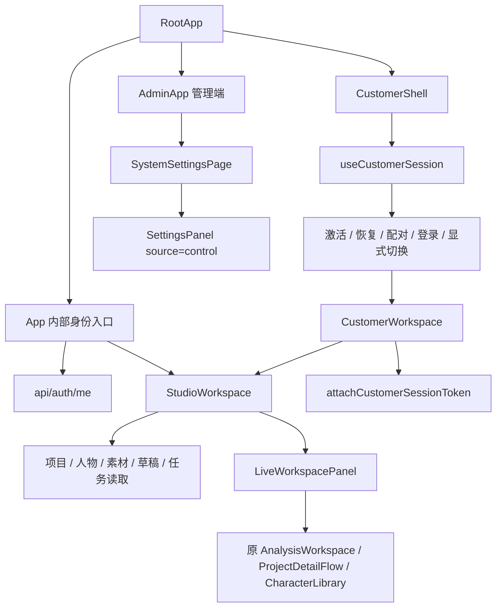

# 前端入口、桌面构建与激活门禁审计

本附件以当前分支源码为准；仅提出改造方案，未修改认证、页面或安装包代码。主报告见同目录《统一前端与单步流程分析报告.md》。源码位置采用仓库相对路径和审计时行号。

## 1. 实际有几套入口

| 入口 | 源码路径 | 当前行为 | 统一后的处理建议 |
| --- | --- | --- | --- |
| 浏览器普通路径 `/` | `client/src/RootApp.tsx:33-46` → `App.tsx:48-134` | 自动调用 `/api/auth/me`；失败显示内部访问令牌输入；成功进入 Studio | 改为统一客户应用入口，首先显示可浏览主界面 |
| `/customer` | `RootApp.tsx:53-174` | checking → activation/login/conflict → workspace；未激活看不到主界面 | 保留兼容路径，门禁改为用户打开受保护内容时出现 |
| Tauri 桌面 | `RootApp.tsx:33-39` | 所有 Tauri 运行时均进入 CustomerShell，包含仍启用 local-sidecar 的内部构建 | 入口统一已有一部分；构建侧仍需收口，不能以路由共用认定内部版已删除 |
| `/customer/pairing` | `RootApp.tsx:62-74` | 独立配对流程，保存设备凭据后启动正常登录流程 | 保留业务能力，统一弹层/承载方式及返回目标 |
| `/admin` | `RootApp.tsx:42-43` → `AdminApp` | 独立管理端登录与管理界面 | 保留。管理激活码、费率、Provider、设备及审计仍需要它 |
| `/review/v1.4` | `RootApp.tsx:18-31` | 仅 DEV 动态加载审核示例，不调用真实业务接口 | 保持开发专用，不作为匿名正式主页的快捷替代 |

`App.tsx:134` 和 `customer/CustomerWorkspace.tsx:231` 都挂载 `StudioWorkspace`。因此需要统一的是登录前承载、身份与能力入口、遗留嵌套页面、构建及服务运行方式；无需再复制一套 Studio 页面。

## 2. 当前依赖图

注意一个类型依赖：`StudioWorkspace.tsx:9,87`、`LiveWorkspacePanel.tsx:3,15-16` 从旧 `App.tsx` 的 `WorkspaceShell` 提取组件属性类型。旧壳即便不再是正常入口，也不能直接整文件删掉；须先把仍使用的类型放到现有共享类型位置，并移除运行时和测试消费者。

## 3. 门禁为何不能只换一行 render

### 3.1 外层状态机在挡整个页面

- `RootApp.tsx:86-174` 仅在 `session.screen === "workspace"` 且有 user 时挂载 CustomerWorkspace。
- `customer-state.ts:14-24,64` 的状态仍以 activation/login/workspace 等整屏状态表示；没有“匿名浏览首页、门禁尚未打开”的状态。
- `useCustomerSession.ts:195-314` 启动即检查设备凭据，桌面缺凭据时尝试恢复；没有凭据则进入激活页。
- `CustomerWorkspace.tsx:50-86,230` 加载并附着 session token 后才挂载 Studio。

这些地方共同构成旧门禁。不能仅把 activation 页面隐藏，然后给 Studio 塞一个假的用户身份。

### 3.2 Studio 挂载会立即读取受保护数据

| 自动行为 | 位置 | 匿名浏览需要的变化 |
| --- | --- | --- |
| 云草稿、个人文案、草稿素材恢复 | `StudioWorkspace.tsx:240-273` | 仅真实客户 session 可用时加载 |
| 自动保存草稿 | `StudioWorkspace.tsx:231-239,566-596` | 门禁通过前不写服务器；激活切换时清理旧账号的定时保存 |
| 独立生成能力探测 | `StudioWorkspace.tsx:298-312` | 按服务端端点权限决定公开配置或登录后加载，不能盲目发私有请求 |
| 项目、人物、素材、任务及统计 | `StudioWorkspace.tsx:430-457` → `live.ts:loadStudioData` | 有 session 才读；访客用不含个人数据的页面框架 |
| 每 20 秒任务、统计轮询 | `StudioWorkspace.tsx:464-480` | 无会话停止；过期/被切换及时撤下旧账号数据 |
| 人物素材懒加载 | `StudioWorkspace.tsx:482-531` | 有有效身份且打开授权内容后加载 |
| 个人资料、设备列表 | `CustomerWorkspace.tsx:64,111-113` | 从匿名框架中分离，激活成功后再挂载 |

当前这些 effect 主要使用 `review` 作为“是否调用 API”的判断，而 `review` 的含义是 DEV 审核，不是访客。正式访客态应独立表达，不得复用 review 模式来伪造正常客户数据。

### 3.3 所有打开路径都需要覆盖

`navigate` 位于 `StudioWorkspace.tsx:553`，hash/popstate 处理位于 `:533`，`openLive` 位于 `:597`。只拦侧边栏按钮会漏掉首页卡片、搜索结果、任务/人物/素材详情、导入入口、旧面板、浏览器历史及 `#studio/...` 深链接。

建议由统一入口记录一个不含凭据的待打开目标（页面、资源 ID、必要视图参数），让导航、深链接、详情、旧面板及实际操作都使用相同门禁裁决。服务端授权仍负责最后校验，前端门禁只负责交互体验。

## 4. 推荐的用户行为矩阵（待实施规格）

| 用户行为 | 未激活/无可用 session | 已激活且会话有效 |
| --- | --- | --- |
| 首次打开应用 | 立即显示现有主界面、完整菜单及功能入口；不强制跳激活屏 | 显示同一界面，恢复本人内容 |
| 看首页布局、功能介绍 | 可见，不调用用户私有接口 | 可见 |
| 打开项目、爆款详情、人物、素材、任务等业务内容 | 在发业务请求前显示激活/登录门禁 | 按原角色与 owner 权限打开 |
| 上传、拆解、选取私有素材、编辑、生成、下载、发布 | 先通过门禁，再进入相应界面 | 继续原业务校验与费用确认 |
| 取消门禁 | 留在原主界面，保留导航意图可重试，不出现错误登录循环 | 不适用 |
| 激活成功 | 进入刚才想打开的内容；不得自动提交付费生成或发布 | 不重复创建用户、钱包、设备 |
| 余额不足 | 先区分授权与钱包状态 | 可以浏览已授权内容，执行付费操作时显示报价/充值 |
| 另一台设备在线 | 保留主界面；访问内容时明确冲突与显式切换 | 不静默踢人 |
| 会话过期/被切换/设备撤销 | 撤下私有数据，回到可浏览框架；展示相应原因 | 重新认证后恢复目标，不能继续使用旧 session |
| 刷新或直接访问详情深链接 | 先显示框架并门禁，不能先请求私有数据 | 重验权限后恢复详情 |
| `/admin` 管理功能 | 沿用管理员登录 | 客户激活不授予管理权限 |

这里将“主界面可见”理解为菜单、布局与功能入口可见；它不等于公开现有账号的项目、人物、钱包与素材。如果后续希望未激活用户还能看到真实爆款列表或演示素材，需要显式定义公开目录，不能复用某个内部账号的数据。

## 5. 应复用的认证能力

建议保留激活、同机恢复、第二设备审批、两槽限制、单在线显式切换、heartbeat、session epoch fencing、三类终止事件、请求幂等、钱包及审计；本次改变的是触发时机和界面承载。

- `useCustomerSession.ts:316-355` 区分 expired/replaced/revoked；前两者保留设备凭据，撤销清全部凭据。
- `useCustomerSession.ts:364-385` 在有效 workspace session 下续租；如果外层状态改名，需要同步 heartbeat 条件，避免界面可用但会话 90 秒后过期。
- `api.ts:1209-1222` session token 附着带 owner 标识，防止旧树卸载误清新会话。统一入口仍需保留这个生命周期保护。
- `useCustomerSession.ts:635-726`：桌面用 Tauri 凭据存储；浏览器用内存闭包、无持久化。浏览器刷新后重新进入门禁是当前能力边界，不能把现有机制宣称为浏览器长期免激活。
- `client/src-tauri/src/customer_credentials.rs`、`video_downloads.rs` 是客户设备凭据/下载能力，不随 local-sidecar 一起删除。

现有激活、赠送额度和充值是不同业务：不能为“先看首页”增加免费额度、取消支付门或改变历史账务。具体面值/赠送秒数以当前激活服务、批次配置和增量账本为准，不能沿用早期文档中的“首充必然到账”描述。

## 6. 内部前端及构建删除候选

以下是依赖解除后的候选，不是本轮已删除项。

| 分类 | 文件/符号 | 当前消费者与安全删除条件 |
| --- | --- | --- |
| 替换后删除 | `App.tsx:48-135` 内部登录壳 | 先将 RootApp 的普通路径接到统一入口；取消 `/api/auth/me` 启动探测及内部令牌字段 |
| 替换后删除 | `App.tsx:143` 旧 WorkspaceShell | 先解除 Studio/LivePanel 的属性类型依赖；确认 App 测试和旧壳入口不再需要 |
| 删除内部分支，保留客户传输 | `api.ts:12,1192,1225` | 当前 `workspaceAccessToken()` 选择 internal token 优先于 customer token；去掉内部身份后应移除此优先分支，并同步上传 XHR 的请求头构造 |
| 删除开发身份注入/调整测试配置 | `api.ts:4358-4366`、`vite.config.ts:19-30` | DEV 默认 `employee_1`、控制代理注入会让本地匿名门禁测试失真；清理须与后端兼容认证配置一起收口；正常 Vite 代理无需因此删除 |
| 条件删除 | `WalletPanel.tsx`、旧钱包 API | LiveWorkspacePanel 内部档案与旧壳仍调用；客户钱包有独立组件，必须逐消费者迁移 |
| 保留共享组件 | `SettingsPanel.tsx:101-160` | 管理端 `admin/SystemSettingsPage.tsx:42` 以 source=control 使用；只能移除 workspace 内部来源分支，不能整文件删除 |
| 保留并核对呈现 | `studio/LiveWorkspacePanel.tsx` | 它连接真实拆解、项目详情、人物与任务能力；去旧皮肤不等于删除其业务依赖 |
| 条件删除 | `src-tauri/src/lib.rs:4-85,119-139` | local-sidecar 启动和退出清理，仅在唯一客户云构建已验证后移除；共享凭据/下载 invoke 保留 |
| 构建收口 | `src-tauri/Cargo.toml:12-18` | 默认 features 仍启用 local-sidecar；客户构建用 --no-default-features。统一后选择唯一标准构建路径 |
| 构建收口 | `src-tauri/tauri.conf.json` 与 `tauri.customer.conf.json` | 客户配置是覆盖基础配置的方式，不宜直接删除基础配置；整合 identifier、资源、CSP、启动 URL，测试安装升级与凭据位置 |
| 条件删除 | `src-tauri/resources/start-backend.bat/.sh` | 默认内部安装包 resources/* 仍打包；先更改构建引用，再删除启动器 |
| 同步调整 | `package.json:14,20-23`、`.github/workflows/ci.yml:168-248` | 当前 CI 明确验证并产出内部与客户两种 NSIS；删内部分支时修改对应断言与产物逻辑，保留客户安装包不含启动器门禁 |
| 保留版本能力 | 两份 package.json、Cargo.toml、Tauri 的 version；业务 versions/prompt/script | 软件升级版本、数据库迁移版本、提示词版本都不是“内部产品变体”；不能做关键字删除 |

特别说明：内部构建仍会启动本地 API，而前端 `isTauriRuntime()` 已统一导向客户认证。这证明双构建与双入口并非严格一一对应；重测安装包路径前不应声称两者都可正常使用。

## 7. 验收用例

1. 无凭据首次启动：主界面立即出现、完整入口可见，没有内部令牌表单，也没有业务数据请求。
2. 首页卡片/导航/搜索/深链接/历史返回/旧面板入口分别触发同一门禁；取消后主界面可继续浏览。
3. 激活成功返回原资源，并由服务端验证该资源属于当前用户；错误或跨用户 ID 不展示。
4. 激活成功不自动发起生成、支付或发布请求；仍需用户核对当前表单与费用。
5. 同设备恢复、第二设备审批、第三设备阻止、另一端在线冲突和显式切换全部回归。
6. 旧 session 的轮询、延迟读取、自动保存全部停止；过期、被切换和撤销提示不混淆。
7. 未激活不能利用 URL、旧内部 token、开发用户头、旧 /api/admin 或代理头绕过服务器权限。
8. 本人可以查看所有已授权内容；零余额不会被误当作未激活。
9. 客户端和浏览器默认入口一致；客户安装包不启动 API/Worker，凭据与下载功能仍可用。
10. 管理员仍可管理激活码、Provider、费率、设备与审计；auditor 不获得写权限。

## 8. 本轮验证证据与阅读范围

实际执行：`npm test --workspace client -- src/RootApp.test.tsx src/customer/customer-state.test.ts src/customer/useCustomerSession.test.tsx src/customer/CustomerWorkspace.test.tsx src/customerApi.test.ts`。

2026-09-07 12:04（Asia/Shanghai）结果：5 文件、80 测试通过；日志 `customer-gate-tests.log`。jsdom 提示 scrollTo 未实现，不影响这批测试退出成功。这证明旧门禁/适配器的当前回归基线，**不是新“首页开放”方案已经实现**。

本附件逐段阅读/追踪：RootApp、App、CustomerWorkspace、useCustomerSession、customer-state、api 身份与传输段、StudioWorkspace 入口及 effect、LiveWorkspacePanel、SettingsPanel、SystemSettingsPage、Vite、两份 Tauri 配置、Cargo features、lib.rs、构建脚本与 CI；相关测试用于定位当前行为。后端内部兼容与共享层详见 `internal-backend-audit.md`；全仓标记索引仅用于防漏查。
