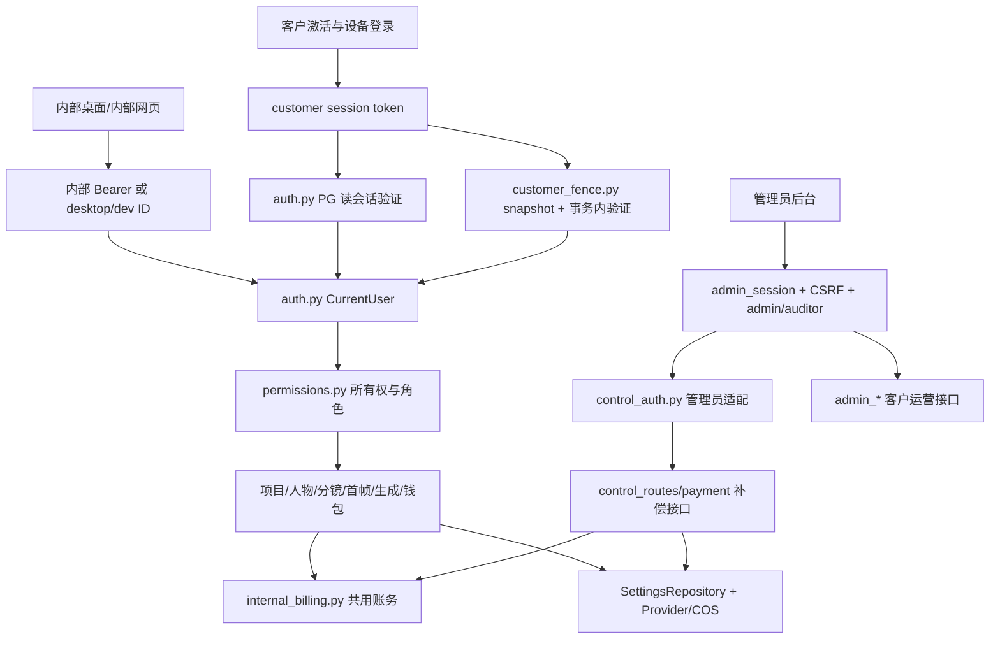

# 内部版后端、身份与部署清理审计

审计日期：2026-09-07。源码基线：`feat/unified-frontend-gate-flow-audit-20260907`；审计初始 `5b91089`，最终核对 `8d13f60`。期间另一任务提交了原有8个Studio前端文件，后端未变；这些变更不属于本报告实施。本分报告只分析 `server/`、`scripts/`、`deploy/` 与 `.github/`；客户端入口、Tauri 打包与完整步骤业务矩阵由总报告汇总。本轮未修改业务代码、数据库或部署，未执行 Provider、支付、COS 调用，也未运行测试。下文“已有测试”表示源码中存在相应保护，不表示本轮已通过。

遵循根 `AGENTS.md` 与 `andrej-karpathy-skills`：先区分真正退休的实现与仍在复用的业务，再设计最小删除，不为更名重建同一套逻辑。已检索 V3 六份正本的身份、账务、PG、部署、fencing 和证据条款；账本旧通过记录不替代当前源码与运行验证。

## 1. 先读结论

目前不是“两套互不相干的后端”。系统是同一个 FastAPI 应用，存在**内部 SQLite/桌面身份分支**和**客户 PostgreSQL/设备会话分支**，上层共享项目、人物、首帧、视频任务、账务与 Provider 服务。管理员控制面是第三种身份入口，负责客户、激活码、账务、配置和运维，仍然必须保留。

因此，“去掉内部版”需要分别处理入口、身份兼容、运行方式和历史数据；不能按 `internal` 字符串删除文件。

1. `internal_accounts.py` 的命令行开户/发内部 token 是较独立的退休候选，但 `users`、`wallets` 不是内部专用表。
2. `internal_billing.py` 是客户视频和口播也在使用的账务核心。删除会破坏余额预占、成功结算、失败释放和异常补偿。
3. `auth.py` 里的 `CurrentUser`、`AuthenticatedUser`、PG 读会话验证、`customer_fence.py` 的事务内验证必须保留。可清理的是其中内部 token、固定桌面 ID、开发请求头等兼容分支。
4. `control_auth.py` 的旧单管理员代理 token 分支可以退休；`control_routes.py` 与真实管理员 session/CSRF 不能整体删除。
5. SQLite 不只是旧运行时，也承担大量现有单测及旧库导入、对账、回滚工具。运行入口退休可以先做，彻底删除 SQLite 是单独的迁移工作。
6. “主界面可见，点击具体内容才激活”首先是前端展示与动作恢复问题。后端业务数据仍按客户会话/所有权保护。无需为了显示菜单把项目、人物、钱包、草稿或生成接口改成匿名。

## 2. 三条身份与调用链

### 2.1 内部用户链

- `server/app/internal_accounts.py:14` 的 `create_user()` 创建用户与空钱包；`:49` 的 `issue_token()` 将摘要存入 `internal_access_tokens`；`:75` 的 `revoke_token()` 撤销 token；`:90` 的 CLI 只接受 `--db-path`，`:109` 的 `main()` 以 SQLite 打开数据库。
- `server/app/auth.py:94` 的 `authenticate_request()` 在非客户生产 PG 环境优先识别内部 token；在 SQLite 环境按 `AUTH_MODE` 选择 Bearer 或旧身份。`:212` 的 `internal_auth_required()` 默认要求 token，只有 `desktop`/`development` 模式开放旧路径；`:258` 的 `identity_user_id()` 先用 `VIDEO_REPLICA_DESKTOP_USER_ID`，否则仅在显式允许时读取 `X-Dev-User-Id`。
- `server/app/customer_fence.py:365` 的 `BusinessDb.write()` 在没有客户 snapshot 时退回 SQLite 并调用上述认证。PG 配置下 `customer_session_snapshot()` 要求客户 token，不是给内部 token 写接口的通用通道。不能用“非生产 PG 内部 GET 可读”推论“内部 PG 写入也可用”。

### 2.2 客户链

- `server/app/auth.py:110` 的 PG Bearer 分支在客户生产跳过 `internal_access_tokens`，转入 `authenticate_customer_read_session()`（`:147`），复用 `verify_session_context()` 后查询活动用户。客户共享 GET 已经接入客户会话，不需重新发明一套身份类型。
- `server/app/customer_fence.py:105` 的 `customer_session_snapshot()` 先拿当前 session、设备、epoch、lease 快照；`:182` 的 `fenced_pg_transaction()` 在业务事务内再锁定验证；`:373` 构造 `role="customer"` 的 `CurrentUser`。在切换设备、码停用或会话过期之后，旧请求不能仅凭早期鉴权通过写入。
- `server/app/permissions.py:228` 的 `require_project_access()` 对普通用户按 `owner_user_id` 限制，管理员/审计员有明确全局读取能力；`:277` 的 `require_asset_access()` 检查项目归属、用户材料、口播、发布人物联系图等。无权读取采用 404 隐藏资源存在性并留下安全审计。
- `server/app/studio_routes.py:112`、`server/app/studio_draft_routes.py:40`、`server/app/material_routes.py:45` 等新前端接口继续复用这些身份。当前没有一个可直接替代这些接口的“匿名真实首页数据 API”。

### 2.3 管理员链

- `server/app/control_auth.py:24` 的 `get_control_user()` 依赖 `CONTROL_PROXY_TOKEN_DIGEST` + `CONTROL_ADMIN_USER_ID`，且在客户生产直接拒绝。这一段是旧内部 P0 单管理员兼容。
- 同文件 `:73` 的 `get_control_route_user()` 在客户生产改用 `admin_auth_routes.get_admin_actor()` 和 `get_admin_writer()`，并适配回共享 `CurrentUser`。
- `server/app/admin_auth_routes.py:732` 校验管理员 cookie 与写操作 CSRF；`:771` 阻止 auditor 写入。用户密码登录、会话刷新/退出、恢复交换码等都属于客户运营后台，不能作为“内部版”删除。
- `ControlUser` 还被 `server/app/payment_routes.py:16` 引入，用于充值结果同步/补偿。因此整删 `control_auth.py` 会连带影响支付运维。

## 3. 按模块给出清理边界

| 模块与证据 | 当前调用和数据依赖 | 归类与删除条件 | 删除风险/应保留的测试 |
|---|---|---|---|
| `auth.py:18–28,94–146,193–273` | 内部 token、desktop ID、开发头与客户 GET 共存；45 处运行代码 import `app.auth` | 只退休内部凭据分支；保留 `CurrentUser`、Role、PG `get_database`、客户读鉴权、活动用户查询 | 全文件删除会破坏几乎全部共享路由。`test_internal_access_tokens.py:281` 本身还保护客户生产拒绝内部 token，不能整删测试文件 |
| `customer_fence.py:346–476` | 16 处运行代码 import；写依赖和 Provider 读配置连接复用 | 可退掉 SQLite fallback；客户 snapshot/锁内验证/审计原样保留 | 会话切换后的旧写、跨用户访问和资金写入可能失去事务保护；`test_customer_fencing.py:1007,1284` |
| `internal_accounts.py:14–139` | 运行代码无 `from app.internal_accounts`；CLI 可独立调用；3 个测试文件导入开户/发码 helper | 内部发 token 与 SQLite CLI 是退休候选；先给相关测试提供明确夹具，盘点旧用户/资产再退工具 | `create_user()` 创建的是共享 users/wallets。删除员工数据会影响项目、账务、人物外键和审计；不能和删工具一起做 |
| `internal_billing.py:56,134,264,332,361,460,657,786` | generation、oral、oral_worker、oral_routes、PG 补偿脚本共用；wallets、wallet_transactions、generation_tasks、oral_tasks | 必须保留业务；后续如需去掉命名，可在冻结文件映射修订后作独立更名，不应复制另一套账务 | 资金预占永不释放、重复结算、口播队列容量不释放；`test_wallet_billing_service.py`、`test_worker_crash_recovery.py:481,532,1052`、`test_oral_domain.py` |
| `control_auth.py:24,76` | control_routes、payment_routes；旧代理身份或真实管理员 session | 仅删除旧代理身份解析；把 ControlUser 明确接真实管理员；保留运营接口 | 误把管理员后台与内部客户端一起下线；`test_admin_auth.py:1054,1091,1147` |
| `control_routes.py:484–531` | `/api/control/accounts` LEFT JOIN internal_access_tokens 并返回 `active_token_count`；同时管理客户充值、账单、生成记录、Provider 和导出 | 去掉内部 token 表前先去掉此 JOIN/响应列/前端消费；其他 API 按后台实际调用保留 | 先 drop 表会使客户管理员账号列表 500；响应契约/生成类型也要同步 |
| `recharge_routes.py:263–325` | 旧 `/api/recharge-orders` POST；共享 `_stage_recharge_preconditions` 与 `_insert_recharge_order`（`:155,194`）也给客户调用 | 旧充值入口可下线；不要删共用函数、客户 `/customer/recharge-orders`、查询/关闭/二维码、支付回调 | 旧路由明确 403 拒绝 customer；不能靠复用旧入口代替客户幂等/fencing；`test_recharge_orders.py`、`test_customer_recharge.py` |
| `wallet_routes.py:14,49,79` 与 `recharge_routes.py:830` | 客户专用钱包沿用 `WalletResponse.internal_unit_price_fen` 字段，但赋的是客户实际成交单价；共享 `wallets` | 旧名称不是旧业务；API 字段更名要兼容更新 TS 类型和调用，资金数据保持 | 不要因名字含 internal 清空定价或断掉客户端充值展示；`test_wallet_routes.py`、客户充值用例 |
| `settings.py:83,323,341,362` | 22 处运行代码 import；Provider 加密配置、COS、运行并发、客户价格共用 | 配置仓储和服务端密钥必须保留；只移除自动 OS 密钥 fallback 的条件分支 | PG 客户节点需要同一配置主密钥；删除加密读取会让全部 Provider 失败 |
| `settings_routes.py:235,263–569` | `/api/admin/settings` 通过业务身份 `SettingsAdmin` 限 admin；旧 SettingsPanel 与 control_routes 共享配置服务/诊断函数 | 旧客户端配置路由是候选；诊断/连接测试 helper 可能被控制面调用，先分辨路由与服务 | 客户生产 auth 不接受内部 admin token，而管理员 cookie 也不走 AuthenticatedUser；不能直接把旧 SettingsPanel 接进客户主界面就认为可用 |
| `local_settings_key.py:26,47` | macOS Keychain/Windows DPAPI；仅 settings 与 bootstrap 两处运行 import | 客户生产只认显式 `VIDEO_REPLICA_SETTINGS_KEY`；停止本地 Provider 配置后可退自动密钥功能 | 旧 SQLite provider_settings 需要原密钥才能迁移；删密钥文件/Keychain 条目是数据损失动作，不属于代码清理 |
| `db.py:13–52` / `db_pg.py:122,157` / `db_portable.py:214,228,320` | 10 处运行代码 import `app.db`，44 处测试 import；BusinessConnection 有 47 处运行 import，提供 PG 行形状与事务边界 | 先禁止旧运行入口；SQLiteBackend/SQL 翻译器与 sqlite fixtures 可延后退。BusinessConnection PG 部分必须保留 | SQL 全仓当前使用 `%s`，SQLite只是翻译运行。`sqlite3.Row` 注解不等同实际 SQLite I/O，机械删 import 不代表完成迁移 |
| `generation_worker.py:325,890,1330,1382,1428` | 一个入口按数据库类型选择单机或 PG worker；共用所有任务服务 | 退 run_sqlite_worker_round/run_forever/SQLite main 分支；先给共用服务补齐 PG 测试 | PG 有持久多步领取、提交不确定、任务恢复、短事务；不能把旧 `run_worker_once` 直接拿来替代 PG 主循环 |
| `oral_worker.py:224,408,592` | 客户/内部共用口播任务领取、Provider 提交、落结果、结算；PG 与 SQLite 的并发实现有分支 | 保留主体，仅清掉确认废弃的数据库分支 | 口播不是“内部专用”；重试及收费状态需要独立验证 |
| `storage.py:167,194,414` / `media_routes.py:147,163,382,486,577` | COS 或 LocalStorageAdapter；资产URI按已存 provider/bucket 选择；签名下载还绑定客户 session epoch | 可以停止新建 local 资产；已有 local:// 资产需迁到 COS并校验后再去解析/上传下载实现 | 只删本地适配器会让历史人物/原视频/首帧无法打开，生成链也断掉 |
| `rbac_routes.py:192,259,323,961` | 客户生产人物缓存走 COS；非生产本地缓存；访问授予与缓存分开验证 | 清理本地缓存分支时保留 COS 缓存与授权重验 | 不是普通临时图片目录，涉及人物所有权与缓存分享；`test_rbac.py`、客户跨用户读矩阵 |
| `viral_routes.py:179,196,537,587,633` | 爆款库后台封面线程分别打开 PG/SQLite；本地媒体URI转签名文件路由 | SQLite/本地文件分支候选；保留 PG 回源连接、缓存表与Provider访问 | 新 Studio 也在用，不能因为注释“桌面单进程”删除整个模块；多节点共享回源锁另需验证 |
| `simple_character.py:68–69,1872,1901,1937` | `internal-short-video` 被写入人物授权与persona使用范围；不是 UI 文案 | 视作持久领域值，不是删除标记。改为统一授权范围要定义新值、兼容历史数据及发布 hash | 字符串直接删除/替换可能改变历史授权和人物版本快照 |
| `character_identity.py:310,324` / `characters.py:389,635` | employee/customer 有所有权逻辑，legacy人物同步到新身份/persona/version；新人物与旧项目同时依赖 | 保留所有权、人物授权与 legacy 数据兼容，是否停止旧写入口另列清单 | “legacy”不等于“内部版”；删同步可能破坏旧项目主角和已发布五视图 |
| `first_frame_routes.py:139–157,179–214` / `character_image_generation.py:243,1163` | 开发时 fake provider/质检，客户生产显式拒绝 | 测试替身可保留在测试层；生产拒绝分支和检查不能删 | “本地有图片”不能证明 Provider 真生成；现有 fail-closed 约束需要保住 |
| `main.py:99,177,268,392` / `bootstrap.py:241,526,579` | API启动安全门、旧loopback与客户代理边界、内部 readiness、SQLite bootstrap | 退内部启动分支时保留客户安全校验、可信代理、HTTPS/Host验证、PG/COS readiness | 仅把 readiness 的 internal 改成 postgres 会制造假就绪，不是完成迁移 |
| `backup.py:164,305,330,352` / `server/scripts/sqlite_to_postgres.py:33,607` | 旧在线备份 + 导入器使用只读快照/校验 | 旧 daily 服务可下线；导入/对账/快照在数据迁完及回滚窗口过后再退 | `backup.py` 全删会让客户 SQLite→PG 导入器导入失败 |
| `server/scripts/reconcile_dangling_billing_reservations.py:21,27` | 只连 PG，调用 internal_billing 补终态流水 | 必须保留；名字/导入不得误判成旧内部运行 | 已终态未结算的钱包长期占额；dry-run和写入分开，审计本轮均未执行 |

### 3.1 数据库里不能一起删的东西

`server/migrations/versions/022_internal_billing.py:21` 在同一个历史 revision 里既创建了 `internal_access_tokens`，也创建 `wallets`、`recharge_orders`、`wallet_transactions` 和价格列。后续 `023_zpay_provider.py:6` 以它为父 revision。即使不再发内部 token，仍不能删除这份迁移，也不能改写它。

`runtime_settings.internal_base_unit_price_fen` 仍被客户激活码、客户定价、后台配置和开户默认值使用：`admin_activation_routes.py:202`、`admin_customer_routes.py:232,456`、`admin_runtime_routes.py:103`、`bootstrap.py:435`。它还进入充值订单定价快照。若需要规范名字，必须是独立的兼容迁移，不是清理时顺手 drop。

旧 `pricing_scope="INTERNAL"` 订单属于历史资金记录。允许停止创建新内部订单，仍应保留查询、支付回调、对账和账单历史。若旧 PENDING 订单还在等回调，关闭旧页面不等于可以关闭回调。

### 3.2 部署、命令行与CI

| 文件 | 当前用途 | 处理方向 |
|---|---|---|
| `deploy/internal-p0.env.example:1` | SQLite路径、内部鉴权、单管理员代理映射 | 内部运行退休后删除示例；不读取/修改真实 env |
| `deploy/nginx/internal-p0.conf.example:1` | 内部网页、API、Basic Auth/IP限制、代理管理员token | 与内部域名部署退役一起清理；支付旧回调是否仍到达先盘点 |
| `deploy/systemd/video-replica-api.service:2` / `video-replica-worker.service:2` | 非模板单机API/worker加载internal-p0.env | 可退内部部署产物；不要删 `api@.service`/`worker@.service` |
| `deploy/systemd/video-replica-backup.service:1` / `.timer:1` | 旧SQLite daily备份 | 客户生产本来就不应安装；确认旧库迁移/回滚完成后下线 |
| `deploy/customer.env.example:1`、`deploy/nginx/customer.conf.example:1`、`api@.service:1`、`worker@.service:1` | 客户PG、多API/worker与统一域名 | 保留。客户nginx `:98,110` 的 `/internal/metrics/*` 是私有监控，不是内部产品 |
| `deploy/systemd/video-replica-pitr-backup.*`、`deploy/postgres/*` | 客户PG备份/WAL/PITR | 必须保留 |
| `scripts/customer_release_preflight.py:49` | 客户生产拒绝桌面身份、检查监控token文件 | 保留，即使不再支持内部运行仍需阻止错误配置 |
| `scripts/p0_acceptance_evidence.py:1` | fake 内部P0证据生成器 | 可随旧验收入口退；不能把它产物当客户真实链路证明 |
| `server/app/gate1_bootstrap.py:12` / `gate1_e2e.py:26` | 本地桌面验收库、固定admin、10额度夹具、进程管理 | 旧Gate1专用候选。其支付记录是fixture，不是客户开户逻辑 |
| `.github/workflows/ci.yml:170–200` | 额外构建/归档内部NSIS；与客户NSIS共用输出目录 | 删内部安装包任务时同步重写输出隔离依赖；保留`:201–250`客户构建与“无本地launcher”检查 |
| `server/pyproject.toml:4` | 描述仍为Internal API service | 仅文案，可在主清理之后改；应用版本`main.py:142`不是内部独立版本开关 |

### 3.3 历史员工账号不自动变成客户账号

`server/migrations/versions/001_core.py:45` 的项目 owner、`:104` 的生成批次创建者指向 users；人物身份/素材/上传者、wallets、订单和审计也持有用户引用。`server/app/auth.py:216` 按现存 role 返回身份，`permissions.py:250` 对 admin/auditor 有全局访问，employee/customer按owner限制。把旧员工界面换成客户界面，不会自动改变这些归属；简单批量改role还可能改变可见范围。

首次激活 `server/app/activation_code_routes.py:371` 的 `_insert_customer_user()` 生成新的随机user ID，`:631` 调用后创建新钱包与首台设备。源码未在这个入口把既有内部employee/admin账号转换或合并成客户。若旧内部使用者激活新码，旧项目/人物/钱包不会自动出现在其新账号下。需要单独定义“保留旧ID并建立客户激活事实”还是“新客户ID下显式迁移授权资源”；两者均需审计、重复执行保护、钱包对账和角色降权验证，当前不能当作已实现。

现有 `server/scripts/sqlite_to_postgres.py:196` 检查PG-only客户表分歧，`:565` 明确拒绝非空且无法精确对账的目标，`:607` 是维护窗口内的整库一次性导入。它**不是**把内部历史库合并到已经运行的客户PG库的工具。`server/scripts/reconcile_customer_billing.py:1156` 比较共用表摘要、PG-only状态、资产引用与资金不变量。保留工具是必要条件，但是否能用于当前数据必须先检查实际源/目标状态；本轮未连接真实库，所以不判断数据是否可直接迁移。

`server/migrations/versions/026_customer_security_and_billing.py:107` 在PG追加账务约束和管理员会话，父revision是025；022→023→…→025→026→027构成已发布迁移链。026的历史正文仍提“激活首充”与历史价格底线，不代表最新业务合同回退（新码零额度由后续迁移和现行激活代码承载）。历史迁移、已入账的`pricing_scope=INTERNAL`、订单定价快照、审计中的旧值应长期保留为可解释历史；运行函数名`internal_billing`没有必须永久保留的技术约束，但更名不能改变其业务、迁移ID或资金事实。

## 4. 与新激活门禁的直接关系

“首页能看到”与“可以匿名读取每个接口”要分别实现。建议保持客户服务端的当前安全边界：

- 未激活用户可以加载统一页面壳、导航、功能说明、静态示例和明确的未开通状态。
- 首次打开项目详情、自己的草稿/人物/素材、视频解析、上传、生成、钱包等受保护内容时，触发激活/登录，再返回原动作。
- 若首页确实必须展示真实公共案例/公开视频列表，应增加明确的公开响应模型，只返回被批准公开的字段；不要把 `AuthenticatedUser` 从既有私有列表整体拿掉。
- 当前 `/api/studio/stats`、草稿、素材等会先取身份。若只把前端总门禁删除而继续无差别请求这些API，匿名首页会出现401/503、错误提示或循环回激活。需要在前端按激活状态延迟数据请求，并区分“尚未激活”与“后端不可用”。
- 不需要因门禁延迟而弱化 session lease、激活码停用、设备并发、每次写操作事务内 fencing 或跨用户授权。主界面可见不等于这些规则被取消。

## 5. 建议的安全删除顺序

**数据迁移前提**：现有T07整库工具会拒绝已存在分歧业务/客户数据的目标PG（`sqlite_to_postgres.py:196,565`）。先确认内部历史数据与当前客户库是否需要合并，不能直接执行该工具，更不能先删旧库。以下是代码清理顺序，数据迁移另需根据实际库状态落实。

1. 冻结目标运行模型：统一前端仍连接客户PG服务；内部员工若继续使用产品，应通过明确客户/员工授权入口，而不是保留匿名admin。前端主界面与管理员后台的职责保持明确。
2. 先统一前端壳和内容触发门禁，保住激活后动作恢复。服务端接口安全不动，这一步可独立验证。
3. 关闭新内部 token/旧内部充值/本地客户端配置入口。先从应用入口与路由挂载退休，保留共用服务。确认管理员后台仍能配置Provider与查询账务。
4. 移除固定 desktop ID、dev header、旧控制代理身份兼容。保留客户拒绝旧身份的测试，避免错误环境变量重新打开绕过。
5. 先清理 `/control/accounts` 的 token 统计字段与所有读表引用，再考虑追加迁移删除 `internal_access_tokens`。用户、钱包、订单、资产数据不随之删除。
6. 退休单机安装/启动/部署服务，保留PG worker与客户CI。独立验证安装包不含本地launcher。
7. 迁移或归档历史SQLite与local://资产，保存Provider原密钥，执行导入对账和可回滚校验。完成前不能删备份/导入工具。
8. 最后才清理SQLite实现、旧测试夹具和命名。先将覆盖关键共享服务的SQLite测试迁成PG合同测试或纯领域测试，再删对应分支。不要以大量删测试来换绿灯。

每一阶段独立提交、回归、证据登记。已发布Alembic revision保持不动；资金与身份清理应独立复核。代码删除可git revert，token/用户/历史数据库/密钥删除则不是同等可逆。

## 6. 已定位的测试保护与仍缺验证

以下测试**本轮未执行**。重构时按变更范围先专项，最后按项目约定由唯一一次 `npm run check` 承载全量，不能同时启动两个PG全量fixture。

| 断言目标 | 已有源码证据 | 清理新增/保持的验收 |
|---|---|---|
| 客户生产不能用内部token读取业务 | `test_internal_access_tokens.py:281` | 删除内部路径后仍拒绝；保留401/503服务不可用区别 |
| 旧代理身份不得替代真实管理员 | `test_admin_auth.py:411,1054,1091` | 管理员session可读，auditor只读，CSRF及二次确认存在 |
| 共享GET必须按客户owner隔离 | `test_customer_fencing.py:780,877` 与角色/人物/材料测试 | 客户同名资源、历史人物、缓存URL不能跨用户 |
| 新旧会话写入隔离 | `test_customer_fencing.py:1007,1284` | 新增Studio写接口也纳入逐路由矩阵；仅早期依赖检查不够 |
| 充值/资金共用链 | `test_wallet_billing_service.py`、`test_customer_chain_e2e.py:500,625` | 保留零额度激活、独立充值、reserve/settle/release及直接交付 |
| Worker崩溃后不重复付费 | `test_worker_crash_recovery.py:283,481,842,931` | PG领取持久化、已提交ID恢复、终态账单补偿都不回退到单机算法 |
| 本地→客户运行边界 | `test_admin_auth.py:1297,1312,1327`、`test_internal_deployment.py:23` | 不允许缺PG时自动创建SQLite，客户构建无local sidecar |
| 旧库迁移与回滚 | `test_sqlite_to_postgres.py`、`test_db.py` | 先验历史库导入、资产URI和账务核对，再移除工具 |
| 未激活主界面可读、点击内容激活 | 不是以上后端测试覆盖的旧合同 | 需要新增前端浏览/内容点击/深链接/刷新/激活取消/激活后恢复用例；真实数据API继续拒绝匿名 |

本报告证明的是源码依赖和清理风险，不能据此声称已完成内部版删除、当前生产支持匿名主界面、或完成真实Provider/支付/多实例验收。

## 7. 审计方法与文件清单

采用全量关键词扫描（internal/Internal/INTERNAL、desktop身份、dev身份、SQLite、local设置/存储）、Python AST导入依赖清点及以上关键分支精读。不是声称逐行人工通读了所有业务文件，也不把关键词命中本身当作删除结论。后续附录列出命中文件与实际位置；测试文件通过明确函数定位核验，未执行它们。

### 附录A：候选文件位置索引（机械索引，不代表整文件应删除）

本分报告扫描上述目录的 216 个文本文件，128 个文件命中内部/旧运行相关关键字。该扫描口径包含角色和Gate1，并不与总报告的扫描计数等同。每组最多列前6处行号，省略部分以“等”标记；第3节才是经过调用路径判断的清理结论。

| 文件 | 命中类别与行号 |
|---|---|
| `.github/workflows/ci.yml` | 内部命名/角色：170,172,175,185,187,196等 |
| `deploy/customer.env.example` | 桌面身份：6,7；SQLite：4,68；本地设置/存储：8 |
| `deploy/internal-p0.env.example` | 内部命名/角色：1,6,20；桌面身份：6,7,8；本地设置/存储：5,12 |
| `deploy/nginx/customer.conf.example` | 内部命名/角色：98,110 |
| `deploy/nginx/internal-p0.conf.example` | 内部命名/角色：1,6,12,14,15,67等 |
| `deploy/postgres/README.md` | 内部命名/角色：81；SQLite：81 |
| `deploy/postgres/migrate.sh` | SQLite：21 |
| `deploy/systemd/video-replica-api.service` | 内部命名/角色：2,11 |
| `deploy/systemd/video-replica-backup.service` | 内部命名/角色：1；SQLite：1,3 |
| `deploy/systemd/video-replica-backup.timer` | 内部命名/角色：1；SQLite：1,3 |
| `deploy/systemd/video-replica-worker.service` | 内部命名/角色：2,11 |
| `scripts/customer_release_preflight.py` | 桌面身份：18,64,66,69,72,73等 |
| `scripts/p0_acceptance_evidence.py` | 内部命名/角色：68,171,176 |
| `server/app/activation_code_routes.py` | 内部命名/角色：41,831；SQLite：41,830 |
| `server/app/admin_activation_routes.py` | 内部命名/角色：202 |
| `server/app/admin_audit_routes.py` | SQLite：17 |
| `server/app/admin_auth_routes.py` | 内部命名/角色：11,744；SQLite：744 |
| `server/app/admin_customer_routes.py` | 内部命名/角色：24,28,83,150,161,232等；SQLite：34,82,83,981 |
| `server/app/admin_rate_routes.py` | SQLite：12 |
| `server/app/admin_runtime_routes.py` | 内部命名/角色：4,5,80,82,103,112；SQLite：16 |
| `server/app/admin_session_routes.py` | SQLite：7 |
| `server/app/admin_write_contract.py` | 内部命名/角色：298；SQLite：298 |
| `server/app/analysis.py` | SQLite：6,561,584,620,632,652等 |
| `server/app/analysis_routes.py` | SQLite：4,559,899,903,906,954等 |
| `server/app/asr.py` | 内部命名/角色：341 |
| `server/app/auth.py` | 内部命名/角色：16,17,48,102,104,108等；桌面身份：18,19,20,21,84,213等；SQLite：47,72 |
| `server/app/backup.py` | SQLite：6,19,20,49,58,62等 |
| `server/app/bootstrap.py` | 内部命名/角色：244,435,446,544；桌面身份：65,245,256,257,260,262等；SQLite：528,544,581,605,610；本地设置/存储：31,35,270,272,536,537 |
| `server/app/character_asset_review.py` | SQLite：6,509,569,635,647,656等 |
| `server/app/character_identity.py` | 内部命名/角色：319,321,333,335,829,835等；SQLite：8,1007,1278,1285,1288,1295等 |
| `server/app/character_image_generation.py` | 内部命名/角色：448；SQLite：5,277,340,475,517,576等 |
| `server/app/character_policy.py` | 内部命名/角色：6,64 |
| `server/app/character_reference_matching.py` | SQLite：6,176,459,474,480,499等 |
| `server/app/character_routes.py` | 内部命名/角色：123,185 |
| `server/app/characters.py` | 内部命名/角色：65,87；SQLite：5,594 |
| `server/app/control_auth.py` | 内部命名/角色：28,80 |
| `server/app/control_routes.py` | 内部命名/角色：206,214,462,476,502,505等；SQLite：10,1378,1498,1586；本地设置/存储：1521 |
| `server/app/customer_device_routes.py` | 内部命名/角色：90；SQLite：90 |
| `server/app/customer_device_service.py` | SQLite：39 |
| `server/app/customer_fence.py` | 内部命名/角色：12,110,116,117,133,355等；桌面身份：429；SQLite：53,84,355,389,400,404等 |
| `server/app/db.py` | SQLite：3,13,18,19,26,45等 |
| `server/app/db_pg.py` | 内部命名/角色：10,117,128,162；SQLite：5,10,12,62,76,84等 |
| `server/app/db_portable.py` | 内部命名/角色：6；SQLite：6,10,14,24,42,55等 |
| `server/app/first_frame_routes.py` | SQLite：5,460,475,497 |
| `server/app/first_frames.py` | 内部命名/角色：1993,2445；SQLite：9,1834,1875,1876,1992,1993等 |
| `server/app/gate1_bootstrap.py` | 内部命名/角色：47；桌面身份：18,75；SQLite：23；本地设置/存储：12,39,47,60,63,85等 |
| `server/app/gate1_e2e.py` | 桌面身份：429,430,433；SQLite：469,729；本地设置/存储：26,29,30,34,163,221等 |
| `server/app/generation.py` | 内部命名/角色：42,45,46,1795,3870,3907等；SQLite：13,862,864,882,917,999等 |
| `server/app/generation_routes.py` | 内部命名/角色：693；SQLite：7,240,641,657,893 |
| `server/app/generation_worker.py` | SQLite：296,343,349,1330,1337,1353等 |
| `server/app/image_tasks.py` | SQLite：13,111,245,282,315,370等 |
| `server/app/independent.py` | SQLite：20,115,116,386,387 |
| `server/app/internal_accounts.py` | 内部命名/角色：19,67,79,91,95,98；SQLite：111 |
| `server/app/internal_billing.py` | 内部命名/角色：17,21,25,134,657,695等 |
| `server/app/local_settings_key.py` | 本地设置/存储：26,47 |
| `server/app/main.py` | 内部命名/角色：80,101,106,110,180,385；桌面身份：99,183,184,308；SQLite：101,107,132 |
| `server/app/materials.py` | 内部命名/角色：278 |
| `server/app/media.py` | SQLite：6,433,540 |
| `server/app/media_routes.py` | 内部命名/角色：209；桌面身份：59,71,587；SQLite：398；本地设置/存储：43,50,167,433,497 |
| `server/app/ops_metrics.py` | 内部命名/角色：467 |
| `server/app/oral.py` | 内部命名/角色：9,30 |
| `server/app/oral_routes.py` | 内部命名/角色：23 |
| `server/app/oral_worker.py` | 内部命名/角色：26,96；SQLite：381 |
| `server/app/payment_routes.py` | SQLite：6,89,208 |
| `server/app/permissions.py` | 内部命名/角色：21,221；SQLite：6,235,251,262,283,322等 |
| `server/app/project_character_selection.py` | SQLite：5,104,241,258,259,336 |
| `server/app/rbac_routes.py` | 桌面身份：395；SQLite：9,146,215,261,325,815等；本地设置/存储：57,143 |
| `server/app/recharge_routes.py` | 内部命名/角色：146,199,231,279,301,343等；SQLite：4,254,258,307,455,978 |
| `server/app/script_from_audio.py` | SQLite：16,82,150,200,216,266等 |
| `server/app/script_rewrite.py` | SQLite：13,278,351,432,436,440等 |
| `server/app/security_rate_limit.py` | 内部命名/角色：144 |
| `server/app/settings.py` | 内部命名/角色：57,292,298,306,314,325等；SQLite：211,214,264；本地设置/存储：11,19,364,367,380,381等 |
| `server/app/settings_routes.py` | 内部命名/角色：49,372,389,481；SQLite：44 |
| `server/app/simple_character.py` | 内部命名/角色：68,69,443,2137,2147,2148等；SQLite：14,469,746,764,777,778等；本地设置/存储：774,2386,2583 |
| `server/app/simple_character_routes.py` | SQLite：8,972 |
| `server/app/source_frame_routes.py` | SQLite：5,257,272 |
| `server/app/source_frames.py` | SQLite：7,47,259,484,538,556等 |
| `server/app/storage.py` | 本地设置/存储：167,194,196,198,208,414等 |
| `server/app/studio_drafts.py` | SQLite：14,295,305 |
| `server/app/studio_routes.py` | 内部命名/角色：68,201；SQLite：166 |
| `server/app/viral_routes.py` | SQLite：191,203；本地设置/存储：537,544,547,556 |
| `server/app/viral_store.py` | SQLite：9 |
| `server/app/wallet_routes.py` | 内部命名/角色：19,65,74,79,83,84等 |
| `server/app/zpay_payments.py` | SQLite：3,38,40,54,75,210 |
| `server/migrations/env.py` | SQLite：51,52,53,64,68,108 |
| `server/migrations/versions/001_core.py` | 内部命名/角色：36 |
| `server/migrations/versions/007_local_storage_provider.py` | SQLite：23 |
| `server/migrations/versions/009_idempotency_project_scope.py` | SQLite：61,63 |
| `server/migrations/versions/012_character_domain.py` | SQLite：272 |
| `server/migrations/versions/014_character_image_generation.py` | SQLite：13,14,52 |
| `server/migrations/versions/017_generation_task_retry_lineage.py` | SQLite：117 |
| `server/migrations/versions/019_character_simple_upload.py` | SQLite：13 |
| `server/migrations/versions/022_internal_billing.py` | 内部命名/角色：6,25,41,54,55,88等；SQLite：140,187,195,203 |
| `server/migrations/versions/023_zpay_provider.py` | 内部命名/角色：6 |
| `server/migrations/versions/025_postgres_runtime_compatibility.py` | 内部命名/角色：8；SQLite：4,15,36 |
| `server/migrations/versions/026_customer_security_and_billing.py` | 内部命名/角色：3,4,5,7,21,33等；SQLite：33,109 |
| `server/migrations/versions/027_activation_code_catalog.py` | 内部命名/角色：44,115；SQLite：44,115 |
| `server/migrations/versions/028_customer_devices_and_activations.py` | 内部命名/角色：41,81；SQLite：41,81 |
| `server/migrations/versions/029_customer_sessions_and_idempotency.py` | 内部命名/角色：28,98；SQLite：28,98 |
| `server/migrations/versions/031_admin_write_idempotency.py` | 内部命名/角色：51,72；SQLite：51,72 |
| `server/migrations/versions/032_security_rate_limits.py` | 内部命名/角色：19,69；SQLite：18,69 |
| `server/migrations/versions/033_batch_creation_audit.py` | 内部命名/角色：24,45；SQLite：24,45 |
| `server/migrations/versions/034_device_fingerprint_canonical.py` | 内部命名/角色：28,48；SQLite：28,48 |
| `server/migrations/versions/035_export_ciphertext_purge.py` | 内部命名/角色：23,43；SQLite：23,43 |
| `server/migrations/versions/036_low_review_constraint_guards.py` | 内部命名/角色：6,28；SQLite：28 |
| `server/migrations/versions/037_device_pairing_requests.py` | 内部命名/角色：42,91；SQLite：42,91 |
| `server/migrations/versions/038_admin_device_operations.py` | 内部命名/角色：24,108；SQLite：24,108 |
| `server/migrations/versions/039_admin_adjustments.py` | 内部命名/角色：16,51；SQLite：16,51 |
| `server/migrations/versions/040_fix_provider_settings_constraint.py` | SQLite：40 |
| `server/migrations/versions/041_user_fair_queue.py` | 内部命名/角色：55；SQLite：37,55 |
| `server/migrations/versions/042_t37_observability_indexes.py` | 内部命名/角色：41；SQLite：41,99 |
| `server/migrations/versions/044_customer_unit_prices.py` | 内部命名/角色：6,84,90 |
| `server/migrations/versions/045_async_analysis_tasks.py` | SQLite：94 |
| `server/migrations/versions/046_async_image_tasks.py` | SQLite：107,187 |
| `server/migrations/versions/047_async_source_frame_tasks.py` | SQLite：105 |
| `server/migrations/versions/048_async_script_rewrite_tasks.py` | SQLite：91 |
| `server/migrations/versions/054_admin_free_grant_adjustments.py` | 内部命名/角色：41；SQLite：41 |
| `server/migrations/versions/056_operation_cost_rates.py` | 内部命名/角色：44；SQLite：14,44 |
| `server/migrations/versions/057_second_based_billing.py` | SQLite：16,106,114,122,127,141等 |
| `server/migrations/versions/058_daily_external_prices.py` | 内部命名/角色：25；SQLite：25 |
| `server/migrations/versions/063_wallet_ledger_sequence.py` | SQLite：25,26,27,43,92,96等 |
| `server/migrations/versions/065_oral_domain.py` | 内部命名/角色：5 |
| `server/migrations/versions/073_oral_durable_billing.py` | SQLite：49,51,92,93,95,143等 |
| `server/migrations/versions/075_independent_creation.py` | SQLite：30,32,73,74,76,93等 |
| `server/scripts/__init__.py` | SQLite：1 |
| `server/scripts/reconcile_customer_billing.py` | SQLite：1,13,28,41,93,107等 |
| `server/scripts/reconcile_dangling_billing_reservations.py` | 内部命名/角色：21 |
| `server/scripts/sqlite_to_postgres.py` | SQLite：1,4,14,33,40,42等 |

### 附录B：共享抽象的直接调用文件（AST import）

**app.auth**：运行代码45处；测试34处直接import。此计数不包括字符串CLI调用或`from app import module`。

`server/app/admin_customer_routes.py:67`、`server/app/analysis_routes.py:32`、`server/app/character_asset_review.py:14`、`server/app/character_generation_routes.py:6`、`server/app/character_identity.py:26`、`server/app/character_identity_routes.py:12`、`server/app/character_image_generation.py:16`、`server/app/character_reference_matching.py:13`、`server/app/character_reference_routes.py:6`、`server/app/character_routes.py:8`、`server/app/characters.py:13`、`server/app/control_auth.py:11`、`server/app/control_routes.py:29`、`server/app/customer_fence.py:43`、`server/app/first_frame_routes.py:12`、`server/app/first_frames.py:22`、`server/app/generation.py:33`、`server/app/generation_routes.py:14`、`server/app/image_tasks.py:22`、`server/app/independent_routes.py:12`、`server/app/internal_accounts.py:9`、`server/app/material_routes.py:11`、`server/app/materials.py:20`、`server/app/media.py:22`、`server/app/media_routes.py:16`、`server/app/oral.py:27`、`server/app/oral_routes.py:15`、`server/app/payment_routes.py:15`、`server/app/permissions.py:13`、`server/app/project_character_selection.py:11`、`server/app/rbac_routes.py:23`、`server/app/recharge_routes.py:13`、`server/app/script_from_audio_routes.py:9`、`server/app/script_rewrite.py:24`、`server/app/settings_routes.py:15`、`server/app/settings_routes.py:16`、`server/app/simple_character.py:25`、`server/app/simple_character_routes.py:26`、`server/app/source_frame_routes.py:12`、`server/app/source_frames.py:21`、`server/app/studio_draft_routes.py:8`、`server/app/studio_drafts.py:22`、`server/app/studio_routes.py:21`、`server/app/viral_routes.py:29`、`server/app/wallet_routes.py:8`

**app.customer_fence**：运行代码16处；测试10处直接import。此计数不包括字符串CLI调用或`from app import module`。

`server/app/analysis_routes.py:34`、`server/app/character_identity_routes.py:38`、`server/app/character_reference_routes.py:13`、`server/app/character_routes.py:20`、`server/app/first_frame_routes.py:14`、`server/app/generation_routes.py:15`、`server/app/independent_routes.py:13`、`server/app/material_routes.py:12`、`server/app/media_routes.py:17`、`server/app/oral_routes.py:16`、`server/app/rbac_routes.py:30`、`server/app/recharge_routes.py:14`、`server/app/script_from_audio_routes.py:10`、`server/app/simple_character_routes.py:31`、`server/app/source_frame_routes.py:13`、`server/app/studio_draft_routes.py:9`

**app.internal_accounts**：运行代码0处；测试3处直接import。此计数不包括字符串CLI调用或`from app import module`。

无运行代码直接import；仍需检查CLI入口与测试夹具。

**app.internal_billing**：运行代码5处；测试4处直接import。此计数不包括字符串CLI调用或`from app import module`。

`server/app/generation.py:42`、`server/app/oral.py:30`、`server/app/oral_routes.py:23`、`server/app/oral_worker.py:26`、`server/scripts/reconcile_dangling_billing_reservations.py:21`

**app.control_auth**：运行代码2处；测试3处直接import。此计数不包括字符串CLI调用或`from app import module`。

`server/app/control_routes.py:30`、`server/app/payment_routes.py:16`

**app.settings**：运行代码22处；测试13处直接import。此计数不包括字符串CLI调用或`from app import module`。

`server/app/admin_customer_routes.py:77`、`server/app/admin_runtime_routes.py:32`、`server/app/analysis_routes.py:49`、`server/app/asr.py:23`、`server/app/bootstrap.py:32`、`server/app/character_identity_routes.py:41`、`server/app/control_routes.py:40`、`server/app/first_frame_routes.py:41`、`server/app/gate1_bootstrap.py:9`、`server/app/generation.py:61`、`server/app/hifly.py:25`、`server/app/main.py:57`、`server/app/media_routes.py:41`、`server/app/oral.py:33`、`server/app/payment_routes.py:21`、`server/app/rbac_routes.py:50`、`server/app/recharge_routes.py:39`、`server/app/script_rewrite.py:27`、`server/app/settings_routes.py:19`、`server/app/viral_routes.py:34`、`server/app/viral_tikhub.py:33`、`server/app/wallet_routes.py:9`

**app.local_settings_key**：运行代码2处；测试1处直接import。此计数不包括字符串CLI调用或`from app import module`。

`server/app/bootstrap.py:31`、`server/app/settings.py:11`

**app.db**：运行代码10处；测试44处直接import。此计数不包括字符串CLI调用或`from app import module`。

`server/app/auth.py:12`、`server/app/backup.py:15`、`server/app/bootstrap.py:19`、`server/app/customer_fence.py:50`、`server/app/gate1_bootstrap.py:7`、`server/app/generation_worker.py:26`、`server/app/internal_accounts.py:10`、`server/app/media_routes.py:18`、`server/app/rbac_routes.py:31`、`server/app/viral_routes.py:30`

**app.db_portable**：运行代码47处；测试51处直接import。此计数不包括字符串CLI调用或`from app import module`。

`server/app/admin_customer_routes.py:69`、`server/app/analysis.py:17`、`server/app/analysis_routes.py:35`、`server/app/asr.py:22`、`server/app/auth.py:14`、`server/app/bootstrap.py:30`、`server/app/character_asset_review.py:36`、`server/app/character_identity.py:38`、`server/app/character_image_generation.py:42`、`server/app/character_reference_matching.py:27`、`server/app/characters.py:14`、`server/app/control_routes.py:31`、`server/app/customer_fence.py:60`、`server/app/first_frames.py:27`、`server/app/gate1_bootstrap.py:8`、`server/app/generation.py:35`、`server/app/generation_worker.py:35`、`server/app/hifly.py:24`、`server/app/image_tasks.py:24`、`server/app/independent.py:28`、`server/app/internal_accounts.py:11`、`server/app/internal_billing.py:9`、`server/app/materials.py:21`、`server/app/media.py:23`、`server/app/media_routes.py:20`、`server/app/operation_costs.py:8`、`server/app/oral.py:28`、`server/app/oral_worker.py:18`、`server/app/payment_routes.py:17`、`server/app/permissions.py:16`、`server/app/project_character_selection.py:29`、`server/app/rbac_routes.py:33`、`server/app/recharge_routes.py:35`、`server/app/script_from_audio.py:32`、`server/app/script_rewrite.py:25`、`server/app/settings.py:10`、`server/app/settings_routes.py:17`、`server/app/simple_character.py:47`、`server/app/source_frames.py:22`、`server/app/studio_drafts.py:23`、`server/app/studio_routes.py:22`、`server/app/viral_routes.py:32`、`server/app/viral_statistics.py:10`、`server/app/viral_store.py:20`、`server/app/viral_tikhub.py:32`、`server/app/zpay_payments.py:10`、`server/scripts/reconcile_dangling_billing_reservations.py:20`
