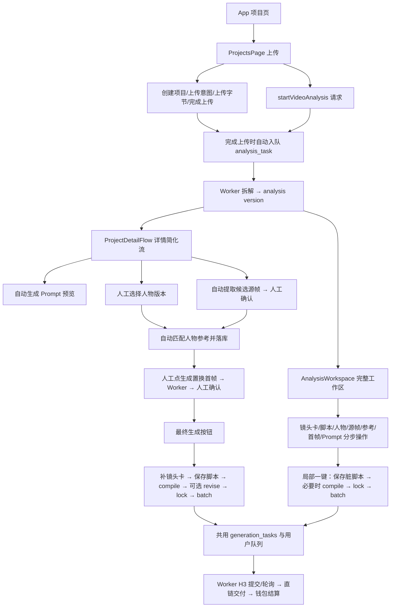

# 老客户版与共用生成后端：逐步迁移基准

审计日期：2026-09-07。基线分支：`feat/unified-frontend-gate-flow-audit-20260907`；初始 HEAD `5b91089`，最终 HEAD `8d13f60`。期间同目录另一任务提交此前的 Studio 工作树改动并切换分支，父任务已将当前分支恢复为上述审计分支；相关后端未变。本报告基于当前工作树只读检查，保留既存改动。仅产出本文；没有修改业务代码、启动 Worker、请求付费供应商、操作数据库、运行测试或提交 Git。

已读项目 `AGENTS.md`、`andrej-karpathy-skills`，并按六份 V3 正本核对业务约束和证据边界。本次结论为源码事实与静态依赖分析，不表示已完成新前端迁移，也不表示真实 Provider 验收。

## 1. 先纠正对原流程的三个理解

1. **原系统已是分步业务服务，部分步骤由页面替用户连续调用。** 并不存在一个“上传视频后自动完成所有人物选择、首帧确认、提示词锁定和最终视频”的单一后端接口。`ProjectDetailFlow` 呈现五个区块；人工选择人物、确认源画面、生成并确认置换首帧后，最终按钮才串行调用镜头卡、脚本、Prompt 编译/修订/锁定、建批。`AnalysisWorkspace` 另保留更完整的手动配置和局部“一键流水线”。
2. **“取原视频源帧”和“生成置换后首帧”是两种不同资产、任务和确认。** 源帧取自上传视频；置换首帧由源帧＋选定人物造型参考生成。上传一张图片或临时预览 URL 不等于服务端已确认的复刻首帧。
3. **当前视频成功交付已经改成供应商直链，不再自动进行视频 COS 归档与视频后期质检。** `docs/客户版任务清单-V3.md:5`、`docs/CUSTOMER-TASK-EVIDENCE-V3.md:9-11` 记录了 2026-09-04 的最新需求；代码 `generation_worker.py:646-887`、`generation.py:5134-5186` 与之吻合。旧 `AGENTS.md` 产品简介仍写“COS 归档质检”，不能据此要求恢复已取消的视频后处理。输入视频、源帧、人物参考图、置换首帧的存储和首帧质检仍存在。

## 2. 老页面调用图：哪些自动，哪些必须人工



入口证据：[App.tsx:395](/Users/honor.pei/Documents/订单项目/乡墅爆款短视频复刻/client/src/App.tsx:395) 同时挂载 `ProjectDetailFlow` 与 `AnalysisWorkspace`；[ProjectsPage.tsx:170](/Users/honor.pei/Documents/订单项目/乡墅爆款短视频复刻/client/src/ProjectsPage.tsx:170) 是上传控制器；[ProjectDetailFlow.tsx:395](/Users/honor.pei/Documents/订单项目/乡墅爆款短视频复刻/client/src/ProjectDetailFlow.tsx:395) 是简化流最终编排；[useGenerationDrafts.ts:707](/Users/honor.pei/Documents/订单项目/乡墅爆款短视频复刻/client/src/useGenerationDrafts.ts:707) 是完整工作区的局部一键编排。

源帧组件注释 `SourceFrameSelection.tsx:149-150` 仍称自动确认，但实际 `212-230` 对新候选设置 `manualConfirmationRequired=true`，`389-415` 才在人工点击后调用确认。分析以实际分支为准。

## 3. 可逐步对照的新旧迁移基准表

| 步骤 | 现有入口 / API / 服务 | 真正持久化的产物 | 应保留的行为和迁移注意点 |
| --- | --- | --- | --- |
| 1. 上传原视频 | `ProjectsPage.tsx:170-214` → `POST /api/assets/upload-intent`、字节上传、`/{asset_id}/complete`；`media_routes.py:410-483`、`media.py:402-522` | `projects`、`assets` 中参考视频，内容 hash、大小、媒体时长 | 资产必须属于当前用户/项目；完成上传需实际探测对象。**旧 complete 自动入队拆解**，新界面若要求“只上传暂不拆解”，必须调整明确的接口语义，不是隐藏拆解按钮就完成。 |
| 2. 拆解视频 | `POST /api/projects/{id}/analysis-tasks`；`analysis_routes.py:353-398` → `analysis.py:734` → Worker `prepare/perform/complete_analysis_task` | `analysis_tasks`、`versions(kind=analysis)` | 有资产完成状态、权限、服务端视频时长检查；API 快速入队，Provider 调用移到 Worker；显式重新拆解必须发布新版本，不能付费后复用旧结果。 |
| 3. 镜头卡 | `PUT /api/analysis/{id}/shots`；`analysis_routes.py:503-550` | `versions(kind=shot_card)`，绑定 `source_analysis_version_id` | 保留动作、运镜、人物、场景、时间段、口播等结构；保存验证时间范围。完整工作区 800ms 自动保存，简化流末尾会补保存。新页面显示分镜 JSON 不等于镜头卡已落库。 |
| 4. 获取并选择源帧 | `source_frame_routes.py:107-129`、`209-229` → `source_frames.py:280-337`、`340-466`、`976-1062` | `source_frame_tasks`、`assets(kind=source_frame)`、候选版本、确认版本 | 默认按视频时长 10/30/50/70/90% 取帧，无时长才回退 0.5/1.5/2.5 秒；FFmpeg 取帧＋可用时语义评分；确认必须来自最新候选，同项目且资产类型正确。 |
| 5. 选人物/场景造型 | `CharacterSelection` → `project_character_selection.py:131`；参考匹配 `character_reference_routes.py:42-60` → `character_reference_matching.py:98-184` | 主人物绑定版本、已发布 `character_version`、`character_reference_selections` 及发布快照/hash | 新人物结构是 identity → persona → published version；选场景形象必须传**该 persona 的具体已发布版本**，不能只传人物 identity ID 或图片 URL。 |
| 6. 生成置换首帧 | `POST /api/projects/{id}/first-frame-tasks`；`first_frame_routes.py:300-325` → `image_tasks.py:235` → `first_frames.py:1496-1977` | `first_frame_tasks`、存储后的 `assets(kind=first_frame)`、候选版本、项目造型版本 | 用确认源帧＋最新人物参考绑定＋服务端稳定模板；1–3 个目标候选，最多 2 轮质量尝试；已付费候选先归档/checkpoint，再质检，不因质检失败丢弃。 |
| 7. 确认置换首帧 | `POST /api/projects/{id}/first-frames/confirm`；`first_frames.py:2027-2106` | `versions(kind=first_frame_selection)` | 当前候选和源头必须仍有效；未过质检可由用户明确 override，并持久化证据。前端需预览并二次确认，不能静默选第一张。 |
| 8. 保存口播脚本 | `POST /api/projects/{id}/scripts`；`generation.py:1062-1139` | `versions(kind=script)`，完整文案、镜头映射、绑定镜头卡版本 | 必须最新镜头卡，源拆解未被替换；文案不能为空。此服务记录 `creates_audio_task=False`，本复刻链不会额外生成音频任务。 |
| 9. 编译/修订/锁定 Prompt | `/prompts/compile`、`/prompts/revise`、`/prompts/{id}/lock`；`generation.py:1142-1295`、`1414-1499`、`1683-1743` | `versions(kind=h3_prompt)`：模板 hash、脚本/镜头卡/首帧/人物/场景绑定与参数快照；SAVED→LOCKED | 保留服务端镜头时间缩放和强提示词模板；修订接口是**整个 Prompt 文本替换**，不是追加补充；锁定检查所有上游版本是否过期。 |
| 10. 创建批次 | `POST /api/projects/{id}/generation-batches`；`generation_routes.py:432-453` → `generation.py:1880-2180` | `generation_batches`、逐条 `generation_tasks`、费率快照、钱包 RESERVE、用户队列游标 | 创建接口不调用供应商；同键同请求返回同批次，异请求 409；LOCKED→USED 原子消费；数量 N 创建 N 条完整成片任务，不是 N 个镜头片段自动拼接。 |
| 11. H3 生成 | `generation_worker.py:646-887`、`generation.py:4905-4952` | Provider task ID、请求快照、轮询时间、任务状态 | 支付/网络耗时放短事务外；提交不确定不自动重发付费 POST；复刻默认 I2V，content 顺序 text → first_frame。 |
| 12. 结果/计费/恢复 | `generation.py:5134-5186`、`7019-7069`；`internal_billing.py:134-261`、`657-783` | 当前新视频为 SUCCEEDED/DIRECT/NOT_REQUIRED，Provider 结果直链；SETTLE 或 RELEASE | 成功直链可交付才结算；失败/取消才释放预留；未确定提交保持待核验。结果读取仍经授权接口，不能把供应商直链作为公共列表内容。 |

## 4. 人物五视图与场景形象：不能省略的关系

人物选择不是“有 5 张图即可”。`character_reference_matching.py:236-299` 比较选中角色版本、源帧确认版本、persona 快照、publication hash 和已发布资产集合；任何不一致都会令绑定过期。默认推荐是按人物朝向选择 body view，再加 FRONT_FACE，允许选择 1–4 个合法发布视图。

但实际调用图像模型还有一层转换：[first_frames.py:2128](/Users/honor.pei/Documents/订单项目/乡墅爆款短视频复刻/server/app/first_frames.py:2128) 发现发布快照有 `contact_sheet_asset_id` 且 identity 有原始照片时，实际图像输入固定为：

1. 原视频确认源帧：构图、动作、场景、光线的模板；
2. 所选造型版本的五视图参考板；
3. identity 原始照片：脸部细节的权威依据。

没有 contact sheet 的历史角色才沿用选中的 legacy per-view 图片。这是兼容分支，需先核查存量人物后再考虑删除；不能因为名字有 legacy 就直接移除。

造型有两条不同规则：

- `appearance_type=scene` 且造型名称、场景描述、服装描述、版本齐全时，以用户选定场景造型的服装/鞋履/配饰为准；**实际背景仍保留原视频源帧**。代码 `first_frames.py:1220-1266`、`2557-2571`。
- 普通基础造型由源帧时间点匹配拆解镜头，按场景生成项目服装要求；身份沿用人物参考，服装不机械复制基础参考图。代码 `1112-1185`、`2572-2584`。

最终 Prompt 固定声明整个人物重构，禁止仅换脸、保留原人物身体、把五视图分格线带入结果。用户补充首帧要求追加到服务端模板之后，不替代模板，见 `first_frames.py:2543-2615`。

需要明确当前限制：`require_single_person_video_analysis` 会拒绝已分析的多人镜头或缺人数的旧拆解；没有 analysis 记录时函数直接返回（`1321-1323`），因此不能声称后端在所有入口都强制先拆解。但 `perform_first_frame_generation` 仍独立检查所选源帧恰好 1 人（`1647-1652`）。模板虽然写有“若有多人只换目标”，当前执行门禁并不支持多人源帧。

## 5. Prompt 与版本链的冻结条件

```text
analysis
  └─ shot_card(source_analysis_version_id)
       └─ script(shot_card_version_id, full_text, shot_mappings)
source_frame_candidates
  └─ source_frame_selection
       └─ character_reference_selection(角色发布版本与快照)
            └─ first_frame_candidates(人物/源帧/项目造型绑定)
                 └─ first_frame_selection(显式质检覆盖记录)
script + shot_card + first_frame_selection + 生成参数
  └─ h3_prompt(SAVED → LOCKED → USED)
       └─ generation_batch(完整请求快照)
            └─ generation_task(每条独立快照与账务轮次)
```

`generation.py:917-993` 的过期原因覆盖 `ANALYSIS_SUPERSEDED`、`SHOT_CARD_SUPERSEDED`、`SCRIPT_SUPERSEDED`、`TEMPLATE_SUPERSEDED`、`FIRST_FRAME_SUPERSEDED` 等；首帧过期继续追到源帧、角色版本、参考选择。拆成独立页面后，这套依赖须通过持久 ID 恢复，不能仅靠 React state 清空一下。

原编译器的重要内容在 [generation.py:75](/Users/honor.pei/Documents/订单项目/乡墅爆款短视频复刻/server/app/generation.py:75) 和 [generation.py:6652](/Users/honor.pei/Documents/订单项目/乡墅爆款短视频复刻/server/app/generation.py:6652)：

- 整体人物身份、脸部、发型、身材、上下装、鞋履和手部延续已确认首帧，不回退原人物身体/服装；
- 用结构化 `motion` 生成确定性的走、跑、转身、手势和跟拍等指令；
- 每个镜头时间按 `目标时长 ÷ 源时间线时长` 线性缩放；
- 分镜口播来自脚本映射，并保留完整口播文本；
- 配音不漏句、不改写、不重复、不交换顺序，与时间段同步。

批次参数必须与 LOCKED Prompt 完全一致（`generation.py:1991-2003`）；首帧资产必须与 Prompt 内首帧一致（`2041-2046`）。当前客户复刻限制 4/15 秒、1/2/4 条（`2004-2018`）；底层 H3 协议可 4–15 秒，两者不是同一个约束层。

## 6. 两个需要纳入新旧对照的真实风险

### 6.1 新单步流程的默认 Prompt 可覆盖后端强模板

与新前端审计者交叉核实：[state.ts:219](/Users/honor.pei/Documents/订单项目/乡墅爆款短视频复刻/client/src/studio/state.ts:219) 的 `buildReplicaPromptText` 仅打印原时间轴、镜头字段、原片口播；[live.ts:1108](/Users/honor.pei/Documents/订单项目/乡墅爆款短视频复刻/client/src/studio/live.ts:1108) 的 `runReplicaGeneration` 则在 `input.promptText != compiledText` 时自动 revise。默认生成的反推文本与服务端编译结果本来就不同，因此即使用户未主动编辑，也会触发整段替换。

后端 `revise_prompt_version` 只是保留旧来源元数据并覆盖 `prompt_text`（`generation.py:1453-1467`），不会重新加入上述强模板或缩放时间轴。这样锁定、建批和钱包均可正常完成，但送给 H3 的实际文字不再等价于原业务编译结果。例如 60 秒参考视频缩成 15 秒时，最终文字仍可能要求原 0–60 秒时间段。

建议迁移时区分“拆解展示文本”和“最终生成文本”：默认使用服务端编译结果；用户明确编辑时再执行确定的修订策略，且明确是否允许覆盖业务模板。不能仅以调用了 compile→lock→batch 判定逻辑完整迁移。

### 6.2 老简化详情流自身的结果未知恢复有不足，不应照抄

`ProjectDetailFlow.tsx:403-424` 每次按生成都会编译新 Prompt。后端 `compile_prompt_version` 每次 `insert_version`，最终 `_insert_version` 用新 UUID（`analysis.py:794-804`）。页面 `435-443` 的请求指纹包含新 `prompt_version_id`，因此上一次批次已经落库、响应丢失后，再按生成会得到新 Prompt 与新幂等键，存在重复建批和再次预留的静态风险。

已有 `ProjectDetailFlow.test.tsx:636-774` 虽断言两次幂等键相同，但把 compile/lock 的返回 ID 固定，未覆盖真实每次返回新版本的情况。这里只作静态发现，未动态复现。

较好的既有参考是 `useGenerationDrafts.ts:670-703`、`855-905`、`1178` 后面的实现：按用户/项目保存待恢复请求，复用完整原请求及原幂等键，结果未知时保留恢复入口，明确拒绝才清除。新 `runReplicaGeneration` 也每次随机生成 key（`live.ts:1152`），需要用等效恢复策略替代。

## 7. 独立视频 API 与项目复刻 API 的边界

独立创作 `POST /api/independent/video-tasks` 是合理存在的不同业务入口，不应把它视作复刻流程的“简便替代接口”。[independent.py:154](/Users/honor.pei/Documents/订单项目/乡墅爆款短视频复刻/server/app/independent.py:154) 会检查用户权限、图片归属/类型/存储、模式矩阵、数量、扩展模式开关、供应商配置与幂等；仍通过 fenced 写事务，并复用生成队列和钱包。

| 约束 | 项目复刻建批 | 独立创作建批 |
| --- | --- | --- |
| `project_id` / `creation_kind` | 真实项目 / replica | NULL / independent |
| 最新分析→镜头卡→脚本 | 必须关联且未过期 | 不要求 |
| 已确认置换首帧及质量覆盖 | 必须 | 仅要求授权的图片资产 |
| 人物、源帧、场景造型版本血统 | 经 Prompt 和首帧快照验证 | 不记录这些复刻关系 |
| Prompt 编译、参数快照、LOCKED 消费 | 必须 | 用户文本直接进入任务快照 |
| 字数/时长/数量 | Prompt ≤7000；客户 4/15 秒，1/2/4 条 | Prompt ≤4000；4–15 秒；数量受运行设置上限 |
| H3 模式 | 复刻是 I2V | T2V/I2V/R2V，尾帧和扩展模式受 capability 开关 |
| 公平队列、Worker、秒数预留、结算/释放 | 共用 | 共用 |

证据：`generation.py:1880-2180` 对照 `independent.py:60-73`、`127-151`、`168-319`、`320-385`。因此“置换首帧→文/图生视频”的入口可以作为用户自主创作；如果产品希望它仍算原复刻流程的最后一步，需携带项目及版本上下文并回到项目建批服务，不能只传图片和文字后声称原业务约束全部保留。

## 8. 计费、队列和失败恢复：内部名称不等于内部专属

**`internal_billing.py` 不可因名字含 internal 而删除。** 其实现已经是客户版、复刻、独立创作的共用账务底座，且同文件还承载口播计费。代码文件映射正本也明确要求迁移复用账务，见 `docs/客户版代码开发清单-V3.md:31`、`:266`。

调用关系：

```text
create_generation_batch / create_independent_batch
  → snapshot_generation_rates(定价快照)
  → _reserve_generation_credit
       → reserve_internal_billing(RESERVE，每任务按提交秒数)
  → ensure_user_queue_cursor
Worker 成功直链交付
  → record_video_generation_cost(实际供应商用量)
  → finalize_internal_billing(success → SETTLE)
Worker 失败 / 用户可取消状态取消
  → finalize_internal_billing(failed → RELEASE)
```

`reserve_internal_billing` 校验任务 owner 与钱包 owner，一轮预留重复调用不重复扣减；`finalize_internal_billing` 检查成功且有可交付结果，或失败/取消，保证每个 billing_round 只有一次 SETTLE/RELEASE。原历史无 RESERVE 的任务不会被追溯扣款（`internal_billing.py:694-697`）。

拆解、首帧和人物五视图的供应商成本也有记录（`generation_worker.py:1024-1051`、`1169-1187`、`1287-1312`），这不等于这些步骤已逐步扣客户钱包秒数。拆成 N 页不应自然变成扣 N 次；收费口径必须与实际域服务一致。

PG 用户队列 `_acquire_fair_queue_lease`（`generation.py:4619-4726`）锁游标→锁任务，按 `user_id` 轮换、默认一个运行任务；设备切换不改变任务所有者。SQLite 内部 FIFO 是另一运行分支；统一前端并不自动完成底层运行模式退役。

失败处理应完整保留：

- 提交前配置/签名失败：可安全重试；
- Provider 已接单或无法判断是否接单：`SUBMISSION_UNCERTAIN`；有 Provider ID 才走查询对账，没有 ID 需要授权的未扣费确认；不能普通按钮重发付费请求；
- 已成功生成但历史归档失败：用已有结果恢复，不重新付费生成；当前实现直接交付已有 Provider 结果；
- 已成功任务再生成：创建明确的付费再生成记录和快照；
- 任务被替代或租约丢失：迟到 Worker 不得再结算旧任务。

行动矩阵实现：`generation.py:7019-7053`；Worker 保护：`generation_worker.py:713-767`、`generation.py:5161-5185`。

## 9. 激活门禁改变时，这些后台服务不应被放宽

“未激活可见主界面”属于页面访问策略变化；不代表未经认证可以读取客户资产、创建项目、提交拆解/图片/视频任务或取得下载链接。旧后台已经把业务写路由置于 `BusinessDbDep.write()`，在事务内重验 session/epoch。相关例子：`media_routes.py:419/463/467`、`analysis_routes.py:369/509`、`character_reference_routes.py:52`、`generation_routes.py:439`、`independent_routes.py:37`。

主界面可使用无私有数据的展示内容；用户打开具体业务后再获取有效客户会话，回到原目标。统一 UI 时仍保留：两设备槽、普通登录冲突、显式切换、heartbeat、旧会话 fencing、用户/项目/资产归属、支付与账务审计。V3 正本当前的 `workspace` 进入条件仍是有效 session（`docs/客户版激活码完整开发文档-V3.md:79-86`），因此新需求应改页面契约及测试，不能只删原登录组件。

## 10. 迁移与删除顺序建议

1. 先明确新页面的资产/版本/任务 ID 输入输出契约，并固定“上传是否自动拆解”“复刻最后一步与独立创作的边界”。
2. 用现有域服务接好每一步；补恢复请求、跨页上下文及来源过期提示；优先修正默认 Prompt 覆盖问题。
3. 建一条新界面完整复刻验收：真实 HTTP（可用受控 Provider stub）依次上传→拆解→取帧→选造型→生成/确认首帧→脚本→Prompt→建批→任务中心。验证最终发送给 H3 的完整请求内容，不只 mock API 被调用。
4. 覆盖异常后再删除老流程外壳；共用服务保留。删除 `App` 或旧组件前，另外核对客户账号/钱包/下载/设备状态控件是否仍被新界面复用。
5. 最后做内部身份、sidecar、SQLite 运行链及打包发布的专门退役；不与业务分步迁移一次性混删。

当前可复用服务：上传与资源授权、异步分析、镜头卡版本、源帧任务与确认、人物发布版本/参考匹配、异步首帧生成与 checkpoint、脚本与 Prompt 编译/锁定、项目建批、公平队列/Worker、钱包/成本、任务记录/下载/恢复。

**不能原样迁移的仅是上层编排与已经发现不足的恢复策略；不能绕过的则是这些域服务中的状态、版本、权限、快照、计费和供应商提交约束。**

## 11. 可复用测试与新增验收重点

以下是已存在测试的源码定位，本次未执行，不能写为“本次通过”：

| 业务 | 现有测试定位 |
| --- | --- |
| 上传完成自动入队、同事务回滚 | `server/tests/test_media.py:317`、`:358` |
| 源帧最新确认、重新取帧使确认过期 | `server/tests/test_source_frames.py:587`、`:613` |
| 首帧任务幂等、权限在回放前检查、checkpoint恢复 | `server/tests/test_first_frames.py:391`、`:511`、`:855` |
| 源帧场景/选定场景造型服装优先级 | `server/tests/test_first_frames.py:1306`、`:1366` |
| 首帧未过检显式覆盖、角色变更过期 | `server/tests/test_first_frames.py:1758`、`:1951` |
| 模板变化、时间轴缩放、LOCKED/参数一致 | `server/tests/test_generation.py:2157`、`:2314`、`:2833`、`:2937` |
| Prompt 单次消费、提交不确定不自动重试 | `server/tests/test_generation.py:4076`、`:4306` |
| 成功直链不上传视频对象、只结算一次 | `server/tests/test_generation.py:4626`、`:6325` |
| 旧详情五步、人工首帧前禁用、改文案不被旧Prompt覆盖 | `client/src/ProjectDetailFlow.test.tsx:312`、`:636`、`:818` |

新迁移必须增加：默认 Prompt 保留服务端强模板与时间缩放；改文案后不恢复旧全文；Provider/批次响应丢失后跨页/刷新复用原 key 和原快照；切换人物/场景/源帧/重新拆解的失效链；未激活仅浏览主界面不触发业务请求；激活后回到原单步页面；过期会话不能提交；独立创作与复刻任务类型和来源关联一致。

## 12. 阅读路径

先读第 1–3 节理解“哪些步骤已存在”；接着第 4–5 节理解“步骤间为什么不能仅传图片和文本”；然后第 6–8 节看迁移实际风险与删除禁区；最后按第 10–11 节拆实施任务和验收。本文的任务边界是老流程/共用生成后端；全新 Studio 页面完成度以同目录新前端专项报告与总报告综合判断。
