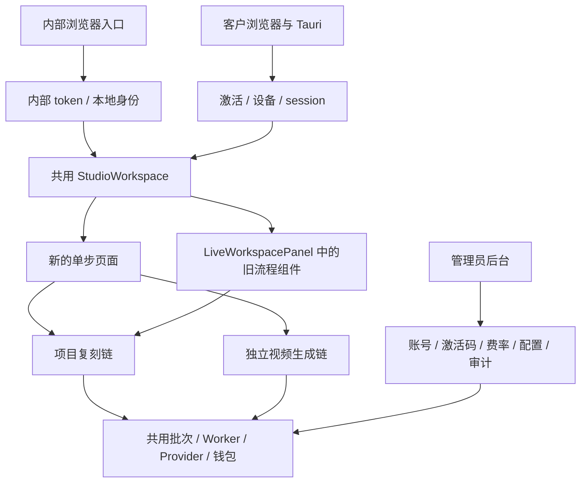
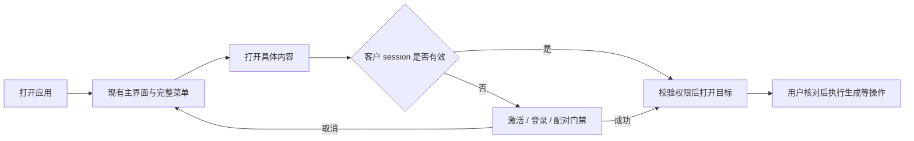

# 统一前端、激活门禁与单步流程迁移分析报告

> 阅读结论：两种身份登录后已经使用同一个 Studio 主界面，但入口、内部兼容逻辑和安装包仍未统一；新的分步骤流程已经接入不少真实业务接口，仍存在提示词、人物场景、首帧交接、依赖失效和重试方面的缺口，不能认定已完整迁移原业务逻辑。
>
> 本轮交付：切换新分支、源码依赖审计、专项测试、清理与迁移方案。**本轮没有删除内部代码，也没有实施新门禁。**

## 0. 先明确分析基线

| 项目 | 本轮事实 |
| --- | --- |
| 仓库 | `/Users/honor.pei/Documents/订单项目/乡墅爆款短视频复刻` |
| 新分支 | `feat/unified-frontend-gate-flow-audit-20260907` |
| 起始状态 | 从当前工作分支 `fix/frontend-completion-no-confirmation-20260907` 的 `5b91089` 新建，保留 8 个已有 Studio 源码/测试修改 |
| 固定代码基线 | `8d13f60e6316afce544d5961ad169aebab8ef7fa`；同目录另一任务在审计期间提交上述修改，并短暂切回原修复分支，本轮已恢复到新分析分支 |
| 最新工作区增量 | 12:16 又有另一任务对 5 个文件的未提交修改：CreationPages.tsx/test、state.ts/test、types.ts；本报告已单列其对 G05/G07 的改善，不将其归为本轮实施成果 |
| 选择此基线的原因 | 你的需求指向“现有前端”；直接切远端 main 会丢掉当前审阅对象。本轮没有拉取、合并远端分支或覆盖已有代码 |
| 快照检查 | 固定基线快照的 484 个文件内容指纹一致；随后工作区增量另用 latest-workspace-test-snapshot.json 记录，12:16 专项测试期间所记录文件没有漂移 |
| 审计口径 | 以当前源码为事实；V3 正本约束身份、账务与任务；旧审计/旧证据只用来定位，不直接复用旧完成率 |
| 真实运行边界 | 未调用付费 Provider、ZPay、生产 COS；未部署或运行真实客户生成全链路 |

“内部版本号相关代码”在本报告中按**内部产品变体及其专用入口/运行方式**理解。软件 `version`、提示词版本、人物版本和 Alembic 迁移版本仍是必要能力，不建议按关键词删除。

### 12:17 增量校核：这些地方已有新进展

后文源码行号与附件主体固定到 8d13f60，最新工作区以本段为准：

- **G05 已有局部修复与专项回归：** VideoPage 缺少首帧资产对象时会请求签名 URL、构造对应素材并回填共享集合，包含加载/错误/重试状态；确认时增加 firstFrameSelectionVersionId。无需重复实现这部分，但完整“真实置换确认→跳转→项目型提交”仍未验收，G06 仍存在。
- **G07 部分修复：** 换项目/人物/目标图会清理旧 firstFrameId、确认版本与 frameConfirmed；重新执行纯函数探针已证实。旧 tailFrameId、referenceIds、videoBatchId 仍保留，换人物后原 Prompt 也仍保留，需要按创作模式确定哪些必须失效。
- **最新专项是 13 文件、277 测试通过**，测试前后源码指纹一致。以上是其他任务正在实施的增量，本轮仅复核。证据见 latest-workspace-tests.log、latest-workspace-test-snapshot.json、latest-state-probes.json。

因此，不应把基线中的 G05/G07 全部当作当前尚未开发；也不能据这两处改动认定整条复刻链已经完成。

交付核对（12:19）：另一任务仍在修改 CreationPages.tsx 及其测试；这些更晚的编辑不纳入 12:16 的 277 项结果。本报告锁定明确快照，实施时先对照当前 diff 更新缺口状态，避免两项任务重复开发。文件变化清单见 report-validation.json。

## 1. 先读这六个判断

1. **前端主界面已共用，统一工作量主要在入口和边界。** `App.tsx:134` 与 `customer/CustomerWorkspace.tsx:231` 都进入 `StudioWorkspace`。不过新界面还通过 `LiveWorkspacePanel` 嵌入旧项目/人物/任务页面，所以“外层统一”与“全部内容统一”是两项验收。
2. **激活门禁仍然挡住整个主界面。** `/customer` 和 Tauri 未认证时直接显示激活/登录屏，没有公开浏览主界面的状态。需要把“显示页面框架”和“获取客户数据/执行业务”分开。
3. **内部版不能整块删除。** 内部 token 登录、桌面固定身份、本地启动器和单机部署是候选；账务、人物、首帧、Worker、管理员后台和历史迁移仍被客户使用。
4. **原流程可复用，不需要重写核心引擎。** 用户体验上原来是一条连续流程；源码已经分成上传、分析、版本、首帧、Prompt、批次和 Worker。原“一键”主要把后半段多个 API 串起来，并非上传后一个后端函数完成所有步骤。
5. **新单步流程尚未达到业务等价。** “按钮有接口”只证明接线存在；目前仍可能选错人物造型、丢首帧素材对象、覆盖完整 Prompt，或从项目复刻切成无项目版本关系的独立生成。
6. **历史内部账号与数据迁移必须单列。** 新激活创建新的客户 user/wallet，不继承员工账号资产；现有旧库导入器不能直接把内部库合并进非空客户 PG 库。清理入口之前就应登记账号、项目、人物、余额与未完任务的归属方案。

## 2. 第一遍阅读：现在系统如何连接

这里有三个不同问题：客户与内部员工看哪套页面、业务调用用哪种身份、服务运行在本地 SQLite 还是客户 PG。修改其中一个，不会自动完成另外两个。

入口证据：`client/src/RootApp.tsx:22-46`、`App.tsx:48-134`、`customer/CustomerWorkspace.tsx:29-86,228-251`。桌面双构建证据：`client/src-tauri/Cargo.toml:12-18`、`src-tauri/src/lib.rs:119`、两份 Tauri 配置及 `.github/workflows/ci.yml:168-248`。

## 3. 第二遍阅读：新的激活门禁应怎样工作

目标体验建议明确为：**打开应用先看到现有首页和全部功能入口；打开具体业务内容时才要求激活或恢复登录。**

| 场景 | 目标行为 | 不能遗漏的细节 |
| --- | --- | --- |
| 首次打开，无凭据 | 首页、菜单、功能卡片立即可见 | 不伪装内部用户、不读取某个员工的私有数据 |
| 点击项目/人物/素材/任务等内容 | 弹出或在当前主界面承载激活门禁 | 请求应在门禁通过后发生，不先请求再靠 401 弹窗 |
| 取消激活 | 留在主界面 | 保持页面可浏览，没有重复弹窗循环 |
| 激活成功 | 打开刚才的页面/内容 | 保留目标 ID 和视图参数；不自动付费生成或发布 |
| 设备已有凭据 | 后台恢复正常 session | 网络失败不能挡住可公开的页面框架 |
| 另一设备在线 | 明确提示冲突与显式切换 | 不因访问首页就静默踢掉另一设备 |
| 会话过期、被切换、设备撤销 | 清理私有数据，回到浏览框架并提示真实原因 | 三种原因保持区分；旧自动保存/轮询不能继续写入 |
| 余额为零 | 仍可访问已授权内容 | 激活权限与付费生成能力分开判断 |
| 深链接/搜索/浏览器返回 | 和点击菜单走相同门禁 | 不能只给首页几个按钮加 onClick |

如果“整个主界面”还包含真实公开视频列表，需补充明确公开数据范围；当前可按不含个人数据的功能展示实现。这个建议不自动把私人素材、钱包、客户项目改成公开数据。

关键改造位置：

- `RootApp.tsx:86-174` 与 `customer-state.ts`：把整屏挡入口改为页面框架常驻、内容入口触发认证。
- `useCustomerSession.ts:195-385`：保留凭据恢复、设备限制、冲突和续租，调整它们与页面显示的关系。
- `CustomerWorkspace.tsx:50-86`：在真实 token 附着后才启动本人数据加载。
- `StudioWorkspace.tsx:231-312,430-531`：草稿、资料、任务、能力查询与轮询需要身份条件；目前主要区分 DEV review 与正式工作区，尚无访客模式。
- `StudioWorkspace.tsx:533-565,597`：统一处理导航、hash/popstate、旧功能面板和待打开目标。
- 后端保留 `auth.py` 客户读授权、`customer_fence.py` 写事务校验、`permissions.py` owner 检查。

完整入口/构建依赖、行为矩阵和验收例见 [前端入口与门禁附件](frontend-entry-and-gate-audit.md)。

## 4. 第三遍阅读：内部版到底可以删什么

### 4.1 按业务归属清理，不按文件名清理

| 对象 | 判断 | 原因/先决条件 |
| --- | --- | --- |
| 内部 token 输入、自动内部身份登录 | 替换后可删 | 统一 RootApp 普通路径，确保客户入口接管 |
| `internal_accounts.py` 内部开户/发 token CLI | 候选 | 盘点运维使用与测试 helper；用户/钱包数据本身不删除 |
| desktop 固定身份、DEV 用户头、旧控制代理身份 | 分支级退休 | 保留客户 session 与真实管理员 cookie/CSRF；测试环境不能再暗中代入 employee |
| local-sidecar 与 start-backend 启动器 | 客户构建验收后可删 | 保留 Tauri 凭据保险库、设备指纹、下载保存/取消能力 |
| 内部 NSIS 与单机部署模板 | 条件删除 | 先修改 CI 对双产物和资源目录的假设 |
| 旧 WorkspaceShell | 解除依赖后可删 | Studio 与 LivePanel 仍从它提取类型；旧组件功能也未全部迁完 |
| `internal_billing.py` | **保留** | 项目生成、独立生成、口播和 PG 补偿脚本均使用预占/结算/释放 |
| `SettingsPanel.tsx` | **保留共享部分** | 管理后台仍以 source=control 使用；只清掉旧 workspace 来源不够理由删组件 |
| `auth.py`、`control_auth.py` | **保留核心，清内部分支** | 客户 GET、CurrentUser、控制面真实 actor 仍依赖 |
| `control_routes.py` | **保留运营功能** | 同时服务客户账号、账务、Provider；删 token 表前先解除账户列表 JOIN |
| `users`、钱包、订单、任务、人物、首帧、审计 | **保留** | 都是共享业务事实，不是内部专用垃圾数据 |
| 022/026 等已发布迁移 | **保留且不改写历史** | 022 同时创建内部 token 与共享账务表；后续 revision 依赖它 |
| SQLite、local 资产与导入工具 | 分阶段退休 | 历史库、图片、测试、导入和回滚都还依赖；停止运行与彻底删实现分开 |
| 软件 version / prompt version / character version | **保留** | 分别负责安装升级与业务追溯，非内部版开关 |

### 4.2 四个容易造成连锁故障的删除点

**删账务文件：** `generation.py`、`independent.py`、`oral.py/worker` → `internal_billing.py` → `wallets/wallet_transactions`。错误删除会使视频和口播无法预占、重复结算或占用余额不释放。

**删内部 token 表：** `control_routes.py:484-531` 的账户列表仍 LEFT JOIN `internal_access_tokens`。必须先调整查询、响应类型和消费者；历史迁移依然保留。

**删旧前端 App 文件：** Studio/LivePanel 的 props 类型还来自 `WorkspaceShell`；App 内部又包含共享业务组件调用。先解除类型依赖与真实调用，再删过时壳。

**删 SQLite/local 支持：** 历史原视频、五视图、首帧可能是 `local://` 资产。删除解析器不会自动把这些文件变成 COS 资产，随后项目预览和生成都会失败。

### 4.3 历史用户与数据不能靠“重新激活”搬迁

`activation_code_routes.py` 的首次激活创建新的客户 user 和 wallet；不会把 `employee_1` 或其他内部账号的 owner 自动改成新客户。

后续需要一份只含内部 ID 的迁移映射，至少覆盖：旧 user → 目标客户 user、项目、reference asset、人物 identity/persona/version、首帧、草稿、任务/批次、钱包与冻结额、未支付订单、Provider 已提交任务及审计。资金历史保留原记录，不直接改余额凑数；无法唯一归属的资产应列冲突处理，不能一律转给首个激活用户。

现有 `server/scripts/sqlite_to_postgres.py` 面向一次性整库导入；非空目标与源库不一致或已有客户 PG 专用事实时会拒绝。**已有客户库的增量合并需要单独设计与演练，不能直接运行这份工具当作完成迁移。**

后端逐模块调用、数据依赖、删除条件、测试与完整候选索引见 [内部后端与部署附件](internal-backend-audit.md)。

## 5. 第四遍阅读：将你的业务拆成可验收的步骤

先区分三种不同图片：**视频源画面**来自原视频；**人物五视图/场景造型**定义要保持一致的人物形象；**最终生成首帧**由源画面与人物参考结合得到，供视频生成使用。三者不能只用一个模糊的 imageId 代替。

| 步骤 | 必要输入 → 持久结果 | 原有核心实现 | 新步骤现状 | 结论 |
| --- | --- | --- | --- | --- |
| S1 上传视频 | 本地视频 → project_id、reference_asset_id、已完成资产 | 上传意图、文件上传、complete、媒体探测 | 新工作台已复用同一上传链；但 complete 会自动入队分析 | 已接通；严格“只上传”尚未分离 |
| S2 拆解视频 | reference_asset_id → analysis_task、分析版本、分镜/口播 | analysis routes/service/worker、分镜卡版本 | ReplicaPage 已有分析读取、轮询、重试与保存；本轮期间已有修复增强往返恢复 | 部分接通；需要明确显式启动与自动分析的关系 |
| S3 获取并确认源画面 | reference_asset_id+时间点（分镜可辅助选时）→ 候选 source frame、确认版本 | SourceFrameSelection、source_frames | 人物置换页复用选帧组件 | 接口可复用；跨页项目/镜头依赖仍需统一 |
| S4 选择人物五视图与场景造型 | identity+persona+character_version → 项目人物绑定 | CharacterSelection、characters、simple_character、reference match | 人物库已有场景图；“用于人物置换”没有完整绑定用户所选场景版本 | 未达到业务等价 |
| S5 生成并确认首帧 | 源画面+人物版本+匹配参考 → first_frame_task、候选图片及质检标签、确认版本 | FirstFrameSelection、first_frame、character_image_generation | 置换页已有真实生成/确认调用，未过质检支持用户明确覆盖；新图片确认后未即时补齐下一页所需资产对象 | 部分接通；即时交接存在断点 |
| S6 生成/调整视频 Prompt | script+shots+first frame+目标时长 → 编译/修订/锁定版本 | generation.compile_prompt_text、版本 staleness、lock | 新页会生成简化文本，再覆盖服务端完整编译结果 | API 已接，关键语义有缺失风险 |
| S7 确认参数与提交 | 首帧+locked prompt+报价+幂等键 → batch/tasks、钱包预占 | generation batch、user fair queue | 复刻页走原项目链；通用 video 页走 independent 链 | 两条都存在，尚未统一复刻步骤的数据血缘 |
| S8 Worker 生成 | task snapshot → Provider receipt、轮询、最终结果 | generation_worker、H3 adapter、状态机与补偿 | 两条提交路径复用底层任务/账务能力 | 核心可保留，不应重写 |
| S9 查看/下载/继续创作 | task/result → 可授权访问的链接、下载记录或再次创作草稿 | task/detail/download 及直接交付 | 已接任务与下载能力，重新创作/换来源仍需完整失效规则 | 存在代码；真实链及完整跨步骤回归待验 |

### 原“一键”具体串联了什么

`ProjectDetailFlow.tsx:395-448` 在前置首帧条件满足后，串行调用分镜准备、脚本、compile、lock 和 batch；前置视频上传、拆解、人物、源帧和首帧各有自己的服务。`AnalysisWorkspace` 又保留更详细的分阶段工作区。

因此迁移的正确方向是：把已有服务及校验接到新的各步骤，并让步骤间传递同一组项目/资产/版本 ID。无需重新实现一套上传、人物生成、H3、计费和 Worker。

### 两条“生成视频”路径为什么不能混为一谈

| 对比 | 项目复刻链 | 独立生成链 |
| --- | --- | --- |
| 前端 | `live.ts:1108 runReplicaGeneration` | `StudioWorkspace.tsx:380 submitVideoTask` |
| 主要调用 | script → compile/revise → lock → project batch | `createIndependentVideoTask` |
| 输入关系 | 项目、分镜、脚本、首帧、Prompt 版本关系 | 用户输入 Prompt、图片/参考素材和参数；不传原项目/分镜/脚本版本 |
| 服务端能力 | 可以检查上游版本过期和首帧匹配 | 仍校验身份、owner、素材、参数、额度和幂等；但不检查原复刻项目的版本关系 |
| 适合用途 | 保持原片拆解、人物和首帧血缘的复刻 | 文生、图生、参考生等独立创作 |
| 当前迁移问题 | 可能覆盖完整编译 Prompt | 从置换页跳入此链后，原项目链不再是事实来源 |

独立接口本身有合理用途；问题是将它当作原复刻步骤的最后一步时，没有完整传递原业务约束。建议保留两种创作类型，但复刻步骤的最终提交继续使用项目链。

### 最新交付口径纠偏

当前真实 PG H3 成功路径使用 `finalize_generation_direct_result`，结果为 `archive_status=DIRECT`、`quality_status=NOT_REQUIRED`。这是 2026-09-04 已记录的“视频直链交付”调整；不能以早期架构中的“生成视频必须再次 COS 归档并视频质检”作为本次补开发标准。**生成首帧的图片检查与视频成片后处理是两回事。**

## 6. 需要优先解决的具体缺口

本表“优先级”表示对这次目标的阻塞程度；事实主体固定于 8d13f60，G05/G07 的工作区新进展见第 0 节。所有代码修复均非本次分析任务实施。

| ID | 优先级 | 已确认事实与影响 | 证据与建议 |
| --- | --- | --- | --- |
| G01 | 首批 | 未激活仍然进入整屏激活，主界面不可见 | RootApp:86-174；建立可浏览框架与统一内容门禁，授权前禁止私有加载 |
| G02 | 首批 | 上传完成自动入队分析，UI 分成两个按钮不等于业务拆步 | media.py:464-496，live.ts:uploadWorkbenchSourceVideo；显式定义仅上传和启动分析，保留幂等及历史兼容 |
| G03 | 首批 | 默认反推文本可能覆盖后端完整 Prompt，丢连续性/口播同步/时长映射 | state.ts:219-244、live.ts:1137-1142、generation.py:1453-1467,6652-6695；未明确编辑时保留服务端编译，编辑时保留必需规则与校验 |
| G04 | 首批 | 人物库选定场景造型没有完整进入置换绑定 | PeoplePages PhotosPanel → draft.ipId/imageId → ReplacementPage；传递并绑定实际 persona/character version，不能自动用基础造型代替 |
| G05 | 已有局部修复 | 基线新首帧仅写 ID，立即跳 video 可被阻断；12:16 工作区已新增签名解析与共享素材回填 | 不重复实现资产解析；继续验连续置换→预览→正确生成通道，见第 0 节 |
| G06 | 首批 | 置换后进入独立 video 路径，缺少原项目/分镜/脚本版本关系 | StudioWorkspace:380-412、independent.py；复刻继续项目链，独立创作保持独立语义 |
| G07 | 部分修复 | 工作区已清理旧 firstFrame/confirmed；tailFrame/reference/batch 仍保留，人物切换后的 Prompt 也保留 | 以 latest-state-probes.json 为新事实；按模式建立完整依赖失效表 |
| G08 | 第二批 | 人物参考匹配失败后的“重试”不一定重新发请求，失败忙碌态亦需收口 | ReplacementPage retryReferenceMatch 与匹配 effect；重试应有可观察的新请求与 finally 释放忙碌状态 |
| G09 | 首批 | 重新提交常生成新幂等键和新 Prompt 版本，响应丢失后重试可能创建另一批任务 | live.ts:1152、StudioWorkspace:411；旧 ProjectDetailFlow 也存在重新 compile 导致 fingerprint 改变的风险；保留一次操作意图和原键，先查询/恢复 |
| G10 | 第二批 | 新 UI 仍打开旧 ProjectDetailFlow/AnalysisWorkspace/CharacterLibrary 面板 | LiveWorkspacePanel:100-143；迁移未闭环前保留业务；完成后再去旧视图与类型耦合 |
| G11 | 前置 | 内部用户改成新客户身份后资产/钱包不会自动随迁 | activation_code_routes、sqlite_to_postgres；先做 owner 和账务迁移方案，再退休旧访问入口 |
| G12 | 首批 | 分析后台完成、前端尚未保存 shot_card 就关闭页面时，恢复页不能自动补齐派生分镜；分析任务 ID 也未重新附着 | CreationPages 分析/restoreSavedProject；优先恢复已有结果并补分镜，不诱导重新调用分析 Provider |
| G13 | 首批 | 复刻“送生成”缺独立报价确认；独立生成报价为空仍可提交；同一 draft 时长在两链含义不同 | 客户复刻归一为 4/15 秒，独立生成 4–15 秒；显示实际参数和有效报价后再确认 |
| G14 | 第二批 | 爆款“复刻”入口只传视觉来源 ID，未导入参考视频项目；分析迟到回调和草稿落盘也有续作缺口 | 详见 Studio 附件 P2-07/08/10；建立来源绑定、任务恢复与已保存状态 |

基线 G05 的范围是“新首帧在本次会话中刚确认、资产尚未进入共享集合、立即跳下一页”。此前依赖刷新/草稿恢复补齐，最新工作区已增加直接读取资产的修复；仍需连续页面验收，不能把旧问题当成完全未处理。

G07 是前端携带旧数据的缺口；本轮没有证明能绕过服务端 owner/fencing。后端拒绝旧数据能避免部分错误提交，但不能替代前端明确清空、重新确认的体验。

G03 举例：原片 60 秒、目标生成 15 秒，服务端编译会按目标时长缩放镜头时间；新页面拼接的源时间文本仍可能写 0–60 秒，再作为全量修订覆盖编译结果。接口状态可以合法锁定，业务语义却已经不同。

## 7. 分步骤必须保持的数据合同

建议首先统一**已有**字段的含义和传递路径；下表是逻辑合同，不要求创建一个新大表或另一套工作流框架。

| 数据 | 为什么必须保留 | 上游变化后的要求 |
| --- | --- | --- |
| project_id、reference_asset_id | 确定这次复刻属于哪个视频 | 换来源清除当前草稿中的旧分析、镜头、源帧、生成首帧、Prompt 和任务交接引用或标记过期；保留历史记录，不取消已提交任务 |
| analysis_version_id、shot_card_version_id、selected_shot_id | 确定拆解版本和选中镜头 | 新分析/镜头编辑后重新检查源帧与 Prompt |
| 源帧候选版本、source_frame_selection_version_id、source_frame_asset_id | 分别确定候选集合和原片已确认参考画面；候选版本名按接口使用 | 换源帧清掉参考匹配与生成首帧确认 |
| identity_id、persona_id、character_version_id | 区分人物本人、具体场景造型与五视图版本 | 换人物/造型使参考匹配、首帧及依赖 Prompt 失效 |
| character_reference_selection_id | 证明本次匹配使用了哪组源帧和人物图 | 两个上游任一变化均应重算 |
| first_frame_task_id、first_frame_asset_id、确认版本 | 区分生成中、完成和用户已确认 | 替换首帧要重新报价、标记旧 Prompt 过期并编译/锁定新版本；不修改已锁定或已使用的历史快照 |
| script_version_id、prompt_version_id、目标参数 | 保留口播终稿、最终送出 Prompt 和时长比例 | 改台词/时长/画幅要更新对应版本和价格 |
| 操作幂等键、batch_id、task_id | 网络重试恢复同一任务，避免重复预占/调用 | 同一意图不换键；确实新创作才建立新意图 |

每个步骤完成后应能刷新恢复；上游变更应能解释“哪个后续结果已失效、下一步重新做什么”；API 已提交但响应丢失时应能恢复同一对象。这三项比“各页面都有按钮”更能证明迁移完成。

## 8. 建议实施顺序与每批出口

| 批次 | 工作 | 独立验收出口 |
| --- | --- | --- |
| A：冻结合同与回归基线 | 明确公共界面范围、复刻/独立生成边界、人物场景绑定、上传是否自动分析、历史账号处理；补故障回归 | 用例能重现 G01–G09；整理一次操作的数据/版本传递图 |
| B：统一入口与延迟门禁 | 公共框架、登录恢复、点击门禁、取消与成功返回、私有数据延迟加载 | 无凭据能看首页，点击内容才门禁；所有导航入口一致；服务端拒绝匿名不变 |
| C：打通项目型单步主链 | 严格上传/分析边界、场景人物绑定、首帧资产回填、完整 Prompt、幂等恢复与失效规则 | 同一项目从上传逐步到生成，页面往返/刷新/换上游均正确；最后仍可追溯原版本 |
| D：迁移旧视图消费者 | 新步骤覆盖旧能力后，去旧壳、重复页面和类型耦合 | 不再需要“返回新工作台”的旧视图跳转；原错误处理与任务恢复仍在 |
| E：退休内部入口/构建/部署 | 内部 token、固定身份、本地启动器、内部 NSIS 与单机服务；保留共用层 | 客户端/浏览器入口一致；安装包无启动器；后台与客户计费完整回归 |
| F：历史数据与 SQLite 退役 | 根据实际存量迁移 owner/local 资产，核对账务、未完任务和回滚；最后考虑删 SQLite 分支 | 旧用户数据不丢、目标 PG 不被覆盖、账本可对账；达到条件才删兼容实现 |

账号迁移规划在 A 开始，F 是实际迁移及最后删除阶段；有存量用户时，E 的彻底关闭必须受迁移出口约束。不要先让员工失去旧数据访问，再考虑账号映射。

建议沿用现有 React/FastAPI/PG 服务，无新增依赖、ORM、Redis 或消息队列。共享账务/Worker 暂不更名，避免为“看起来没有 internal”扩大改动。

后续代码任务应分别更新 V3 文件映射、任务/证据账本；新门禁是对旧“先激活再 workspace”交互合同的修订。当前报告不擅自改变冻结任务状态，也不沿用历史勾选状态宣称新需求完成。

## 9. 验收应当覆盖什么

### 9.1 必须新增的连续业务用例

1. 未激活启动 → 看主界面 → 点击具体内容 → 取消门禁 → 再次进入 → 激活后回原目标。
2. 上传视频 → 上传结束不分析（如果采用严格拆步）→ 用户显式启动分析 → 获得可恢复的分析/分镜版本。
3. 从人物库选择某个**场景造型** → 进入置换 → 实际绑定该造型版本 → 首帧使用对应参考图，而非默认基础造型。
4. 确认新首帧 → 不刷新直接进入下一步 → 图片立即可见且能报价/提交。
5. 60 秒原片 → 15 秒输出 → Prompt 时间线在 0–15 秒内；原稿顺序、人物/服装连续性、动作和口播同步规则仍完整。
6. 任一步刷新/返回恢复原对象；换原视频、人物或源帧后，旧首帧/Prompt/批次不再被误用。
7. 提交已成功但响应丢失 → 重试恢复同 batch/task；钱包只预占一次、Provider 只创建一次任务。
8. 生成途中另一设备切换 → 旧端不能写；新端看到同一队列任务，不复制任务、不重新扣费。
9. 生成完成直接交付 → 下载保存/取消/失败正确；管理员账务和生成记录仍保留。
10. 内部旧数据迁移演练：目标已有客户数据、账号冲突、local 资产缺失、未完订单/Provider 任务逐项核对。

### 9.2 本轮实际执行与未执行

| 验证 | 本轮结果 | 能证明什么 |
| --- | --- | --- |
| 客户入口、session 状态、workspace、customer API | 5 文件 / **80 测试通过** | 当前旧门禁和认证适配器回归基线 |
| Studio 基线专项 | 8 文件 / **193 测试通过** | 12:05 固定业务快照的组件与 mock API 接线；见 studio-focused-tests.log |
| 最新工作区合并专项 | 13 文件 / **277 测试通过** | 12:16，包括其他任务新增首帧/状态修复用例；无测试期间文件漂移 |
| 草稿依赖失效纯函数探针 | 两次实际执行 | 基线旧首帧残留，最新已清首帧但仍留尾帧/参考/批次；无 API/DB/Provider 调用 |
| 内部标记与源码指纹 | 484 文件扫描，230 文件有标记，2229 处标记行 | 全局检索覆盖索引；不是 230 个待删文件，也不是人工逐行全读的数量 |
| 报告交付检查 | 5 份 Markdown 的 UTF-8、代码块、16 处本地文件链接及限定凭据特征检查通过 | 文档完整性；不替代应用安全扫描 |
| 全量后端/PG/安装包/CI | 本轮未执行 | 本轮不改业务代码；不对服务端全回归、Windows 或 CI 声称通过 |
| 真实 Provider/支付/COS/生产 | 本轮未执行 | 不能宣称真实生成链或上线完成 |

早期两批共 273 项，随后因其他任务继续编辑而重验为 277 项；不是把两次执行重复累加。日志保留 jsdom 的 scrollTo 提示但退出成功。没有用测试通过来否定源码确认的跨页缺口，也没有为了分析任务修改或补全业务代码。

实施阶段按项目规则：先为缺口写失败测试，再最小修复，专项验证；收尾只由一次 `npm run check` 承载后端全量，避免同时占用 PG fixture。涉及依赖、Rust、安装包时补相应 CI 门禁；真实链路按独立证据记录。

## 10. 带你阅读的建议顺序

**第一步读第 1–3 节：** 确认目标确实是保留现有视觉和所有入口，只把激活从启动时移到打开内容时。这决定门禁改造范围。

**第二步读第 4 节：** 确认要退休的是内部产品入口与运行方式；账务、后台、人物、首帧及历史数据必须保留或迁移。这决定能删哪些代码。

**第三步读第 5 节的 S1–S9：** 按你的日常操作逐步看。重点看“源画面 → 人物场景造型 → 新首帧 → 完整 Prompt → 项目型视频批次”是否和你期望一致。

**第四步读第 6–8 节：** 对照每一个缺口，先修会改变结果或重复收费的逻辑，再收口旧页面和构建。完成一批就按出口验收，避免大删除和逻辑迁移混在一次改动里。

**需要看证据时再读附件：**

- [前端入口、门禁与构建](frontend-entry-and-gate-audit.md)：路由、自动数据请求、身份存储、可删除前端分支。
- [内部后端与部署](internal-backend-audit.md)：模块调用依赖、表与配置、共享账务、SQLite 与迁移限制。
- [原有流程与服务不变量](legacy-flow-audit.md)：旧链输入输出、版本/首帧规则、任务恢复、直接交付。
- [Studio 单步逐项审计](studio-steps-audit.md)：新页真实接口、逐步交接、具体缺口与测试范围。
- `internal-marker-index.tsv`：按文件/行定位全部检索命中，避免清理漏查。
- `source-snapshot.json`、`source-snapshot-final.json`、`snapshot-delta.json`：基线、内容指纹及并行工作期间的变化证明。

本报告提供的是本次清理前的依赖地图与迁移验收方案；正式删除前仍应按最终实施分支再次查消费者与数据存量，不能保证未经回归验证的删除绝不会引入问题。
